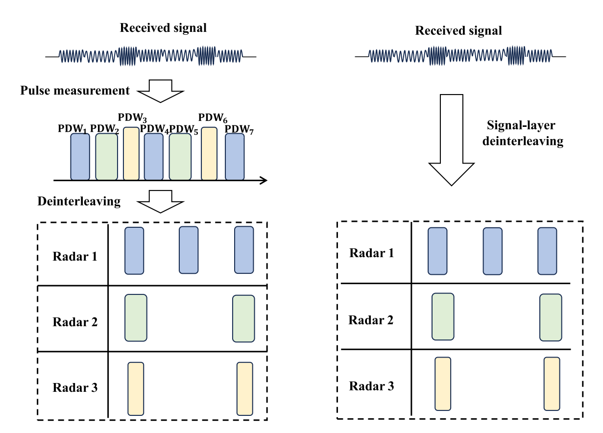
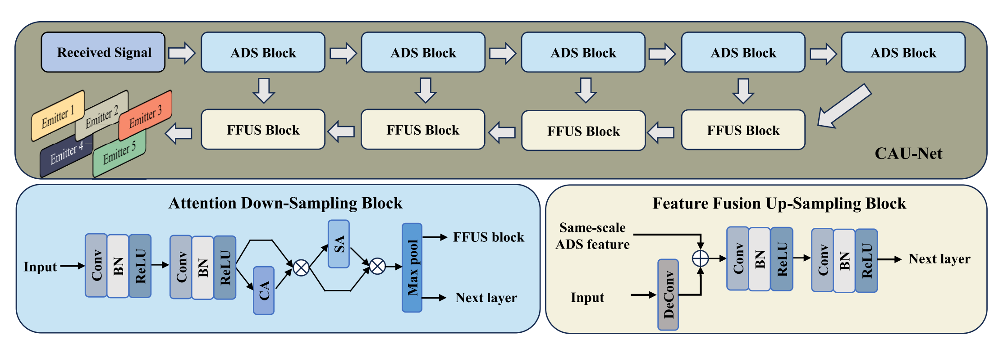
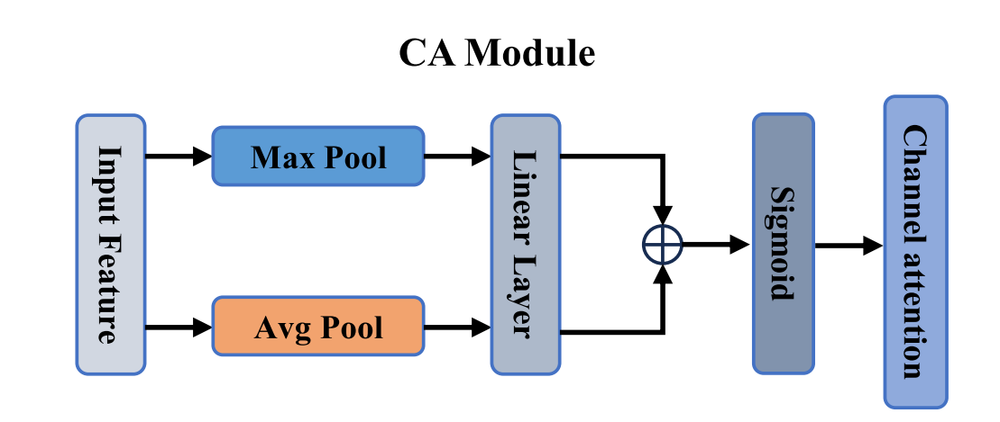
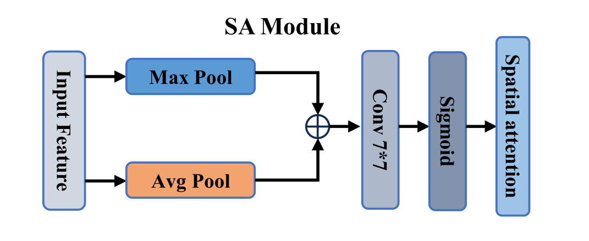

## **CAU-Net: A Convolutional Attention U-Network For Radar Signal Deinterleaving**

#### **keywords：Radar signal deinterleaving, deep convolutional network, convolutional attention mechanism, parameter estimation.**

IEEE COMMUNICATIONS LETTERS, VOL. 28, NO. 7, JULY 2024

https://ieeexplore.ieee.org/document/10538278

**解决问题：**

传统的方法和目前现有的深度学习的方法都无法逃避pwds的信息，传统方法通过于类似的模板匹配的方法，而目前其他的深度学习方法，则需要收集到足够多的PWDs的信息，雷达发射器的数量信息，作为先验条件，但是实际情况中，不能保证收集到的PWDs的完整性，对于其解交织性能就会有很大的影响。

**创新点：**

1. 不需要PDWs，只需要对原始信号做处理。

2. 首次提出了用一个网络去识别多个发射器。

**内容：**

**实验结果：**

实验结果较好，主要学会代码的内容。