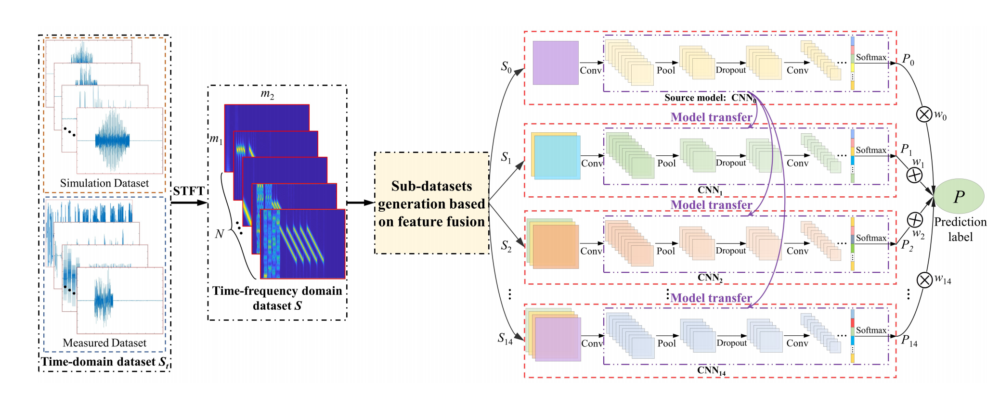
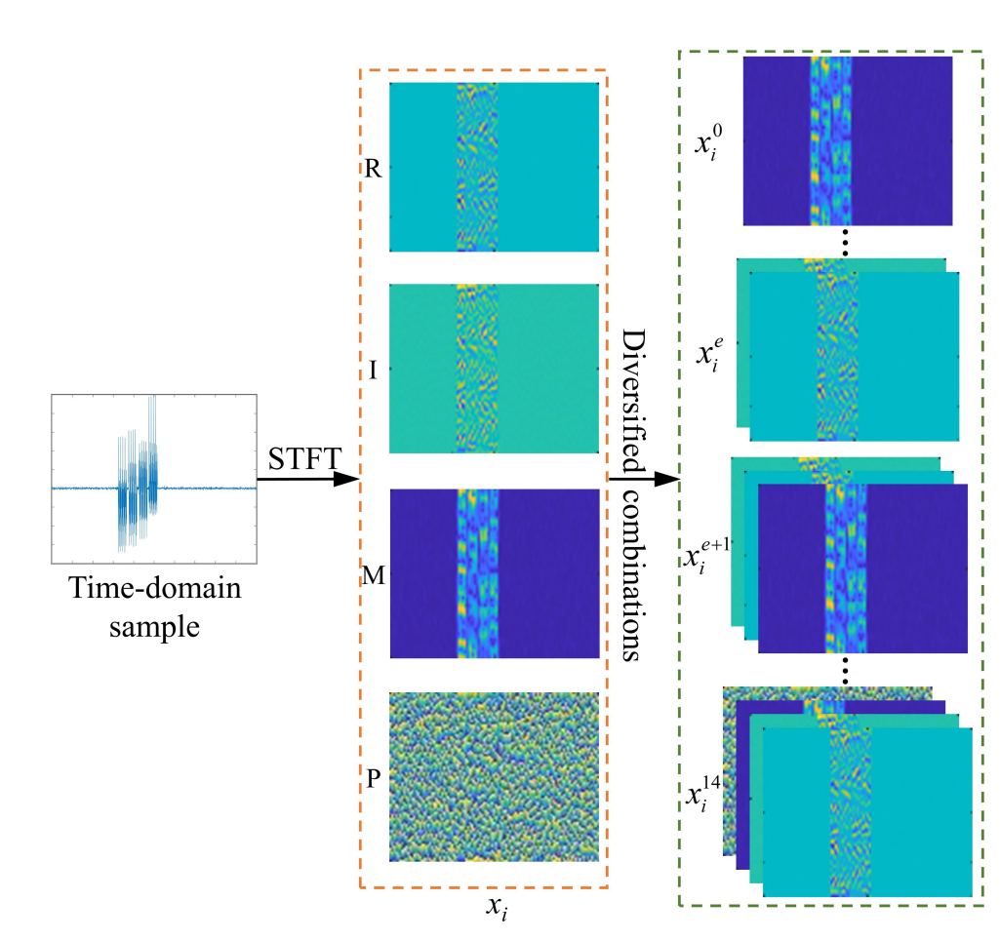
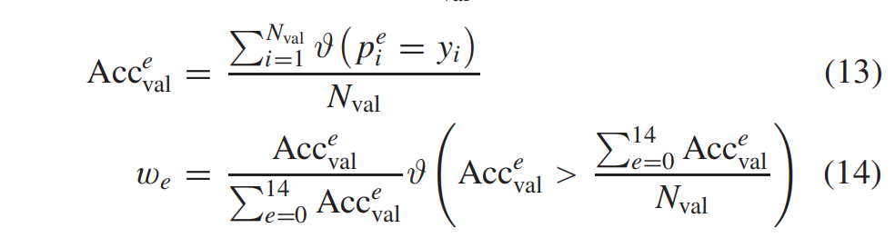
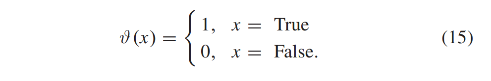

## **Radar Deception Jamming Recognition Based on Weighted Ensemble CNN With Transfer Learning**

#### **Keywords :Convolutional neural network (CNN), deception jamming recognition, ensemble learning, small sample, transfer learning.**

IEEE TRANSACTIONS ON GEOSCIENCE AND REMOTE SENSING, VOL. 60, 2022

https://ieeexplore.ieee.org/abstract/document/9622244

**解决问题：**

在复杂的战场环境中，获得可靠的样本是极其困难的，而其他的方法，无法在小样本的情况下拥有很好的识别干扰的能力，所以设计出一个方法，使其能在小样本情况下来识别出相应的干扰信号。

**其创新点：**

1. 通过STFT获得时频分布，并将其实部，虚部，幅值和相位作为数据集。
2. 设计了一个新的WECNN-L，其结合了迁移学习和加权集成算法。

#### **内容**

针对雷达抗干扰中欺骗干扰识别难题，鉴于小样本下深度学习算法局限，提出WECNN-TL算法。加上*Ensemble Learning*和*Transfer Learning*。但是其Ensemble Learning不是完整的，没有包含有放回的抽样过程，但有包含单独训练和最后聚合分类。

创新地将时频域特征构建多数据集，并提取其实部， 虚部，幅值和相的信息，作为子数据集，再将这些子数据集排列组合，再通过设计的迁移学习机制和加权投票提升模型性能。

该算法在小样本的情况相比于其他方法性能较好。

**其权重计算公式：**

**实验结果:**

与多种基本的方法对比，也与固定权重ECNN，不加迁移学习WECNN的方法做对比，实验结果证明其在小样本的情况下各个性能指标都有提示，且是否具有固定权重的影响比是否加入迁移学习的影响更大，后者主要体现在其运行时间的差异。

感觉整个流程框架可以借鉴一下，可以试一下替换文章中的卷积网络。