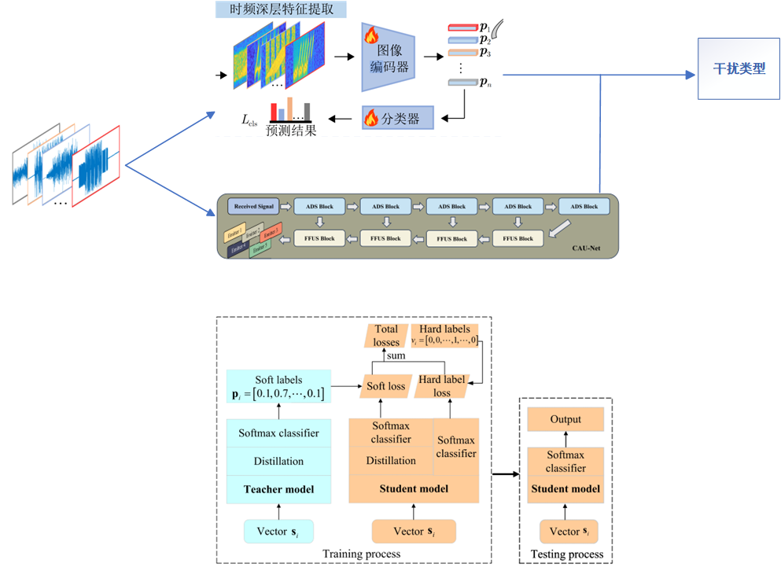

**多域浅层特征引导下雷达有源干扰多模态对比识别方法**

其多域浅层特征  需要整合的信息过多。

可以选取其时域深层特征提取部分，和其他结合。

**Few-Shot Radar Jamming Recognition Network via Time-Frequency Self-Attention and Global Knowledge Distillation**

整体框架可以借鉴一下，通过上面深层特征提取出来的标签作为软标签，然后再选用一个网络作为另一个标签。

框架

