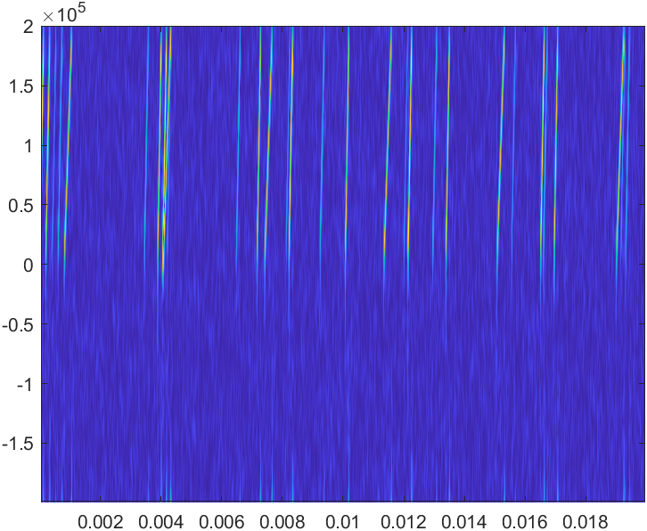
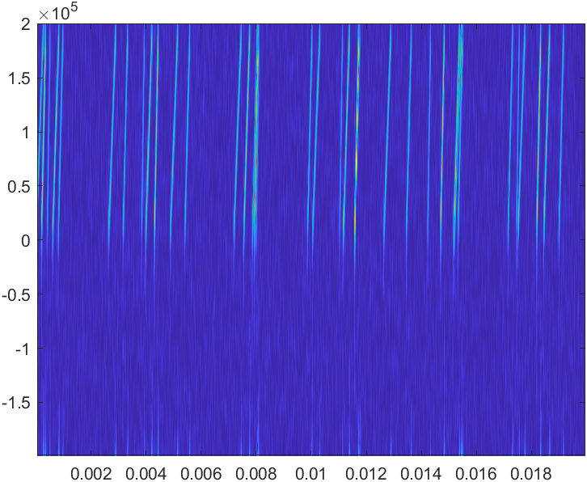

## **分选**

目前针对于stft图像与一维信号的结合，没有什么想法，感觉对于短时间内接收众多信号，再将其转为stft图像这个工作不太适用，因为每个发射器的持续时间太短，其stft图像内其他发射器之间，没有明显的特殊的独属于专属发射器的特征。但是相比于一维图像，stft的图像不同信号之间的间隔较为清晰的，可以考虑是不是可以多加位置信息，来帮助分选。

就目前郑烨的结果来看，对于非重叠的信号已经有很好的识别率，但是在重叠信号的识别，识别效果较差，所以想要再提高准确率，可以考虑一下如何处理重叠信号。

