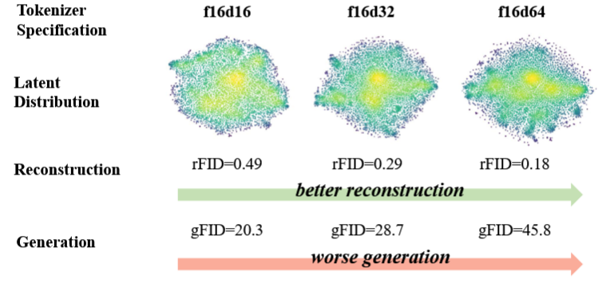
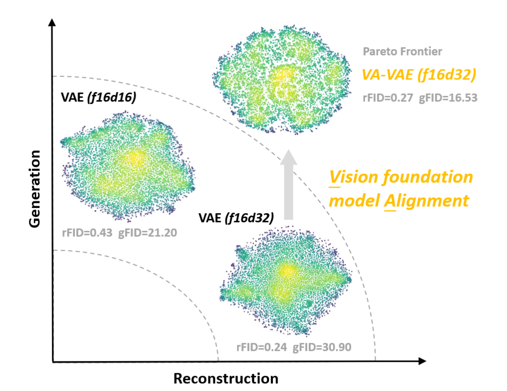

**周报**

**Reconstruction vs. Generation:  Taming Optimization Dilemma in Latent Diffusion Models** 

这个是一个今年CVPR的一个论文

主要讲的就是对于潜在扩散模型而言，潜在层的特征维度大小会影响最后重建和生成的效果。

特征维度越大，重建效果越好，但是生成效果越差。

于是设置了一个新的损失函数**对齐损失VF-Loss **，从**局部元素相似性**和**全局结构相似性**两个维度约束 latent 空间

$\mathcal{L}_{vf }=w_{hyper } * w_{adaptive }\left(\mathcal{L}_{mcos }+\mathcal{L}_{mdms }\right)$

其中**局部元素相似性**:

$\mathcal{L}_{mcos }=\frac{1}{h \times w} \sum_{i=1}^{h} \sum_{j=1}^{w} ReLU\left(1-m_{1}-\frac{z_{i j}' \cdot f_{i j}}{\left\| z_{i j}'\right\| \left\| f_{i j}\right\| }\right)$

具体做法就是将输入图像同时送入**VAE 编码器**和已经**训练好的视觉基础模型**，然后计算VAE 编码器$z_{i j}$和练视觉基础模型的$f_{i j}$的**余弦相似度**

其中**全局结构相似性**:

$\mathcal{L}_{mdms }=\frac{1}{N^{2}} \sum _{i,j}ReLU\left(\left|\frac{z_{i} \cdot z_{j}}{\| z_{i}\| \| z_{j}\| }-\frac{f_{i} \cdot f_{j}}{\| f_{i}\| \| f_{j}\| }\right|-m_{2}\right)$

这个就是计算**VAE 编码器**和已经**训练好的视觉基础模型**的两向量相似度矩阵的绝对差异

自适应权重：

$w_{adaptive }=\frac{\left\| \nabla L_{rec }\right\| }{\left\| \nabla L_{vf}\right\| }$

最后将重建损失$\nabla L_{rec}$ 的梯度和VF Loss的梯度$\nabla L_{vf}$，保证参数更新的影响一致。

最后结果图

让整个模型兼顾重建和生成。

**模型：**

1.加了一个验证模型状态建模那一块的有效性可视化

性能从高到低

我的

128

CNN的

因为前两层策略相同，所以前两层的特征分布基本一致。随着特征提取的深入，特征维度可以有很好的分离，如果只用CNN，其深层的特征分布都纠缠在一起，对于辐射源分选这个任务而言效果不是很好，同样的decoder层想要去重建的效果肯定更差。

但是感觉目前的这个模型的最后一层出现**过度碎裂**的现象，我怀疑这个导致了最后性能有损失。

我有一个想法，就是通过引入其他的一些策略，因为我感觉这个encoder的最后一层，这个在decoder或者最深处加一些处理，然后去更多的区分这个特征，这种可以让目前的效果更好。

**其他：**

目前有很多扩散模型＋稀疏成像，但是针对于ISAR成像，基本上没有用这个方法的。
