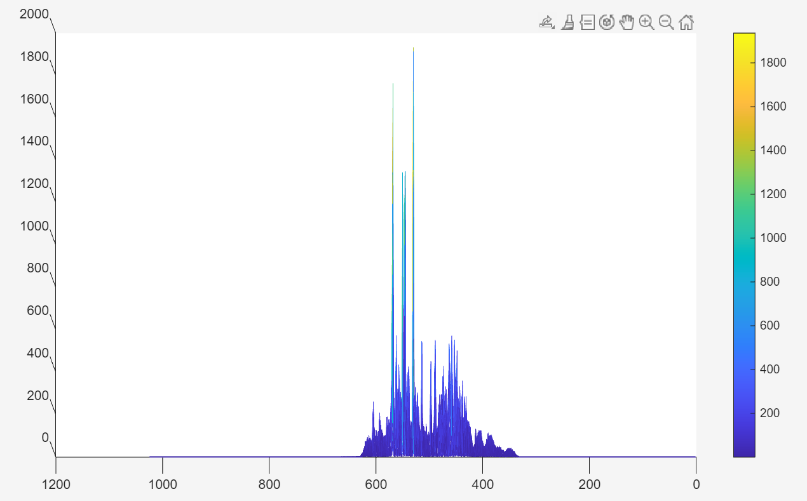
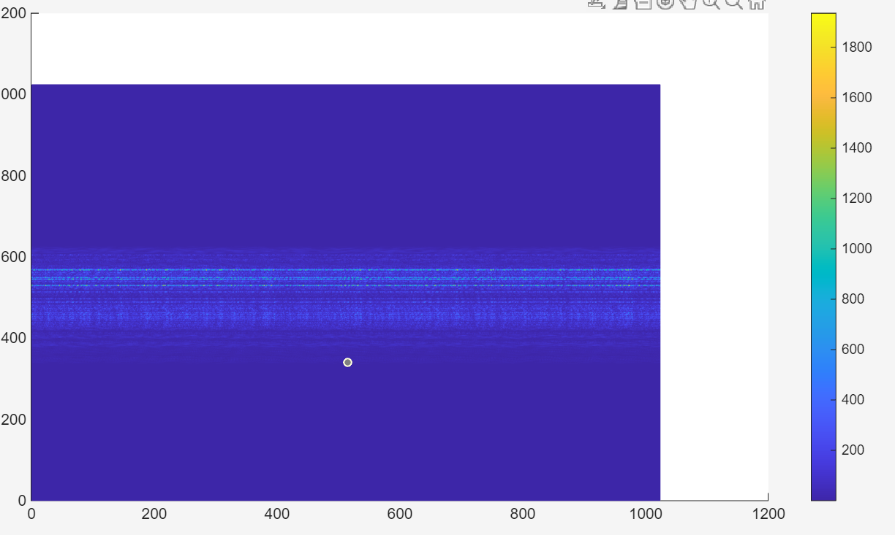
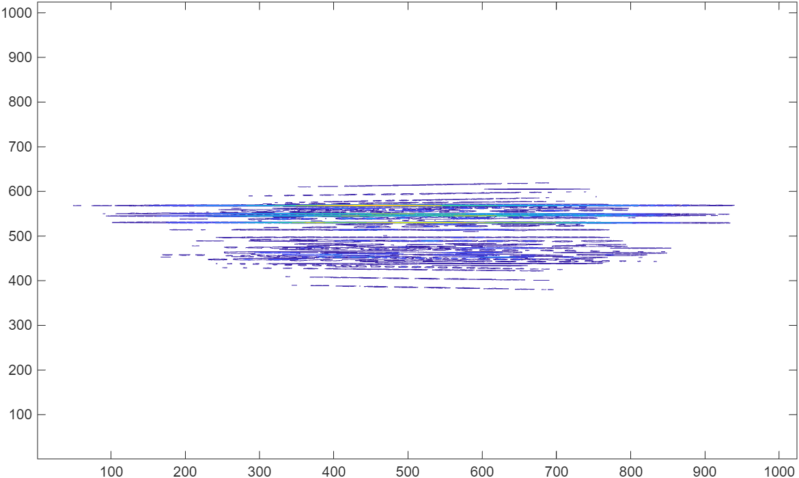
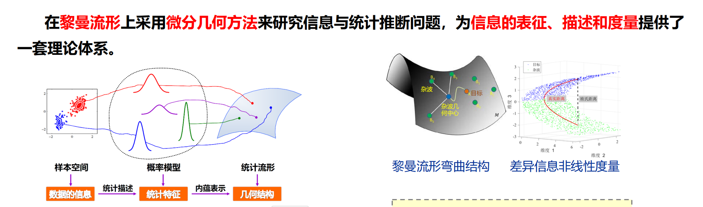
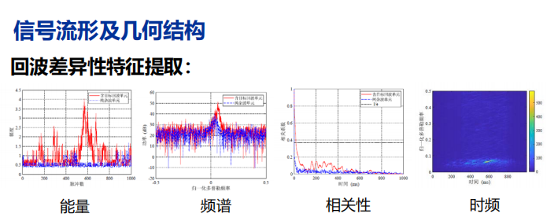
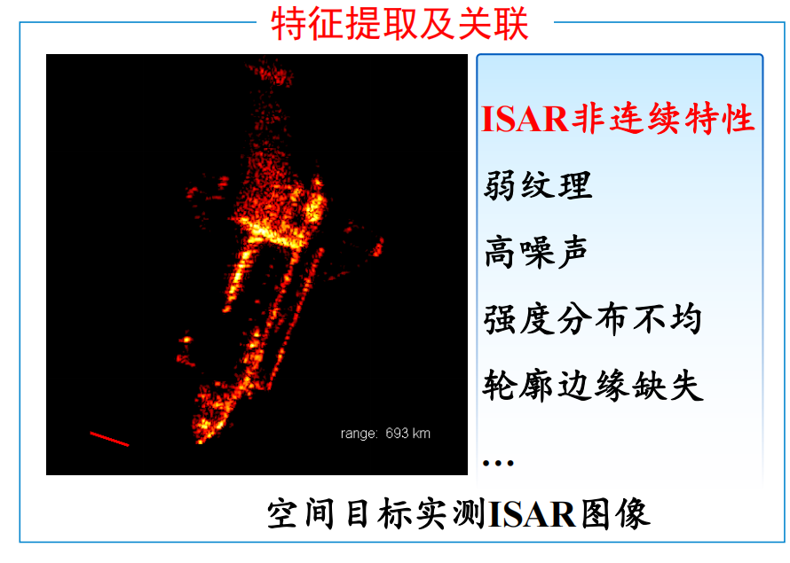
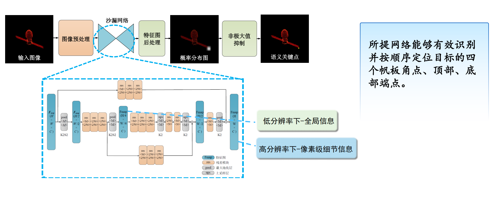

**周报**

1.还是在学成像内容，目前感觉还是不对。

目前感觉是积累时间太长的问题，最后给最后的成像的结果拉成长条状，导致最终成像还是很差。但是短CPI时间内的角度变化太少，最后结果也不好。

雷达学报博士论坛：

**信号内容：**

信息几何与传统的对比：

首先，非线性的处理方法，在短脉冲的时候减少能量泄露，不需要先验信息。

第二个，几何距离，更好的构建杂波和目标的距离

第三个，能量累计，会有泄露现象，失配现象。信息几何不需要对信号建模，不需要累计，能解决两个问题。

不同场景下的回波数据到特征建模的过程。

除了构建矩阵流形，也可以用其他方法去构建流行空间。

信息几何应用场景，非均匀具有理论的提升，短脉冲。

**ISAR内容：**

学习雷达系统设计的**动目标显示和杂波抑制**，以及**模糊函数**。