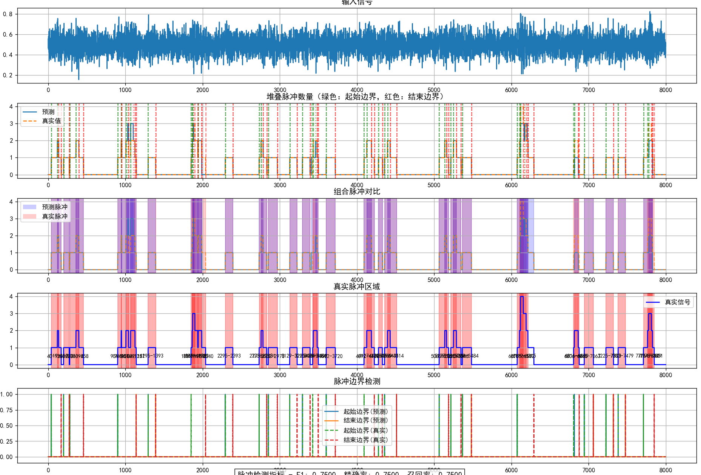

周报

上星期提出要做参数估计，我认为参数估计应该放在脉冲分选结果之后，然后把所有脉冲分选出之后，然后再做参数估计，做一些负反馈之类的东西，提高模型性能。

于是这周我把分选任务拆分，拆分成粗分类（脉冲定位），和细分类（堆叠判断），然后根据这俩的结果，先把脉冲预测出来，再搞参数估计。

**SNR(0db)**  目前粗分类的结果：

Similarity:    0.9855
Pixel Accuracy:0.9887
IoU:           0.9645

然后又查资料，想找到一种能把脉冲分选出来的模型，找到了一个DPRNN，但是这个针对于长序列任务，效果并不好，再找一些其他的论文，发现其过程和郑烨之前的工作大差不差（模型训练的方法），也没有找到相应的启发。

然后我就从脉冲数据出发，希望能互补的三个特征，帮助分选，最后决定以 堆叠区间，起始和中止沿，作为特征。

堆叠区间，起始和中止沿，参数

mean_similarity: 0.9965，overall_accuracy: 0.9974，mean_iou: 0.9957  脉冲预测对比。

这样可以再去做后面的参数估计，然后辐射源判别。

**-5db**

mean_similarity: 0.9810，mean_iou: 0.9770，overall_accuracy: 0.9862

**-10db**

mean_similarity: 0.9381，mean_iou: 0.9204，overall_accuracy: 0.8916