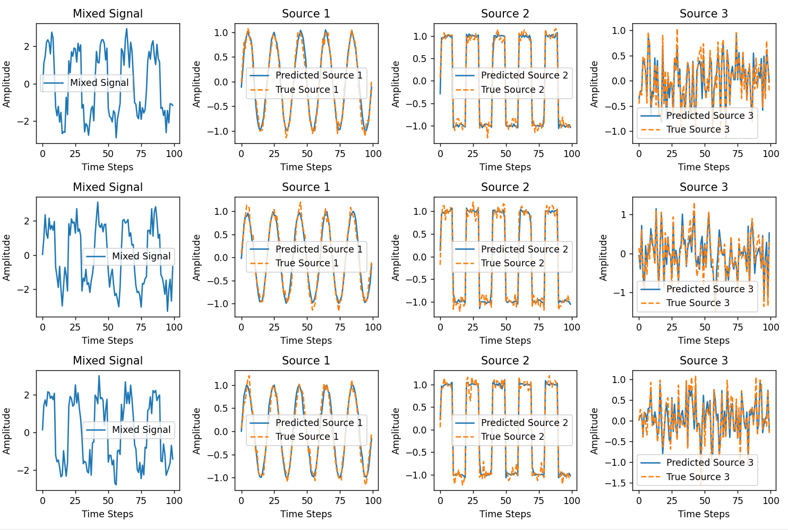
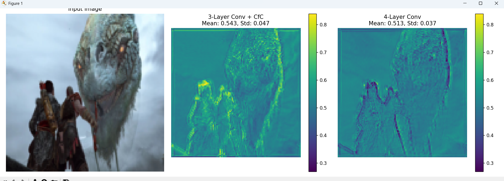

**2025.4.14 周报**

目前问题：

**针对于脉冲分离的情况**预测的信号 会出现这样的问题，在堆叠区域，其各个通道的会同时产生预测。

可以说是针对于这种情况，模型的分离能力不足，预测信心不足。

1.根据边界和重叠区域去再处理，但是感觉这种办法相当于二次解决了，目前没有去尝试。

2.尝试了一种新的网络LNN

处理动态信息，会比较好。

然后跑了一个简单的3中不同类型的信号分离

注意力范围

但是这个模型有确定，就是他的更新过程是根据ODE去求解，如果序列特别长，会有梯度消失的问题，而且这个模型训练速度很慢。