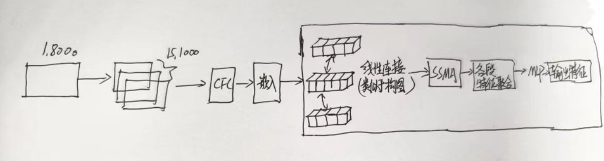

1. 本周主要是完成课程相关的大作业。

针对于模型的想法，我觉得对于Unet除了小的框架改变，其他的已经做不了什么改变了。

上周的想法 是想设计一个全局特征提取模块，去和Unet结合。

针对于这样的结构，阅读了关于不同的patch之间改怎么进行特征传递，怎么从单个patch实现全局网络特征的提取。

阅读了两个论文，一个是关于如何让图网络的特征聚合步骤更有效。

另外一个是关于不同通道信息的聚合然后做各通道预测。

感觉目前的任务，不同的patch间 更像是隐藏的链式关系，所以下周会采用链式构图的方法，来重新做分选任务。

针对于各个通道的预测会同时产生，我目前还没有什么头绪，下周看有没有类似于通道竞争的方法，来避免这种情况。