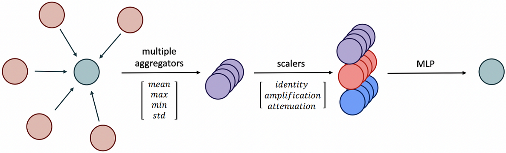

### **Sequential Signal Mixing Aggregation for Message Passing Graph Neural Networks **   NIPS 

传统的聚合方法

SSMA 

这是一个新的图网络的特征聚合方法，对于节点的特征，通过仿射变换，将特征扩展到矩阵，然后对其进行FFT计算，将分离幅度和相位。

使用均值让幅度聚合，使用加法让相位聚合。 聚合后进行逆FFT变换 再经过MLP 压缩回共有的特征维度。

理论证明了，求和的聚合器邻居混合能力的上界，证明其邻居混合能力有限 和 广义 DeepSets 多项式系数构成分离不变量集合的原理。

### **SOFTS: Efficient Multivariate Time Series Forecasting with Series-Core Fusion**    NIPS 

这个是一种通过多通道的时间预测的论文。

其主要的贡献就是只用了MLP ，就实现了多通道特征的聚合。

其STAR聚合模块 ： 各个时序输入特征映射到模型所需的特征空间， 然后在训练时经过MLP 处理，然后计算通道权重，选择权重随机选择通道特征 ，然后依次复制到 原始特征， 然后再经过MLP 融合输出。