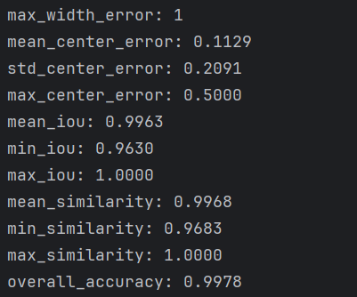
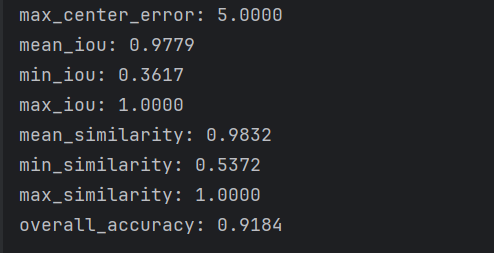

周报

1.实验了3个PRI变换，2个脉宽和PRI都变换。

- 基础脉宽： base_Ts = 1e-4 (100μs)
- 脉冲重复间隔(PRI)： Tp = 1e-3 * (2 + 2*np.random.rand()) (2-4ms随机)
- PRI变化范围： change_PRI = 0.2 (±20%)
- 脉宽变化范围： change_Ts = 0.5 (±50%)

堆叠和边界最后结果和不带脉宽变换差不多，但是真实预测的情况下，如果两个脉宽设置的过于相近，会让这两个出错。会把一个信号完全判断成两个都同时存在。

然后又跑了郑烨的基础模型，在相同的训练策略的情况下，发现在0DB时候效果只比这个差一点。

2.想给模型的加上局部＋整体的分析过程，但是加入模型里面之后效果不好。

局部是CNN，整体是前两层CNN，后两层transformer，将特征做MLP特征变换，设置门控机制去融合，然后去当作真正的encoder。

后面看看还有没有办法去加。