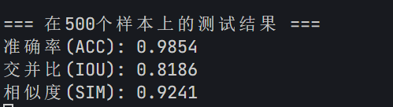

目前已经实现了的功能：

效果上

1.低信噪比下，分选性能的提升。

2.模型的轻量化，模型的参数和复杂度的减少。

模型上

因为最后要搞重建工作，所以Unet的框架就不会大变换了，类似工作的**语言分离**上面，没有什么很新的模型，都是一些比较计算复杂度极高的模型，去年NIPS上还有一个把Unet的特征提取部分（传统的CNN）全部层替换成Transformer来做的，目前没有人用mamba去做分离工作。

因为这个任务是长序列任务，很多的模型不能很好的使用，但是如果把输入切片，这会产生信号中断，这可能会有一定的影响。

采用了原本的模型框架 + Mamba2 去测试了一下结果(0db，3200个训练，800个验证)

消融（减去可变卷积）

**准确率(ACC): 0.9776**
**交并比(IOU): 0.7331**
**相似度(SIM): 0.8806**

郑烨的结果

**准确率(ACC): 0.9640**
**交并比(IOU): 0.5999**
**相似度(SIM): 0.8000**

然后又试了两个模型

1.深度可分离模型

**准确率(ACC): 0.9505**
**交并比(IOU): 0.4442**
**相似度(SIM): 0.7279**

2.深度可分离模型+可变卷积

**准确率(ACC): 0.9475**
**交并比(IOU): 0.4102**
**相似度(SIM): 0.7100**

3.可变卷积＋transformer（第四层）

**准确率(ACC): 0.9817**
**交并比(IOU): 0.7742**
**相似度(SIM): 0.8964**

如果在每一层都加上transformer，那么模型计算复杂度极高，训练过程极慢，自己电脑上跑不动，服务器上感觉有些问题，也是训不动，其他模型也一样。

可以看出，针对于这个任务，尤其是在**低信噪比情况下**，是否加上具有**全局建模能力**，是至关重要的。

针对于这一点，可以写一个类似于全局特征提取，和局部特征提取，郑烨的并不具备全局建模的能力，这个算是一个改进。

补：（训练6400，验证1600）800个样本测试的结果。

准确率(ACC): 0.9864
交并比(IOU): 0.8288
相似度(SIM): 0.9276

这个结果应该是和之前不加mamba，全部使用卷积的情况差不多，因为郑烨的数据设置里面有辐射源为2，3，4的情况。这三种占了百分之60，我的测试辐射源被设置为5，这会导致其数据要比我设置的要简单。

