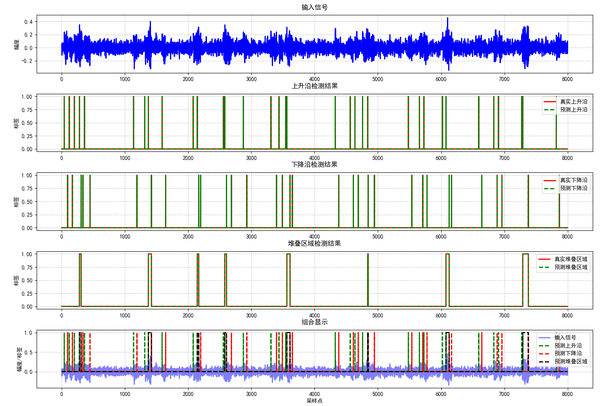

**1**.本周看了论文，然后列了一个大概的论文提纲，然后去做对应的模型补充。

**1. 引言**

任务介绍，传统PRI方法，脉冲参数密度聚类，深度学习。

**2. 问题描述**

2.1 信号形式

2.2 不同PRI

2.3 场景

**3. 神经网络设计**

3.1 数据预处理过程

3.2 脉冲流特征提取过程

3.2.1 局部特征提取模块

3.2.2 全局特征提取模块

3.3 多尺度注意力融合过程

**4. 实验结果与分析**

**4.1实验数据组成**

表格1（五个抖动PRI调制）

表格2（不同PRI调制混合）

表格3（三个抖动PRI调制，两个在脉冲流内的随机变换）

实验数据处理

（归一化处理）

**4.2实验结果分析**

1. 不同信噪比下的实验结果(**分选结果，堆叠结果，起始沿和下降沿结果**)

1. 不同PRI的实验结果。
2. 三个抖动PRI调制，两个在脉冲流内的随机变换。
3. 对比实验与模型的参数量和计算复杂度

**4.3消融实验**

**2**.试着在可变卷积加上频域的内容，然后整个模型就不会有大的变换了。

**下周任务**

加上频域内容，继续晚上论文的文字内容，写一个完整的版本。

