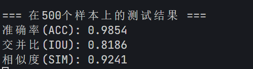
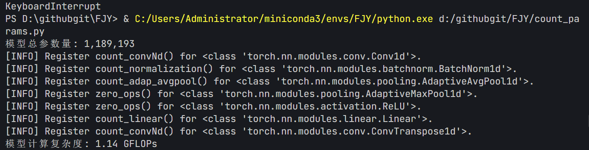
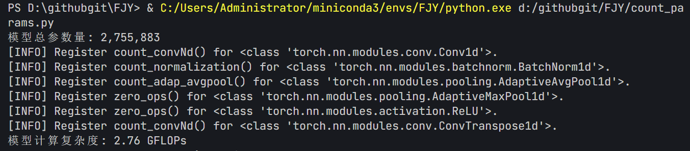
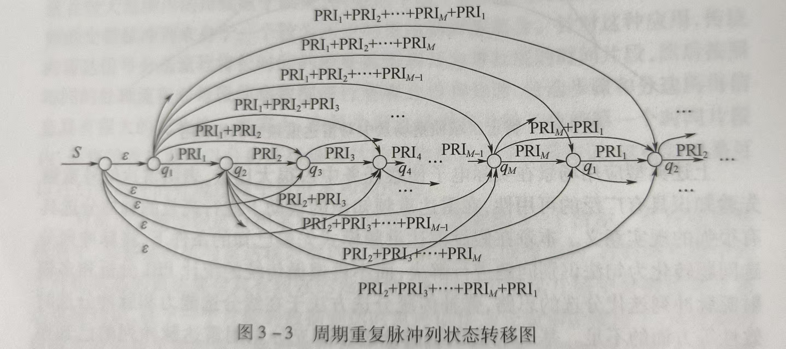
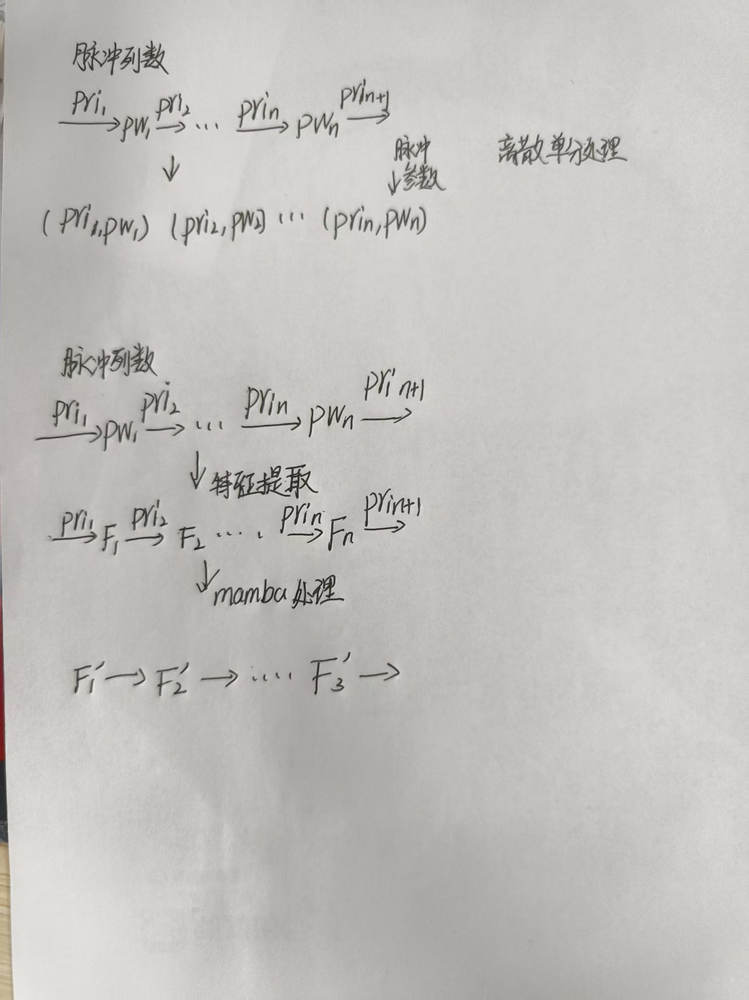

**1.** 本周采用了原本的模型框架 + Mamba2 去测试了一下结果(0db，3200个训练，800个验证)

郑烨的结果

**ACC: 0.9676, IOU: 0.6362, SIM: 0.8238**

在训练输入少一半的情况下，效果比郑烨的在20db（实际15左右）的情况下要好一点。

目前的参数量和复杂度：

参数量和复杂度为郑烨的百分之43。

然后我又找了一个根据近似微分方程的方法来去改进。发现最后模型复杂度太高，训练速度过慢就放弃了。

1.我还想在模型上加上一些其他的东西，下周继续改一下模型,下周想试一下能不能在mamba2的框架上，用上能量信息，去做到一个类似于交叉注意力的功能，这块目前没人做。

2.

这个周期脉冲序列状态转移图，和mamba的思路很相似，因为mamba实现了类似的状态空间模型计算。

这种能够捕获时间段内的长距离依赖关系，适应不同的PRI间的调制类型。

感觉这个点是不是可以写一下，目前深度学习的论文里，没有通过状态空间模型来写的。

**2.**复习深度学习，准备深度学习的考试和大作业。

