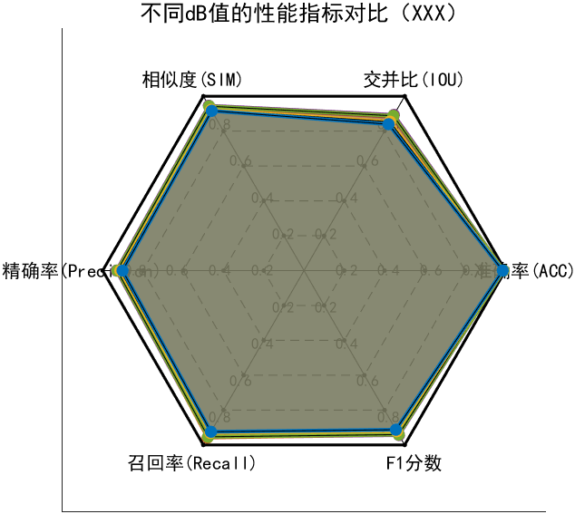

**周报**

1.状态机

目前设置了一个简单的状态机

- 状态机有三个状态：BUILD (建立)、TRACK (跟踪) 和 DORMANT (休眠)
- 初始时，每个新检测到的脉冲创建一个新的 BUILD 状态轨迹
- 当轨迹积累到足够多的脉冲 (MIN_HITS=3) 时，计算其 PRI 并转入 TRACK 状态
- 跟踪过程中，通过预测下一个脉冲到达时间与实际检测时间比较进行关联
- 如果连续多次 (MISSES=3) 未关联到脉冲，轨迹转入 DORMANT 状态并最终被移除

目前是使用简单的能量门限检测器进行脉冲检测。

最终没有搞聚合起来，后面改一下，通过根据脉内的一些参数去建立状态，然后再做测试。

2.完整的跑了一个对比实验，目前但是模型可能还需要改一下，总体框图没有画。

2.目前雷达原理的课程看完了，我需要综合性的去整理一下。

3.完成**预测控制**的报告。

下周要完成预测控制的仿真作业。