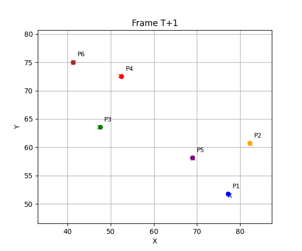
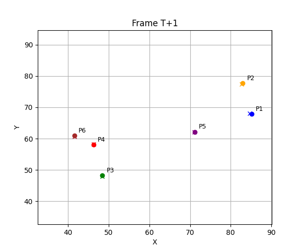
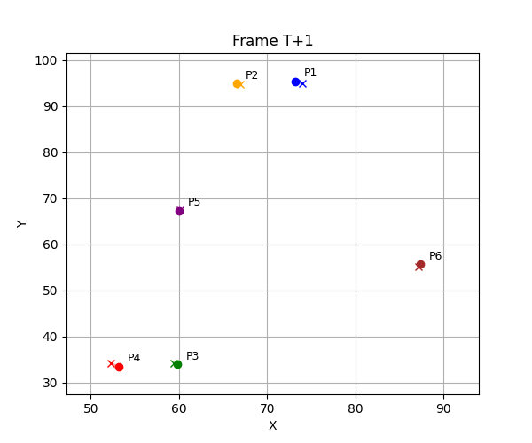
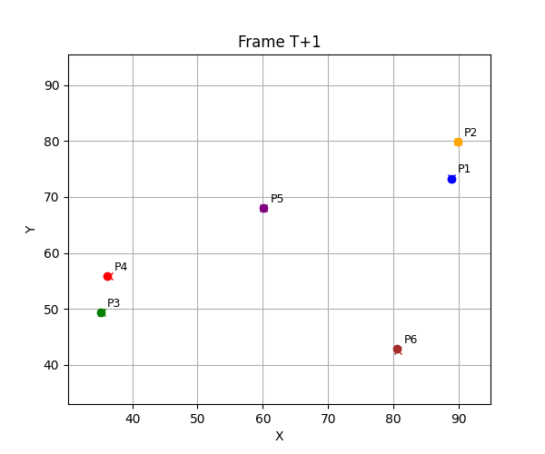
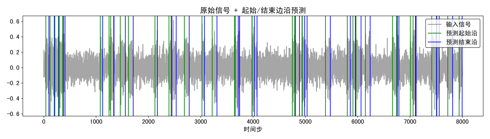
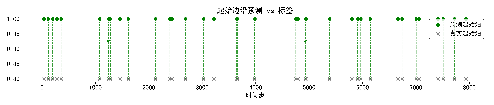
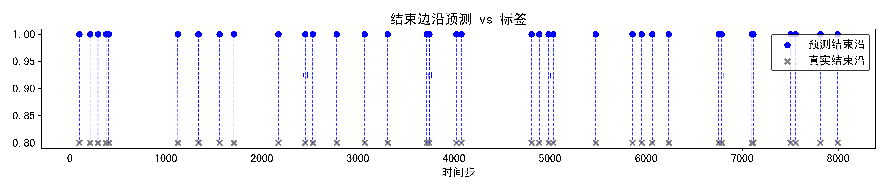

**周报**

**论文阅读**

未来学习HMM，可能需要更精确的去处理时间序列，因此学习了

**Neural ODEs: breakdown of another deep learning breakthrough**

神经网络常微分方程

可以把时间间隔作为动态演化的一部分。

最近看了一个模型，感觉对于时序预测很强，然后我就去拿光学图像的关节点去做一个轨迹预测。将ODE由通过积分器处理变换成闭式表达解析解，保留了 ODE 模型“连续时间建模”的优点，同时通过闭式表达减少了数值解算的成本和不稳定性。

数据集的运动轨迹大概为90帧为一次 完整的短时预测。做20帧预测10帧。

单周期运动

✅ 全部预测点总 RMSE: 0.18
✅ 平均每个点的欧氏距离误差: 0.26

每搁两帧率进行预测

✅ 全部预测点总 RMSE: 0.34
✅ 平均每个点的欧氏距离误差: 0.32

单周期运动，随机消去**百分之20**的点结果

单周期运动，随机消去**百分之30**的点结果

**论文**

目前正在补消融实验，补美化一下实验结果图

预测图加放大图

起始沿下降沿预测结果

第一个为总的预测图

下面两个补上预测和真实的起始沿，终止沿图， 把差的位置标在图中

堆叠区域预测结果

然后5个辐射源，5种不同的PRI调制，这个数据集还在改，如果数据集随机性太小，效果非常好，但是没有意义，如果抖动调制过大，就会导致模型性能不好。

**学习内容**

基本的学习了关于HMM模型的一些基本内容

1. 前向，后向算法
2. 维比特算法
3. Baum Welch算法
