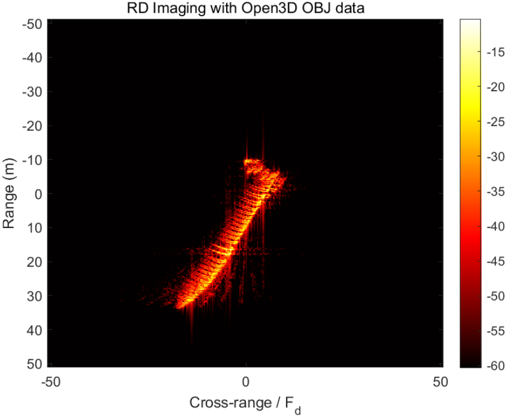
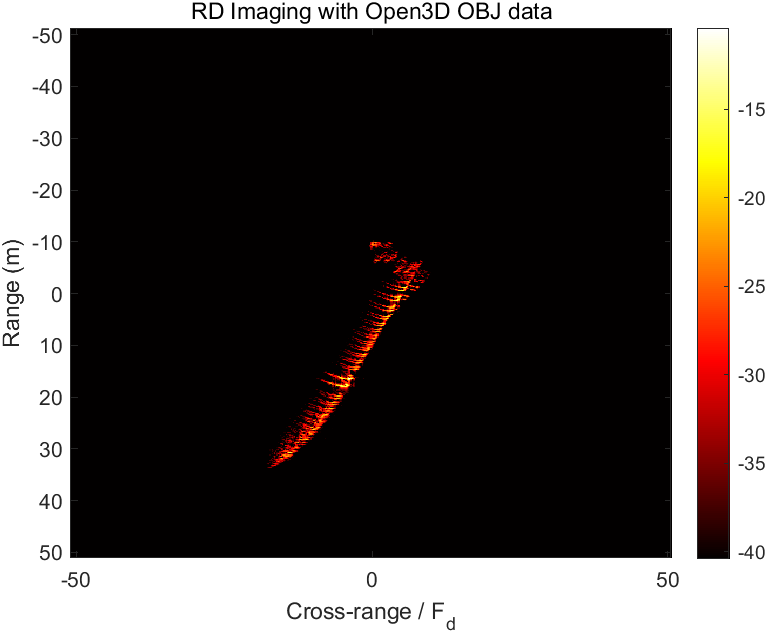
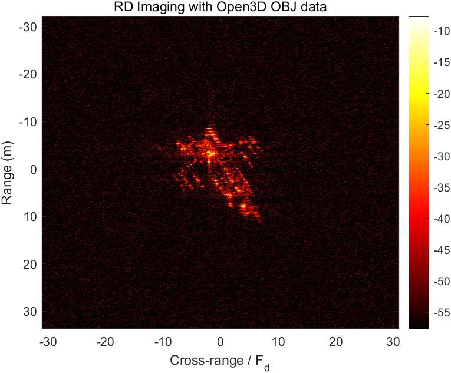
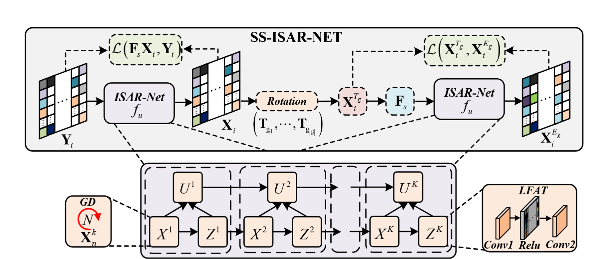
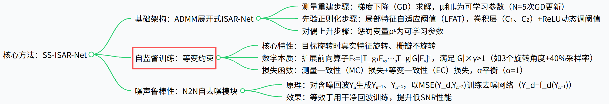

**1.论文**

**2.ISAR成像：**

目前找的博士毕业论文（高分辨ISAR成像与精细化运动补偿技术研究_邵帅）去看的，感觉还没有完全理解。但是大体过程理解了。然后去改的代码，自己去仿真。

3D模型：spaceX BRF

距离维像素数512,方位维512,距离分辨率0.2,方位分辨率0.2,载频10e9,积累时间1.5

加噪30dB

歼20：

这个还需要时间去学习一下，没有完全搞懂，怎么根据目标去设置系统的参数。

**3.关于稀疏ISAR成像：**

1.模型设计

目前常见的网络都是通过将优化算法中某一个步，用网络去替换。然后优化其迭代过程。

Self-Supervised-ISAR-Net  Enables Fast Sparse ISAR  Imaging （北理工）

这个可以后面继续再读一下，感觉内容挺好的，实验的效果也挺好。

2.干扰部分

1.微动部位特征提取：SVD，将其分解为低秩和稀疏两部分；

2.高斯白噪声：这个很多。

3.强散射点干扰，这个目前没有了解

搞这部分，我可能需要抽时间去详细学一下凸优化的问题。

