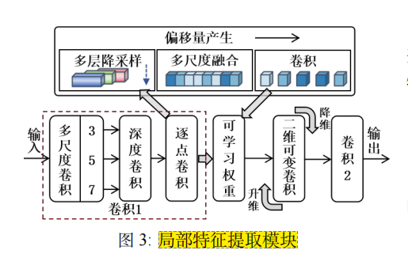
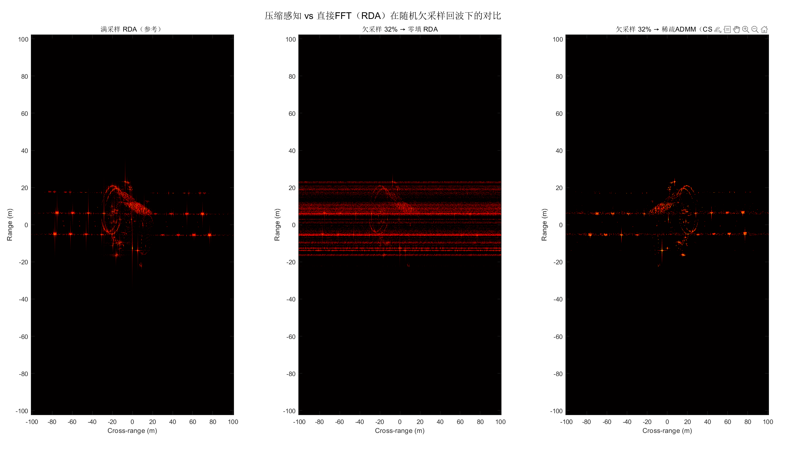

**1.论文内容**

**1).**论文部分很大一部分修改的点就是要把内容联系背景。没有说明这个模型是针对雷达分选任务去设计的，这个后面需要加一些把模型内容关联上。

**2).**论文后面没体现强干扰场景。

**3).**论文画图，没有突出雷达分选任务。(没有和背景对应)

**4).**实验评价指标给出怎么定义的(这个是否需要写公式)

**2).这个点可以后面用英文去加一些，类似于脉冲丢失这种，之前相加脉冲丢失，但是感觉没必要，因为丢失的不会检测。**

**2.ISAR成像**

这个我感觉我还需要大概两星期再去学一下。我是想做一个，从目标运动，3D点云提取（调用open3D库），到成像，都整合成一个系统。目前存在的问题，还没有解决.

