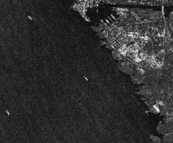
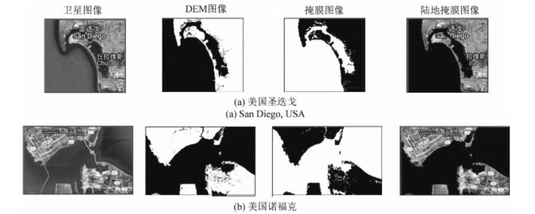
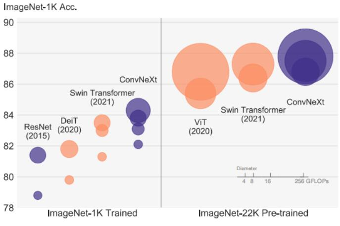

# SAR Ship-Detection 

## 1-SUN Xian (Keywords: SAR ship detection，Public dataset) 
中科院
### Publications
   - **AIR-SARShip-1.0: High-resolution SAR Ship Detection Dataset**  [paper](https://radars.ac.cn/en/article/doi/10.12000/JR19097) 
   - AIR-SARShip-1.0：高分辨率SAR舰船检测数据集 [paper](https://radars.ac.cn/article/doi/10.12000/JR19097)
  - 2022/11/20
  - comments by WYC: SAR图像舰船检测公开的数据集比较有限，基于高分三号卫星数据，构建了一个面向宽幅场景的数据集，该数据集有更多的近岸和岛礁，更贴近真实场景，且分辨率更高。数据集按照PASCAL VOC格式标注，保存为XML格式。Train和Test按照2：1比例分配。
  - conclusion by WYC:此数据集存在两个问题，一是影像数量太少(31张)，二是单张影像太大(3000*3000)，使用时应该要进行剪切。
  -  
## 2-LeiYu (Keywords:Google Earth Engines，遥感云计算，舰船检测)
国防科技大学
### Publications：
   - **基于Google Earth Engine的海量舰船目标SAR图像处理应用研究** [paper](https://www.signalpro.com.cn/cn/article/doi/10.16798/j.issn.1003-0530.2021.06.019)
   - 2022/11/24
   - comments by WYC:GEE平台海量的数据存储能力和强大的运算能力，可以应用在大范围海域的海量舰船检测方面。论文中利用GEE平台的Sentinel1 SAR卫星数据集剪切出一些港口的SAR图像，然后通过"NASA SRTM Digital Eleva tion 30 m"数据集获得相应图像的陆地掩膜，将陆地Mask掉只留下海洋区域减少误差。在得到只有海洋背景下的图片后，通过设置阈值，利用最大类间方差法(OTSU)过滤得到目标舰船。
   - conclusion by WYC：论文用的是传统的图像处理方法进行舰船检测，感觉参考意义不大，但是文章使用的数据集得到的图像质量比较好，无论是利用神经网络还是传统方法进行舰船检测，陆地都会有干扰，可以借鉴文章的方法减小陆地带来的误差。
   -  
# Deep Learning

## 1-Liu Zhuang (Keywords: Vision Transformer，Convnet，RenNet)
Facebook AI Research，UC Berkeley
### Publications
   - **A ConvNet for the 2020s**  [paper](https://arxiv.org/abs/2201.03545)  [github](https://github.com/facebookresearch/ConvNeXt)
   - 2022/11/22
   - comments by WYC：由于ViT的诞生，transformer越来越火，但是卷积神经网络还没有被完全开发。文章提出了一种名为ConvNext的纯卷积神经网络，与Swin Transformer对标，通过学习ViT的训练策略，改变ResNet的训练技巧，例如改变ResNet的Block的堆叠次数，改变激活函数，把BN换成CN等等策略。
   - conclusion by WYC:论文主要讲了ConvNext主要做了那些训练策略的改变，修改网络不一定要修改网络结构，也可以修改训练技巧。
   -  

  

