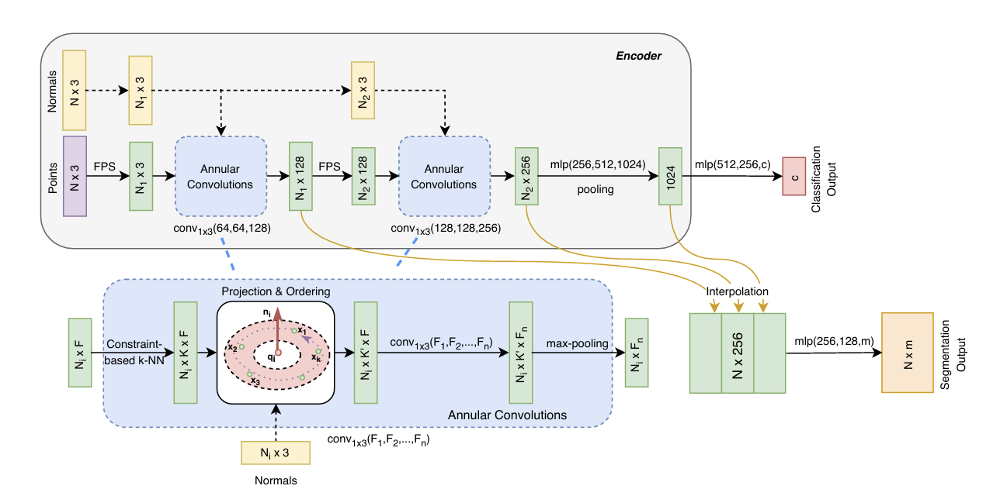
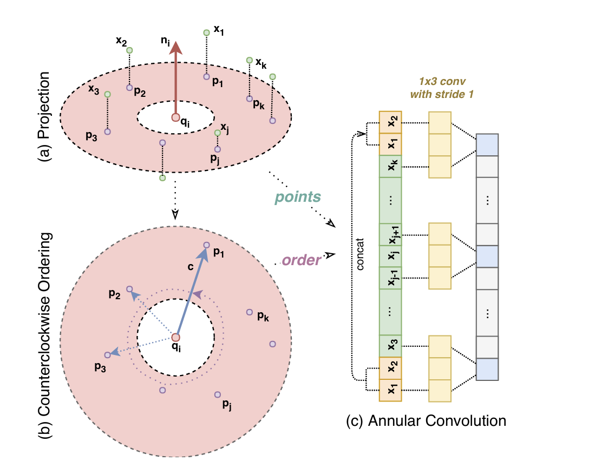
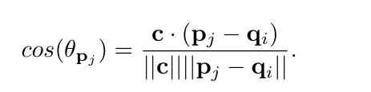
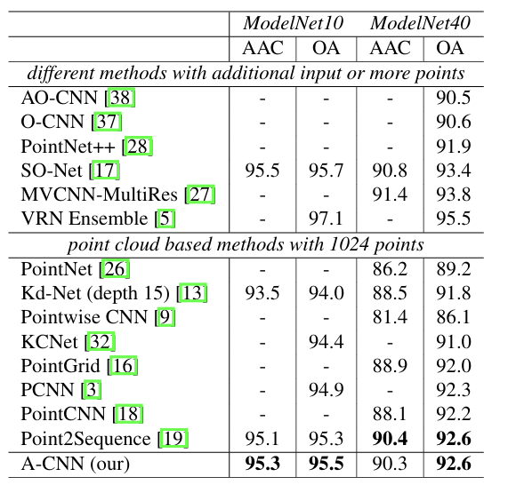
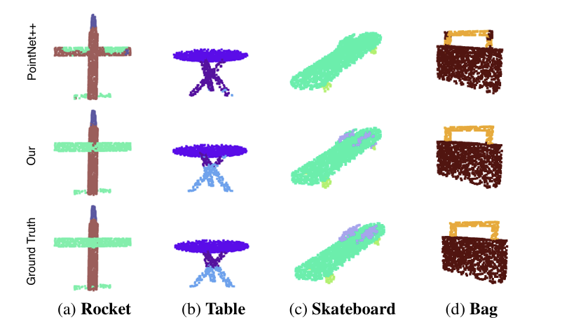
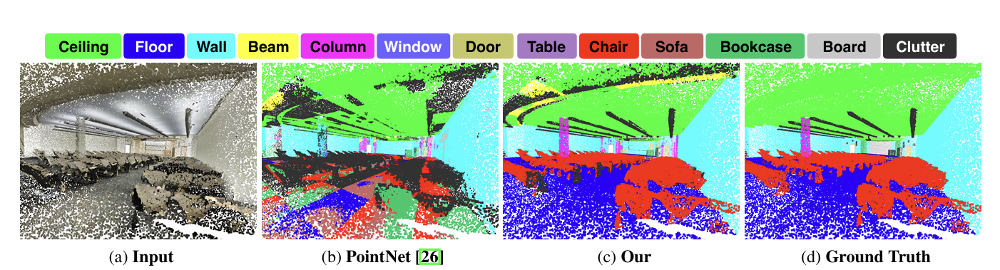
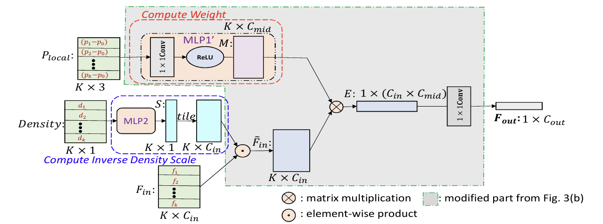
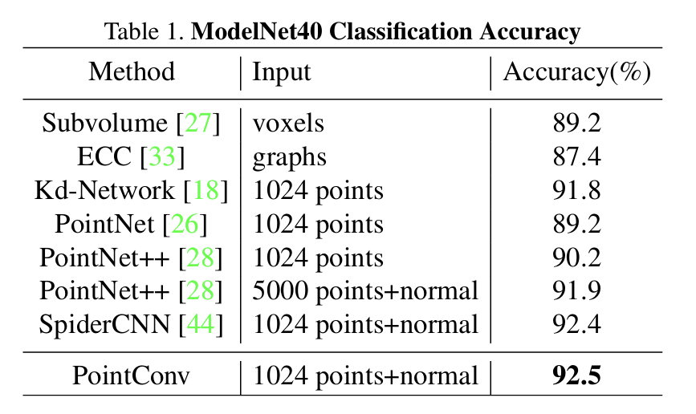
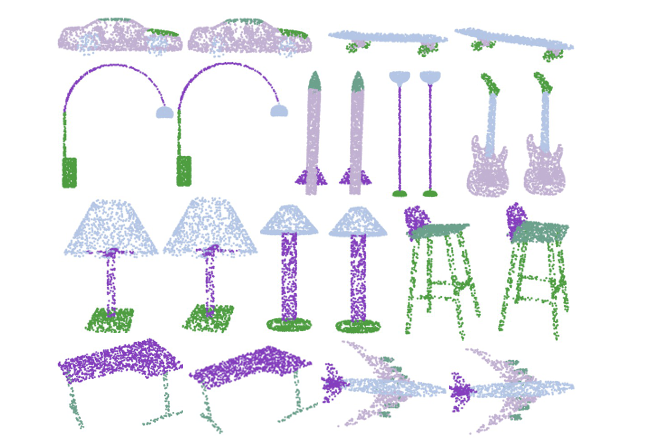
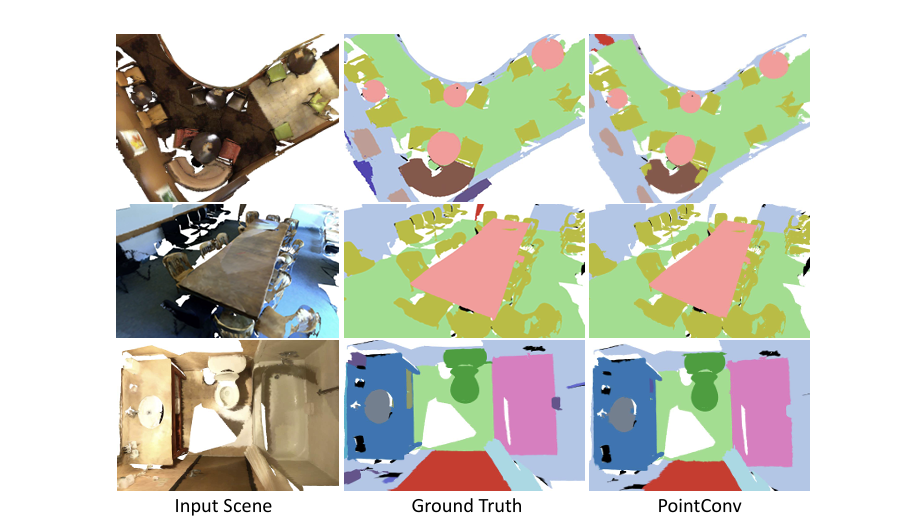

# 点云分割、分类 Point Convolution based 两篇
## 1篇-Artem Komarichev
-Department of Computer Science, Wayne State University, USA

### A-CNN: Annularly Convolutional Neural Networks on Point Clouds 【CVPR2019】[paper](https://arxiv.org/pdf/1904.08017)

- 2025/1/22

本文提出了一个定义点云卷积的新方法，提出的环形卷积方法可以在每个本地环形区域内定义任意大小的卷积核，从而有助于获得对3D物体更优的几何表示。

## 框架

- 输入：点（Points, N x 3）输入的点云数据，每个点由其三维坐标表示。

- 约束 k-NN 搜索（Constraint-based k-NN Search）：对于每个中心点，搜索其在指定半径内的k个最近邻点。确保每个环中的邻近点是唯一的，没有重叠。

- 投影:一个查询点 qi和其邻近点 x1,x 2,…,x 
k。每个点都有一个法线向量 ni；
将邻近点 xj 投影到查询点 qi 的切平面上，得到投影点 pj；

- 逆时针排序：计算每个投影点 pj 与参考方向 c 之间的角度  根据计算的角度对投影点 pj 进行逆时针排序，得到有序的点序列；

- 环形卷积：将排序后的点序列 [p1,p2,…,pk] 复制并拼接，形成一个循环数组，在循环数组上应用卷积操作，卷积核大小为 1×3，卷积后的特征图包含每个点及其邻域的几何信息。

## 结果

- 分类任务（ModelNet10/40）

- 部件分割

- 语义分割

# 1篇-Wenxuan Wu
- CORIS Institute at Oregon State University
## PointConv: Deep Convolutional Networks on 3D Point Clouds 【CVPR2019】[paper](https://arxiv.org/pdf/1811.07246)

提出了一个卷积运算，它将传统的图像卷积扩展到称为 Point Conv 的点云中。使用 MLP 来近似权重函数，然后应用密度尺度来重新加权学习的权重函数。

- 输入：局部点云的相对坐标，大小为 K×3
- 计算权重：使用 MLP1（多层感知器）对局部坐标进行处理，得到权重矩阵 W
- 计算逆密度尺度：补偿点云数据的非均匀采样问题，对高密度区域的点进行降权，对低密度区域的点进行升权。使用 MLP2 对密度信息 Density 进行处理，得到逆密度尺度 S，通过 tile 操作将 S 扩展到 K×Cin。
- 特征加权：将输入特征 Fin与逆密度尺度 S 相乘； 将加权特征与权重矩阵 W 进行卷积

##  结果

- 分类任务

- 部件分割

- 语义分割

