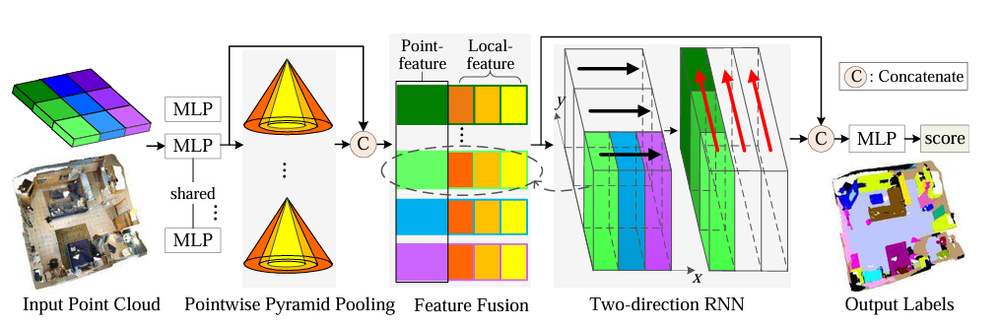
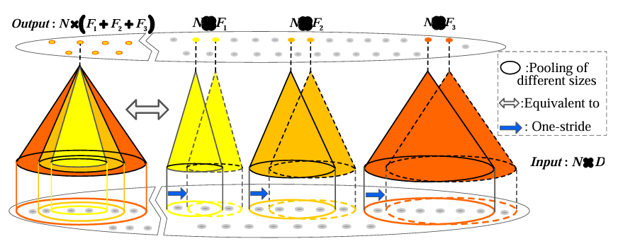
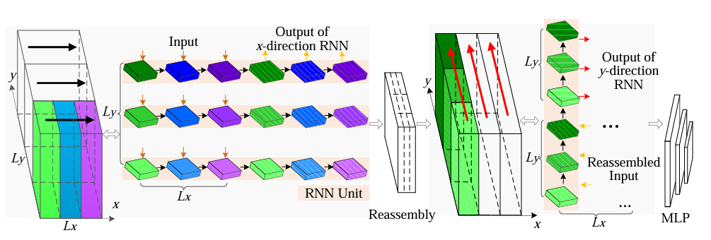
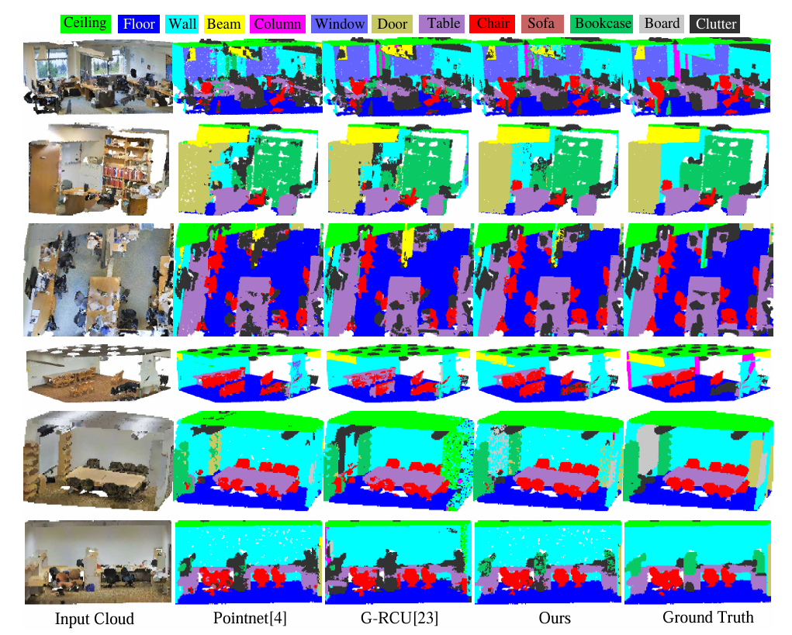
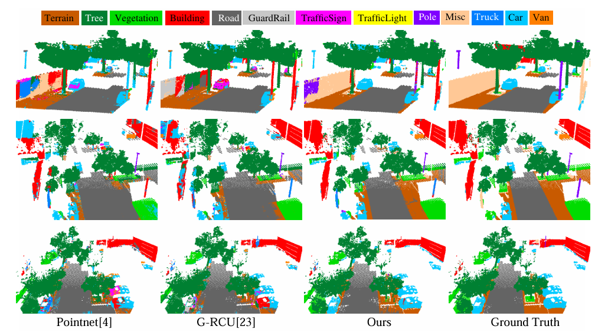
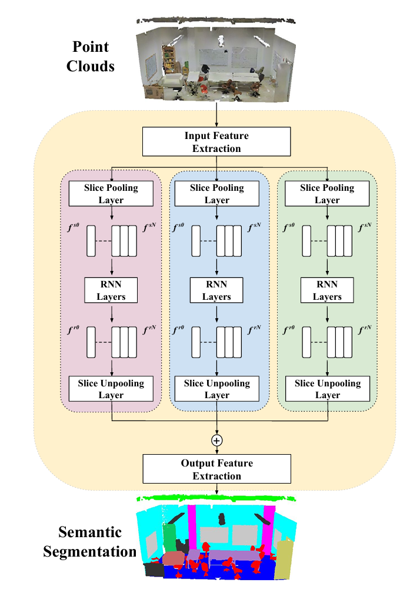
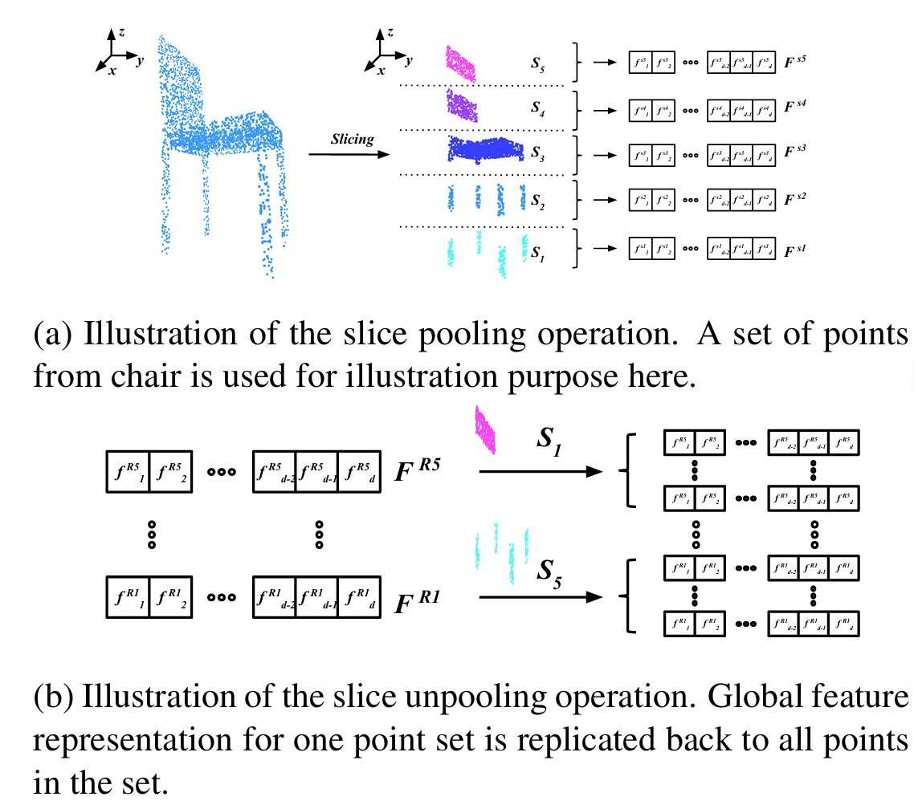
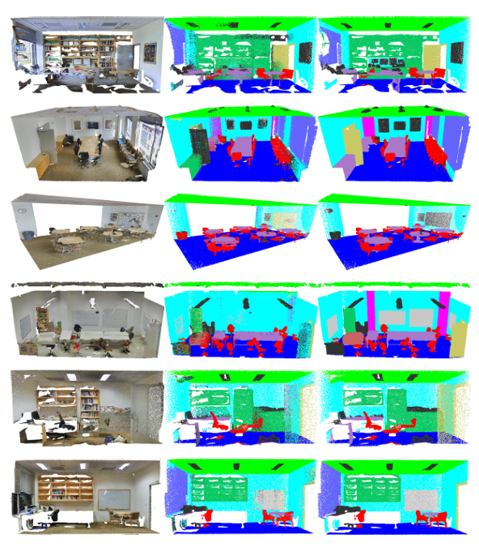
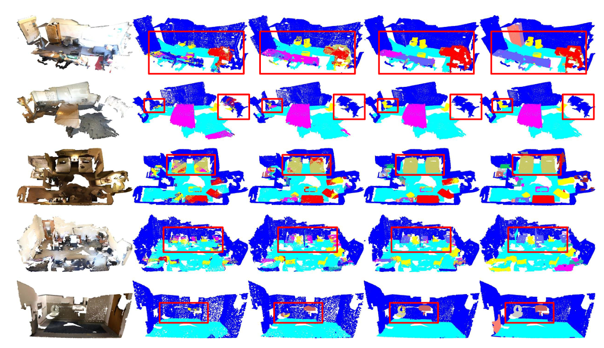

# 点云分割、分类 RNN based 两篇
## 1篇 - Xiaoqing Ye
-Shanghai Institute of Microsystem and Information Technology, Chinese Academy
 of Sciences, Shanghai, China

### 3D Recurrent Neural Networks with Context Fusion for Point Cloud Semantic Segmentation 【ECCV2018】[paper](https://openaccess.thecvf.com/content_ECCV_2018/papers/Xiaoqing_Ye_3D_Recurrent_Neural_ECCV_2018_paper.pdf)

- 2025/2/10

构建一个新的3P-RNN来实现点云的语义分割。首先，构建了一个高效的金字塔池化模型（pyramid pooling module）来提取3D点云的局部信息，再通过一个双向的RNN提取空间的点云全局依赖性。两个RNN通过不同的方向扫描3D空间提取信息，最终达到良好的3D语义分割的效果。

## 框架

- 输入：输入是一个无结构的3D点云数据，每个点包含空间坐标（X, Y, Z）和颜色信息（RGB）。

- 点金字塔池化 (Pointwise Pyramid Pooling)：将点云数据划分为多个小块（blocks），每个小块沿地面平面（x-y平面）划分为1.5m × 1.5m的区域。在每个小块内，使用多尺度的金字塔池化模块（3P）来捕获不同尺度的局部结构。

- 多层感知机 (MLP): 使用多层感知机（MLP）对每个点进行特征提取。

- 三个不同尺度的池化操作，分别用不同颜色的金字塔表示（黄色、橙色、红色）。每个金字塔代表一个不同大小的池化窗口。

- 池化窗口: 每个池化窗口覆盖一定数量的点，通过最大池化（max pooling）操作提取该窗口内的特征。

- 一阶池化 (One-stride): 池化操作在每个尺度上都是一阶的，即池化窗口的步长为1，确保每个点都被池化操作覆盖。

- 特征融合: 每个尺度的池化结果被拼接在一起，形成一个多尺度的特征表示。

- 输出特征 (Output: N × (F1 + F2 + F3)): 输出是一个N × (F1 + F2 + F3)的特征矩阵，其中F1、F2、F3分别表示不同尺度池化后的特征维度。

- 输入点云数据 : 输入是一个3D点云数据，数据被划分为多个小块（blocks），每个小块沿x和y方向分别排列。

- 点云数据沿x方向被划分为多个小块，每个小块包含一定数量的点。每个小块的特征通过RNN单元进行处理，RNN单元依次处理每个小块的特征，捕获沿x方向的长距离的语义关联。

- 重新组装 (Reassembly): 经过x方向RNN处理后的特征需要重新组装，以便进行y方向的RNN处理。重新组装的过程是将x方向处理后的特征重新组织成沿y方向排列的小块。

## 结果

- 语义分割  (indoor S3DIS dataset)

- 语义分割  (outdoor vKITTI dataset)

## 1篇 - Qiangui Huang
-University of Southern California Los Angeles, California

### Recurrent Slice Networks for 3D Segmentation of Point Clouds [paper](https://arxiv.org/pdf/1802.04402v1)

- 2025/2/17

设计了一个Recurrent Slice Network (RSNet) 来实现对点云数据的3D语义分割（semantic segmentation）任务。

## 框架

- 输入点云（Point Clouds）：输入是原始的点云数据，这些数据是无序的3D点集，每个点可能包含坐标（x, y, z）和颜色信息（RGB）。

- 输入特征提取（Input Feature Extraction）：这个模块对输入的点云进行初步处理，生成每个点的独立特征表示。它使用多个1×1的卷积层来提取特征。
  
- 输出特征提取（Output Feature Extraction）：这个模块对经过局部依赖模块处理后的特征进行进一步处理，生成最终的语义分割结果。它使用多个1×1的卷积层来提取特征，并输出每个点的语义标签。

- 切片池化层（Slice Pooling Layer）：点云数据沿着某个轴（例如 z 轴）被切分成多个切片（S1, S2, ..., S5）。每个切片包含了一部分点云数据。切片的目的是将无序的点云数据转换为有序的序列，以便后续的处理。

- 切片反池化层（Slice Unpooling Layer）：切片反池化层将RNN层更新后的特征复制回每个切片中的所有点。具体来说，对于每个切片 Si，其对应的全局特征向量 f^Ri 被复制到该切片中的所有点。

## 结果

- 语义分割  ( S3DIS )

- 语义分割  ( ScanNet )

