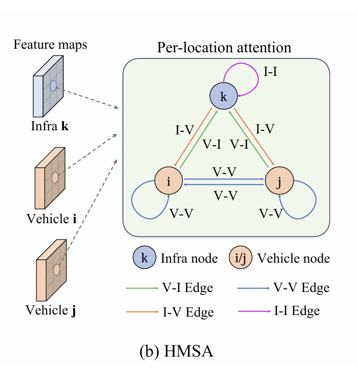
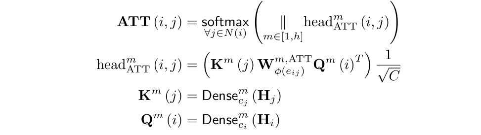
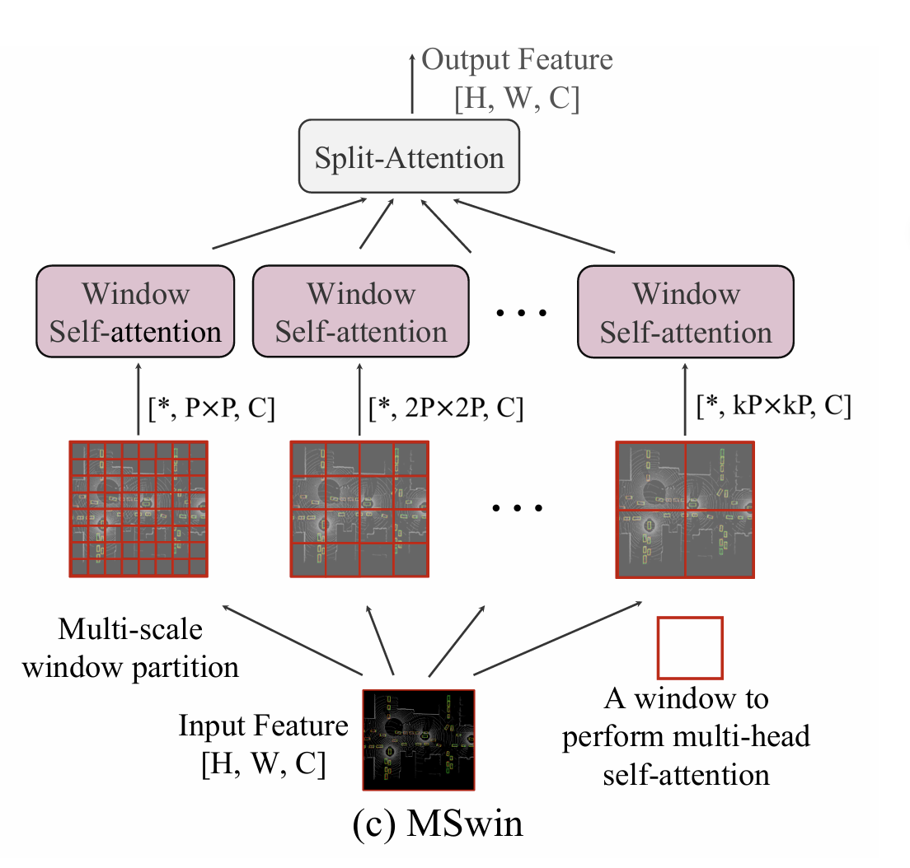
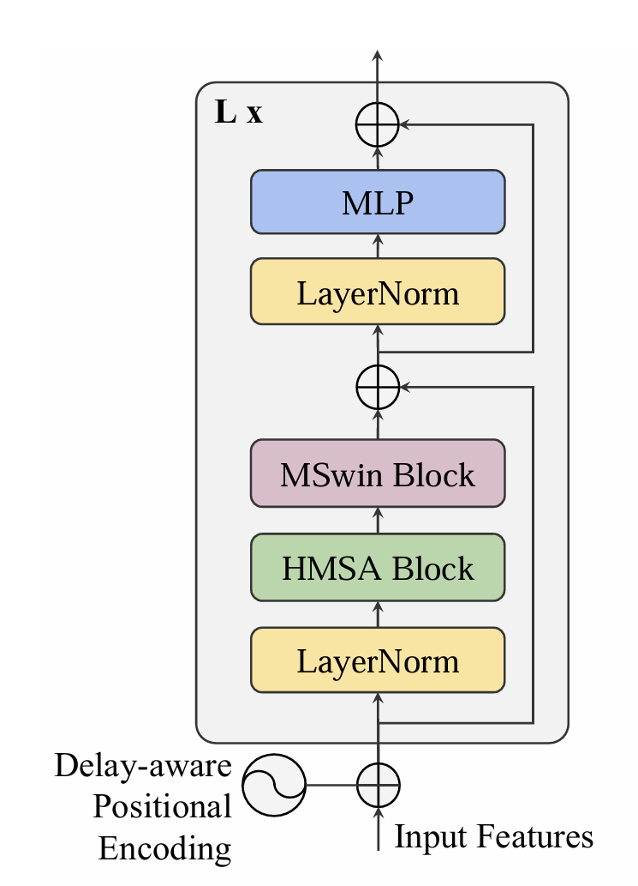

# V2X-ViT
一种名为V2X-ViT（Vehicle-to-Everything Cooperative Perception with Vision Transformer）的新型视觉Transformer架构，通过融合路上各个参与者（如车辆和基础设施）的信息，提高自动驾驶车辆的环境感知性能。

### 单智能体感知
一个独立的智能体(如一辆自动驾驶汽车)，利用周围的传感器来感知周围环境，并决策行动。受视野限制、障碍物遮挡、传感器距离限制等，对环境的感知有限

### 多智能体感知
多个智能体(如车辆、无人机、路边基础设施等等)通过共享数据和信息提高对周围环境的感知。

## 创新点
1）提出了第一个用于V2X感知的统一Transformer架构(V2X-vit)，它可以捕获V2X系统的异质性，对各种噪声具有很强的鲁棒性。此外，该模型在具有挑战性的协同检测任务上取得了最先进的性能。

2) 提出了一种新的异构多智能体注意力模块(HMSA)，专门用于异构智能体之间的自适应信息融合。

3）提出了一种新的多尺度窗口注意力模块(MSWin)，它可以同时并行捕获局部和全局空间特征交互。

4）构建了V2XSet，一个新的大规模的V2X感知的开放模拟数据集，它明确地解释了不完善的现实世界条件。

## 数据集V2XSet
用于 V2X 感知的新型大规模开放模拟数据集，使用高保真模拟器 CARLA 和协作驾驶自动化模拟工具 OpenCDA 明确考虑了 V2X 通信期间的现实世界噪声

## V2X-ViT框架

infra 和其他 EV 把自身的 LIDAR 点云投射到 Ego-AV 的坐标系上，投射好的 LINDAR 过一个 CNN 提取Features,再经过一个 Encoder 压缩,传输到 Ego 端再解压缩，把所有 Features 过 V2X-ViT 融合成一个单一的 Feature，最后过一个 Head 输出得到结果。

## V2X-Vision Transformer
### 1. 异构多智能体自注意力(HSMA)

解决传感器类型不同，噪声问题，视角不同问题的异构性问题。
将类型附加到节点和边缘有向图。为了简化图结构，假设同一类别的agent之间的传感器设置是相同的。如图 3b 所示，有2种类型的节点和4种类型的边，即节点类型 和边类型。

HSMA 表示为：
.png)

HSMA 包含3个操作符：一个线性聚合器、注意力权值估计器ATT和消息聚合器MSG
ATT计算基于相关节点和边缘类型的节点对之间的重要性权重:

式中，|| 表示concat，m为当前Head数，h为Head总数。请注意，这里的密集度是由节点类型和Head数m共同索引的。K和Q中的线性层有不同的参数。

利用矩阵，根据源节点与目标节点之间的边缘类型投影特征：

.png)

### 2. 多尺度窗口注意力(MSwin)
解决GPS造成的整体偏移量。
使用金字塔窗口，每个窗口限制不同的注意力范围

小window：注意力放在更多的detail上;
大window：感知视野大，解决一些全局偏差

### 3. Delay-aware positional encoding
解决时间延时问题

用正弦、余弦的方式对位置(W T)进行编码。

 ## Experiments
1. 实验在两种设置下进行评估：
   完美设置（Perfect Setting）和嘈杂设置（Noisy Setting）。在完美设置中，所有智能体的定位都是准确的，并且所有智能体之间完全同步。在嘈杂设置中，考虑了定位误差和时间延迟的影响。
2. 评估指标：
   使用平均精度（Average Precision, AP）在不同交并比（Intersection-over-Union, IoU）阈值下评估模型的检测性能。重点关注基于LiDAR的车辆检测任务。
   

