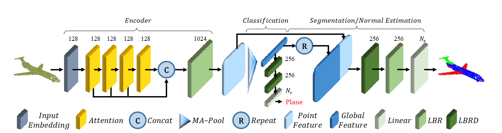

# Point Cloud Transformer
将Transformer运用到点云处理当中，用于分割、分类、法线估计

## 创新点
点云数据：原始的点云数据在存储空间中的排列是无序的，不方便处理

Transformer: 该模块可以忽略点云数据排列的无序性，利用注意力机制进行特征提取
(Transformer 通过自注意力机制能够捕捉点云中任意两点之间的关系，这使得模型能够利用全局信息来理解局部特征)

## 框架

输入原始点集，通过嵌入层转换为高维向量，四个注意力层包含注意力机制，学习点云的局部和全局特征。编码器的输出与输入嵌入层的输出进行连接，以便在后续的解码器中同时利用局部和全局特征。
LBR 提供了基本的特征提取和非线性变换，而 LBRD 则在此基础上增加了正则化措施，以提高模型的泛化能力。

