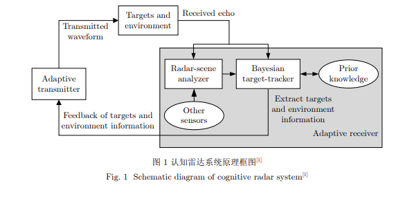

# Radar and jamming（大方向）

## 1.Wang XueSong（Keywords：interrupted-sampling repeater jamming）

- School of Electronics Science and Engineering, National University of Defense Technology, Changsha 410073, China

### Publications

- Mathematic principles of interrupted-sampling repeater jamming (ISRJ)  ( [paper](https://link.springer.com/article/10.1007/s11432-007-2017-y) )
  * 阅读时间：2022.11.21
  * 点评:文章指出了中断采样干扰技术是起因是为了解决工程问题（雷达信号高速采样和两个收发天线的高度隔离问题），然后提出来的一种***基于带收发分时天线*** 的干扰机的干扰技术。先分析了中断采样信号（矩形脉冲串）的时域和频域特性，然后对中断采样雷达信号的匹配滤波输出进行分析，最后对具体的窄带雷达信号和LFM信号干扰输出表达分析。
  *  总结: 文章比较早了，以了解中断采样转发干扰的数学原理为主要目的。

## 2.   崔国龙, 余显祥, 杨婧等  (关键词：认知雷达，优化理论)

- 电子科技大学信息与通信工程学院 成都 611731
- 上海汽车集团股份有限公司 上海 201804

### Publications

- 认知雷达波形优化设计方法综述  ( [paper](https://radars.ac.cn/article/doi/10.12000/JR19072)  )
  * 阅读时间：2022.11.23-11.24
  * 点评:认知雷达指的是能够通过对接受到的信号进行分析和处理，然后自适应设计和发射最优信号去适应目标与环境的最佳匹配。有讲到根据干扰类型（相关干扰和不相关干扰）选择的优化准则和约束条件的优缺点和研究进展。最后提到了三个认知雷达波形优化的三个方向：1.针对混合多目标设计 2.利用多域联合优化 3.实现多功能。
  *  总结: 认知雷达主要是从发射端自适应来实现抗干扰，后面的研究方向应该还是以网络模型为主。

# Model framework

## 1. Ian J. Goodfellow（关键词：GAN）

- 

### Publications

-  Generative Adversarial Nets(GAN) ([paper](https://arxiv.org/abs/1406.2661) )
   * 阅读时间：2022.11.29
   * 点评：这个网络同时训练两个模型（训练过程中是先训练识别模型，再训练生成模型），一个是生成模型，一个是鉴别模型，它们二者之间进行一个对抗。他们的目标函数的构成是一样的，只不过识别模型是想要最大化（识别真实数据的概率+把生成数据识别为假的概率），而生成模型是想要最小化。
   
   
   
   
   
   * 总结：这个论文首次提出了GAN的概念，这里主要以了解GAN的概念和最优解的数学证明为主.

