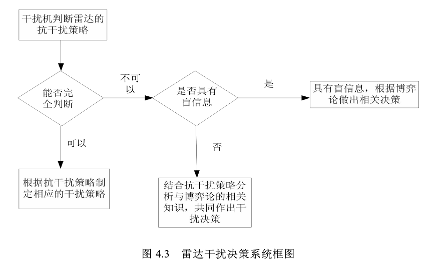

# 雷达干扰技术（大方向）

## 1.Mathematic principles of interrupted-sampling repeater jamming (ISRJ)  ( [paper](https://link.springer.com/article/10.1007/s11432-007-2017-y) ）

- School of Electronics Science and Engineering, National University of Defense Technology, Changsha 410073, China
- Wang XueSong（*Keywords：interrupted-sampling repeater jamming*）

### Publications
  * 阅读时间：2022.11.21
  * 点评:文章指出了中断采样干扰技术是起因是为了解决工程问题（雷达信号高速采样和两个收发天线的高度隔离问题），然后提出来的一种***基于带收发分时天线*** 的干扰机的干扰技术。先分析了中断采样信号（矩形脉冲串）的时域和频域特性，然后对中断采样雷达信号的匹配滤波输出进行分析，最后对具体的窄带雷达信号和LFM信号干扰输出表达分析。
  * 总结: 文章比较早了，以了解中断采样转发干扰的数学原理为主要目的。

## 2.  认知雷达波形优化设计方法综述  ( [paper](https://radars.ac.cn/article/doi/10.12000/JR19072)  )

- 崔国龙, 余显祥, 杨婧等  (*关键词：认知雷达，优化理论*)
- 电子科技大学信息与通信工程学院 成都 611731

### Publications
  * 阅读时间：2022.11.23-11.24
  * 点评:认知雷达指的是能够通过对接受到的信号进行分析和处理，然后自适应设计和发射最优信号去适应目标与环境的最佳匹配。有讲到根据干扰类型（相关干扰和不相关干扰）选择的优化准则和约束条件的优缺点和研究进展。最后提到了三个认知雷达波形优化的三个方向：1.针对混合多目标设计 2.利用多域联合优化 3.实现多功能。
  * 总结: 认知雷达主要是从发射端自适应来实现抗干扰，后面的研究方向应该还是以网络模型为主。

## 3. 基于博弈论的雷达干扰决策技术研究（[paper](https://kns.cnki.net/kcms/detail/detail.aspx?dbcode=CMFD&dbname=CMFD201402&filename=1014331648.nh&uniplatform=NZKPT&v=8NNNeSUecRK4pIq03_SqxormnpJ0SRswUG2XMOWw6T7hftsyUQJQ3z_TbcaWlP3w))

- 周脉成 (*关键词：雷达；干扰决策；非确定性；博弈论*)
- 西安电子科技大学 硕士论文

### Publications
  * 阅读时间：2022.12.1
  * 点评：前面主要介绍了干扰技术和抗干扰技术。其次，介绍了博弈论的概念，主要由局中人、策略树和盈利矩阵三个部分组成。将雷达和干扰机作为局中人，然后干扰技术和抗干扰技术作为策略树，干扰的效果作为盈利矩阵。基于博弈论，设计干扰决策如下：
  * 总结：技术的关键应该是盈利矩阵的求解，文章给出了一个基于经验的盈利矩阵和一种基于模糊数学的盈利矩阵的求解，但是后者对于盈利矩阵影响因素的权重因子没有给出结论。

## 4.A Practical Deceptive Jamming Method Based on Vulnerable Location Awareness Adversarial Attack for Radar HRRP Target Recognition([paper](https://ieeexplore.ieee.org/document/9766209))

- Chuan Du , Yulai Cong, Lei Zhang , Member, IEEE, Dandan Guo , and Song Wei
- Published in : IEEE Transactions on Information Forensics and Security

### Publications
* 阅读时间：2022.12.8
* 点评：根据HRRP目标识别问题，本文提出了一种新的干扰模式。之前的干扰方式都是对HRRP上的所有距离单元增加微小扰动，这篇文章主要是一个距离单元增加干扰脉冲来产生对抗性。然后设计了一个算法VLA，主要是将易受影响位置的计算作为一个优化约束问题，利用了QE算法计算。然后为了提高实时性，设计了一个VLAN网络。
* 总结:文章的主要创新还是提出了这种只在一个距离单元上增加干扰脉冲的HRRP欺骗干扰方式。

# 网络模型

## 1.Generative Adversarial Nets(GAN) ([paper](https://arxiv.org/abs/1406.2661) ) 
- Ian J. Goodfellow（*关键词：GAN*）
- D ́epartement d'informatique et de recherche op ́erationnelle Universit ́e de Montr ́eal Montr ́eal, QC H3C 3J7

### Publications
   * 阅读时间：2022.11.29
   * 点评：这个网络同时训练两个模型（训练过程中是先训练识别模型，再训练生成模型），一个是生成模型，一个是鉴别模型，它们二者之间进行一个对抗。他们的目标函数的构成是一样的，只不过识别模型是想要最大化（识别真实数据的概率+把生成数据识别为假的概率），而生成模型是想要最小化。

   

   

   * 总结：这个论文首次提出了GAN的概念，这里主要以了解GAN的概念和最优解的数学证明为主

