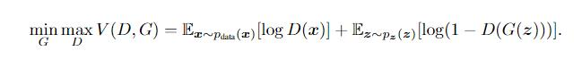

# 网络模型

## 1.Generative Adversarial Nets(GAN) ([paper](https://arxiv.org/abs/1406.2661) ) 
- Ian J. Goodfellow（*关键词：GAN*）
- D ́epartement d'informatique et de recherche op ́erationnelle Universit ́e de Montr ́eal Montr ́eal, QC H3C 3J7

### Publications
   * 阅读时间：2022.11.29
   * 点评：这个网络同时训练两个模型（训练过程中是先训练识别模型，再训练生成模型），一个是生成模型，一个是鉴别模型，它们二者之间进行一个对抗。他们的目标函数的构成是一样的，只不过识别模型是想要最大化（识别真实数据的概率+把生成数据识别为假的概率），而生成模型是想要最小化。

   

   

   * 总结：这个论文首次提出了GAN的概念，这里主要以了解GAN的概念和最优解的数学证明为主

## 2.Dynamic Graph-Based Anomaly Detection in the Electrical Grid ([paper](https://ieeexplore.ieee.org/abstract/document/9638319/) ) 
- Shimiao Li （*关键词：动态图、异常检测、图距离、LODF*）

### Publications
   * 阅读时间：2023.1.5
   * 点评：这篇文章根据电网的专业知识提出了一种新的图距离定义方式LODF。然后以传感器为图的节点，根据每一时刻传感器的值定义该时刻网络拓扑结构，然后以某一节点为例，在某一个时刻可以根据各个传感器的值来定义这一时刻的网络拓扑结构，然后从历史拓扑信息中寻找相似的拓扑结构，从而赋予相对比较大的权重，最后得到一个预测异常检测范围，如果该节点的检测值超过预测阈值，则发生异常。

   

   * 总结：这个论文首次提出了一种新的电网中边的定义，然后提出一种基于动态图的异常检测算法 DYN WATCH。

## 3.Can CNNs Be More Robust Than Transformers? ([paper](https://arxiv.org/pdf/2206.03452) )
- Zeyu Wang, Yutong Bai, Yuyin Zhou, Cihang Xie （*关键词：CNN架构）

### Publications
   * 阅读时间：2023.7.16
   * 点评：这篇文章根据Transformers的设计特点来改进CNN的架构提高模型的鲁棒性，改进主要分为如下三点：  
          1.下采样策略：将输入划分为p*p个不重叠的Patch，即kernel-size和stride都为p;  
          2.增加深度卷积层的kernel-size模拟Self-Attention块的行为;  
          3.减少激活和规范化层的数量。
     
   * 总结：后续可以将这种CNN架构（Robust-ResNet）作为对比实验中的一种。
