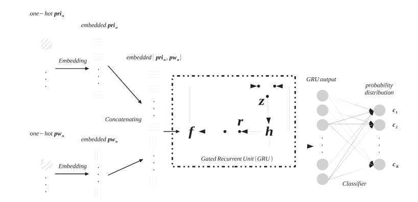
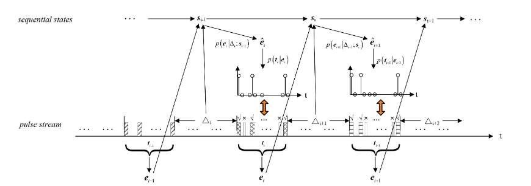

# 雷达辐射源信号分选

## 1. An improved algorithm for PRI Modulation Recognition 

- Yanchao Liu；Qunying Zhang
- IEEE International Conference on Signal Processing, Communications and Computing (ICSPCC)
- 2017

### Publications

* 阅读时间：2023.8.8
* 点评：这篇文章是在信号分选（去交织）的步骤之后展开工作的，通过将分选之后的脉冲（存在脉冲缺失的情况）经过预处理，得到信号的**局部平稳性、单调方向性和对称性**作为特征，然后利用这三个维度特征搭建简单的神经网络来识别PRI的工作模式。
* 总结：文章主要是利用神经网络做一个分类任务，输入也不是单纯的时域信号了，而是经过预处理后得到一些能够表达信号特性的特征量作为输入，进而识别辐射源的PRI工作模式。并且在信号分选结束的基础上展开研究的，所以默认时域信号只是由**单个辐射源的脉冲**构成。

## 2.Toward Convolutional Neural Networks on Pulse Repetition Interval Modulation Recognition

* Xueqiong Li , Zhitao Huang, Fenghua Wang, Xiang Wang, and Tianrui Liu
* IEEE COMMUNICATIONS LETTERS
* 2018

### Publications

* 阅读时间：2023.8.6

* 点评：这篇文章通过直接将PRI序列输入到神经网络中从而识别PRI的调制方式，调制方式有七种，分别是（固定PRI、抖动PRI、参差PRI、滑动PRI、随机参差PRI、驻留&切换PRI和正弦变换PRI）。由于文章较早的缘故，网络设计的还是比较简单的，通过四个卷积层、两个池化层和两个全连接实现。

* 总结：这篇文章依旧是用神经网络做一个分类任务，主要改进就是不需要进行预处理，直接通过PRI序列（应该是每个脉冲的到达时间）。其中文章设计了三种不同的实验环境，来验证模型的鲁棒性，后续可以参照这个设计组网场景。

  |  scene  | measuring（%） | lost pulses（%） | spurious pulses（%） |
  | :-----: | :------------: | :--------------: | :------------------: |
  |  ideal  |       0        |        0         |          0           |
  | extreme |       5        |        80        |          50          |
  | typical |       1        |        50        |          20          |

## 3. Classification, Denoising, and Deinterleaving of Pulse Streams With Recurrent Neural Networks

* ZHANG-MENG LIU，PHILIP S. YU
* IEEE Transactions on Aerospace and Electronic Systems
* 2019

### Publication

* 阅读时间：2023.8.11

* 点评：作者将脉冲重复时间和脉冲宽度的数值大小用one-hot的形式表达并embedded，使得模型学习的效果更好。模型方面则是利用GRU学习特征，再将学习到的特征利用全连接层进行分类、去噪和去交织。

  

* 总结：将当前时刻的PRI和PW用one-hot形式输入到模型中，然后通过RNN预测下一时刻脉冲的重复时间和脉冲宽度实现去噪和去交织。

## 4.Pulse Deinterleaving for Multifunction Radars With Hierarchical Deep Neural Networks

* ZHANG-MENG LIU
* IEEE Transactions on Aerospace and Electronic Systems
* 2021

### Publication

* 阅读时间：2023.8.12

* 点评：在一个时间窗中，利用编码器学习已知的感兴趣脉冲序列信息，然后解码器预测下一个时间窗口中感兴趣序列可能出现的位置，然后和真实观测到的脉冲信号匹配，实现去交错。

  

* 总结：作者是将整个序列信息分成n个时间窗口，其中前k个窗口的信息是确定的，后面n-k个窗口信息是未知的，利用前k个窗口的信息作为监督信息，来预测后面的n-k个窗口中目标脉冲可能出现的位置。
