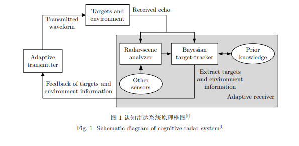
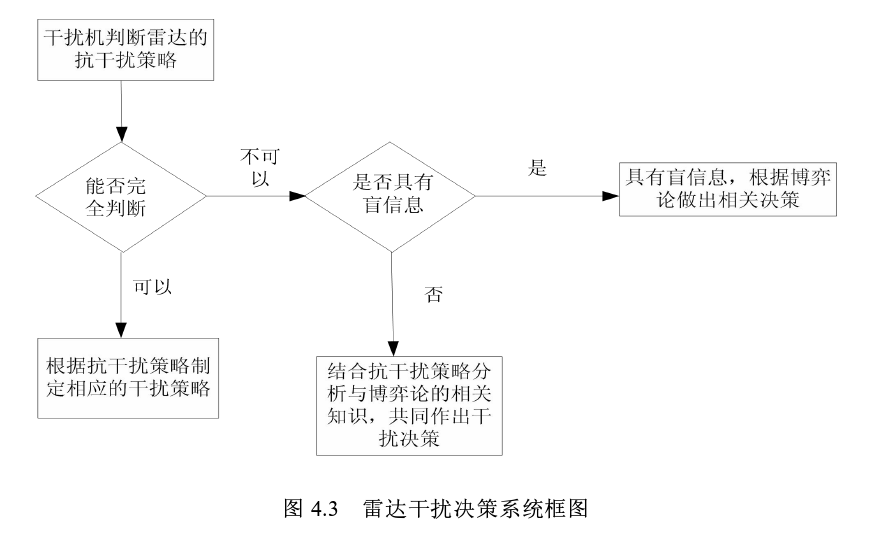
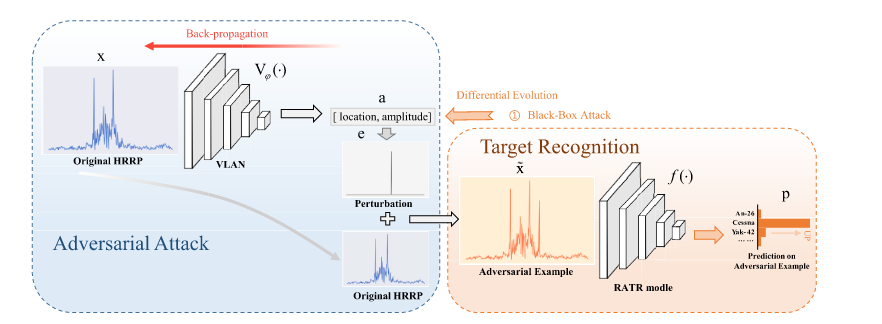
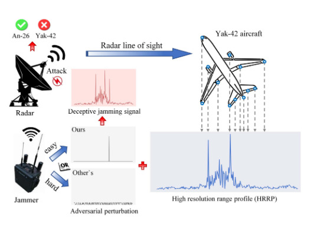
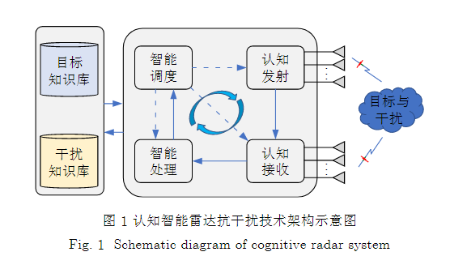
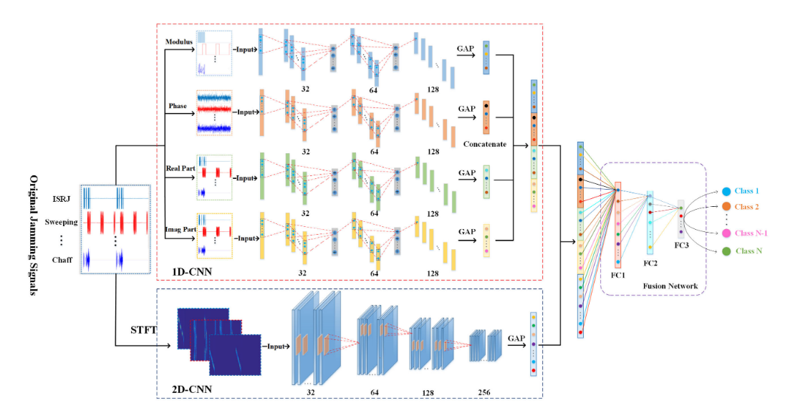
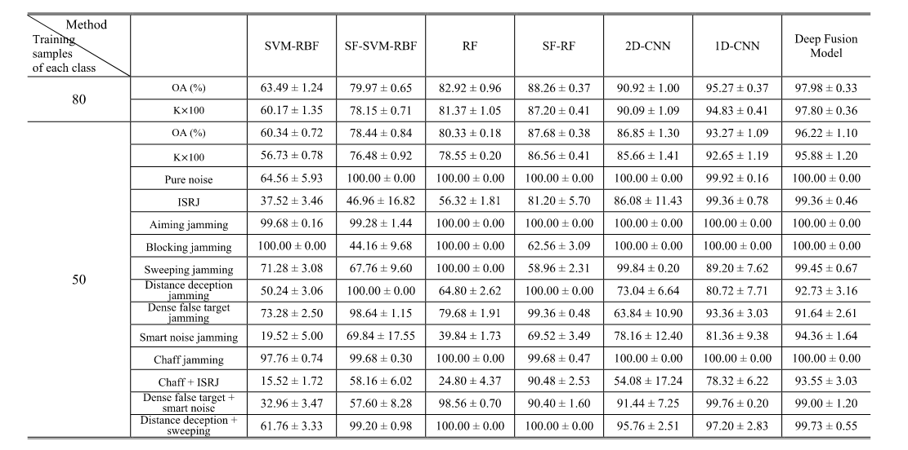
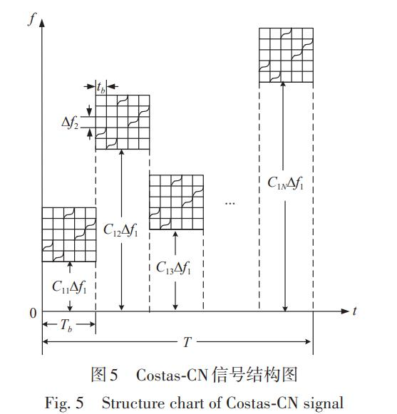

   * # 雷达干扰技术（大方向）

     ## 1.Mathematic principles of interrupted-sampling repeater jamming (ISRJ)  ( [paper](https://link.springer.com/article/10.1007/s11432-007-2017-y) ）

     - School of Electronics Science and Engineering, National University of Defense Technology, Changsha 410073, China
     - Wang XueSong（*Keywords：interrupted-sampling repeater jamming*）

     ### Publications
       * 阅读时间：2022.11.21
       * 点评:文章指出了中断采样干扰技术是起因是为了解决工程问题（雷达信号高速采样和两个收发天线的高度隔离问题），然后提出来的一种***基于带收发分时天线*** 的干扰机的干扰技术。先分析了中断采样信号（矩形脉冲串）的时域和频域特性，然后对中断采样雷达信号的匹配滤波输出进行分析，最后对具体的窄带雷达信号和LFM信号干扰输出表达分析。
       * 总结: 文章比较早了，以了解中断采样转发干扰的数学原理为主要目的。

     ## 2.  认知雷达波形优化设计方法综述  ( [paper](https://radars.ac.cn/article/doi/10.12000/JR19072)  )

     - 崔国龙, 余显祥, 杨婧等  (*关键词：认知雷达，优化理论*)
     - 电子科技大学信息与通信工程学院 成都 611731

     ### Publications
       * 阅读时间：2022.11.23-11.24
       * 点评:认知雷达指的是能够通过对接受到的信号进行分析和处理，然后自适应设计和发射最优信号去适应目标与环境的最佳匹配。有讲到根据干扰类型（相关干扰和不相关干扰）选择的优化准则和约束条件的优缺点和研究进展。最后提到了三个认知雷达波形优化的三个方向：1.针对混合多目标设计 2.利用多域联合优化 3.实现多功能。
       * 总结: 认知雷达主要是从发射端自适应来实现抗干扰，后面的研究方向应该还是以网络模型为主。

     ## 3. 基于博弈论的雷达干扰决策技术研究（[paper](https://kns.cnki.net/kcms/detail/detail.aspx?dbcode=CMFD&dbname=CMFD201402&filename=1014331648.nh&uniplatform=NZKPT&v=8NNNeSUecRK4pIq03_SqxormnpJ0SRswUG2XMOWw6T7hftsyUQJQ3z_TbcaWlP3w))

     - 周脉成 (*关键词：雷达；干扰决策；非确定性；博弈论*)
     - 西安电子科技大学 硕士论文

     ### Publications
       * 阅读时间：2022.12.1
       * 点评：前面主要介绍了干扰技术和抗干扰技术。其次，介绍了博弈论的概念，主要由局中人、策略树和盈利矩阵三个部分组成。将雷达和干扰机作为局中人，然后干扰技术和抗干扰技术作为策略树，干扰的效果作为盈利矩阵。基于博弈论，设计干扰决策如下：
       * 总结：技术的关键应该是盈利矩阵的求解，文章给出了一个基于经验的盈利矩阵和一种基于模糊数学的盈利矩阵的求解，但是后者对于盈利矩阵影响因素的权重因子没有给出结论。

     ## 4.A Practical Deceptive Jamming Method Based on Vulnerable Location Awareness Adversarial Attack for Radar HRRP Target Recognition([paper](https://ieeexplore.ieee.org/document/9766209))

     - Chuan Du , Yulai Cong, Lei Zhang , Member, IEEE, Dandan Guo , and Song Wei
     - Published in : IEEE Transactions on Information Forensics and Security

     ### Publications
     * 阅读时间：2022.12.8
     * 点评：根据HRRP目标识别问题，本文提出了一种新的干扰模式。之前的干扰方式都是对HRRP上的所有距离单元增加微小扰动，这篇文章主要是一个距离单元增加干扰脉冲来产生对抗性。然后设计了一个算法VLA，主要是将易受影响位置的计算作为一个优化约束问题，利用了QE算法计算。然后为了提高实时性，设计了一个VLAN网络。
     * 总结:文章的主要创新还是提出了这种只在一个距离单元上增加干扰脉冲的HRRP欺骗干扰方式。

     ## 5.认知智能雷达抗干扰技术综述与展望

     * 崔国龙，余显祥，魏文强等（关键词：认知智能雷达；认知发射；认知接收；智能处理；智能调度）
     * 电子科技大学信息与通信工程学院 成都 611731

     ### Publications

     * 阅读时间：2023.1.10
     * 点评：智能认知雷达主要有五个研究方向，分别是智能雷达干扰信号感知技术、抗干扰信号发射、回波信号的接受、信号的处理和调度方面展开。目前我们主要研究的都是干扰信号的感知和抗干扰信号的发射。干扰的感知主要是对干扰特征进行估计。根据干扰特征维度，干扰特征可分为浅层特征与深层特征。浅层特征一般指有实际意义的物理特征，包括干扰频谱、多普勒以及脉内调制特征等；深层特征主要是指经过深层神经网络映射的高维特征空间中的语义特征，一般没有明确的物理含义。最后文章指出了认知雷达的几个发展趋势;
       1.具备闭环自学习进化能力。
       2.与智能化干扰的动态博弈。
       3.多雷达信号域协同组网。
       
       
     ## 6.Deep Fusion for Radar Jamming Signal Classification Based on CNN
     
     * GUANGQING SHAO , YUSHI CHEN , , AND YINSHENG WEI
     * School of Electronics and Information Engineering, Harbin Institute of Technology, Harbin 150001, China
     
     ### Publications
     
     * 阅读时间：2023.1.17
     
     * 点评：用1D-CNN提取干扰信号的模值、相位、实部和虚部四个部分的特征，用2D-CNN提取干扰信号的时频特征，然后融合特征完成干扰信号的分类。
     
       其中，信号是LFM信号，干扰信号主要是压制式和欺骗式，数据集由十二种不同类型的干扰信号组成,实验结果如下。

      ## 7.  脉间频率编码脉内复合调频雷达信号设计与分析 

      * 付银雪 刘星宇 曾耀平（关键词：射频隐身；模糊函数；自相关函数；功率谱；截获因子 ）
      *  西安邮电大学通信与信息工程学院，陕西西安 710121 

      ### Publications

      * 阅读时间：2023.4.7
      * 点评：在脉间脉内双重频率编码（Costas-Costas）信号的基础上，在脉间将频率编码和NLFM信号结合，得到脉间频率编码脉内复合编码（Costas-CN）调频雷达信号，极大地增加了脉内调频特征的复杂性，增加了无源探测系统分选和识别的难度。
        
      * 总结：有时间可以复现一下这个信号模型
