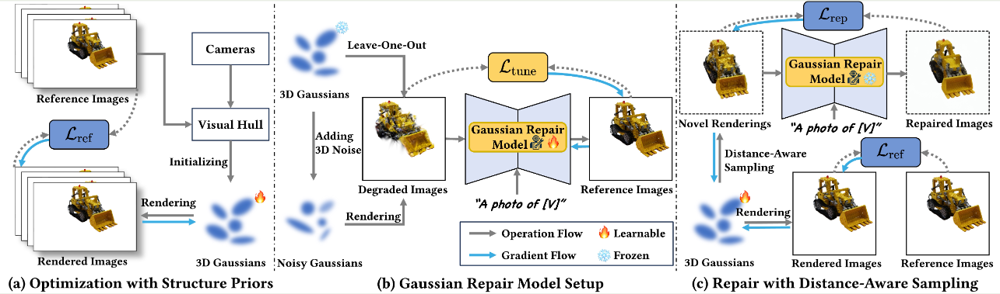

## GaussianObject: High-Quality 3D Object Reconstruction from Four Views with Gaussian Splatting [[code]](https://github.com/chensjtu/GaussianObject) [[paper]](https://arxiv.org/abs/2402.10259)

#### Overview of GaussianObject:

(a) 使用**相机参数(camera parameters)**和**掩膜图像(mask images)**构建**视觉外壳(visual hull)**初始化3D高斯（用到现有的**SAM**和**dust3R**模型），使用Lref进行优化，并通过**浮子消除(floater elimination)**对其进行细化；

(b) 使用新颖的**“留一”**策略，并在高斯中添加3D噪声来生成损坏的高斯渲染图。这些渲染图与相应的参考图像配对，便于使用Ltune训练**高斯修复模型(Gaussian repair model)**；

(c) **高斯修复模型**一旦训练完毕，就会被冻结并用于纠正需要纠正的视图。这些视图是通过距离感知采样来识别的。**修复后的图像(repaired images)**和**参考图像(reference images)**被Lrep和Lref用于进一步优化3D高斯（这部分没看懂）

#### **结果**

通过四个观测角度视图，生成360°的渲染三维模型

#### 总结

本文致力于通过稀少的视图图像，生成高质量的三维模型，同时为了进一步将高斯对象扩展到实际应用，引入了无COLMAP的变体。该项目网络工程量相对较大，涉及到分割SAM模型、深度估计DUSt3R以及附加于预训练扩散模型的ControlNet等。

