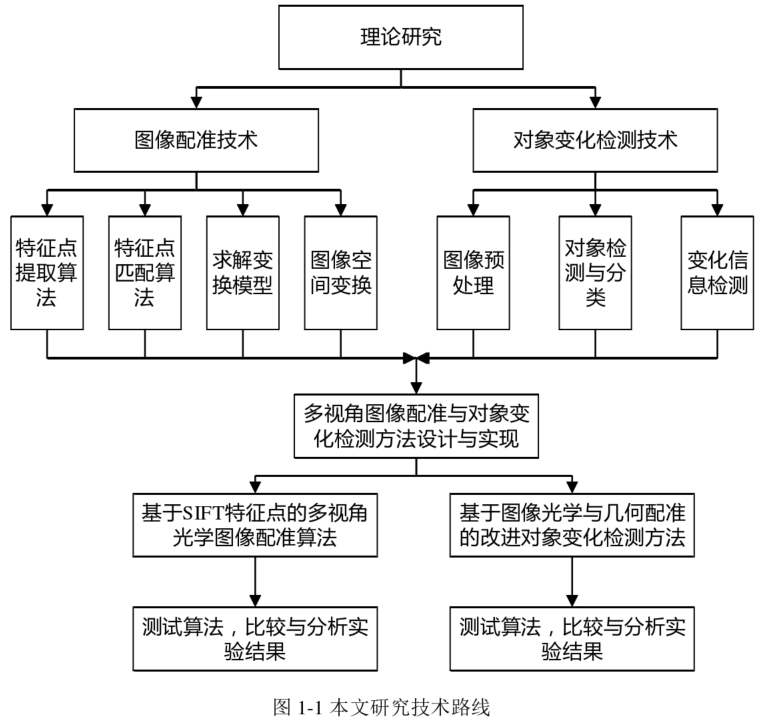

# 多视角光学图像配准与对象变化检测方法
- 王者风（作者）
- 电子科技大学
- 链接：[paper](image\多视角光学图像配准与对象变化检测方法_王者风.pdf)
- 阅读时间：2023.10.8

### 标题、摘要、关键词、结论
- 标题：多视角光学图像配准与对象变化检测方法
- 摘要：随着计算机及通信技术的发展，图像和视频的应用领域愈加广泛。而人类需要从图像中获取的信息越来越多，单一视角的图像难以满足这些需求。人们为了能够获取到目标的更多信息，通常采用从不同视角进行拍摄的方式，得到同一个目标的更丰富的信息。图像配准算法经过长期的发展，也形成了较为稳定的框架，被广泛的应用在图像融合，图像校正等场合，而传统的配准算法对于多视角光学图像的处理准确率会受到影响，所以基于这种多视角光学图像的配准技术已成为研究的一大热门。与此同时，对象变化检测方法作为动态图像分析与目标跟踪的基础，同样得到了广泛的应用。因此，研究针对多视角图像的、能够更准确，稳定的进行图像配准的配准算法就有着非常重要的理论意义和实用价值。
- 关键词：视角，SIFT特征，光学图像配准，对象变化检测
  
 
 
- 结论：
1. 研究了图像配准算法，包括基础理论、特征点匹配，以及评价标准。

2. 深入分析了基于SIFT和SURF特征点的图像配准算法，进行了仿真实验。

3. 改进了基于尺度不变特征的配准算法以适应多视角图像，进行了实际测试比较。

4. 将图像配准算法应用于对象变化检测方法。

5. 完成了图像处理与计算机视觉模型的构建，包括图像特征提取和配准等模块的设计、开发、测试和集成。

### 研究背景
**图像处理的发展**：随着计算机技术的不断突破和发展，图像处理技术引起了广泛关注和深入研究。这是一门新兴学科，利用计算机或专用图像处理设备对图像进行采集、增强、压缩、检测、跟踪等处理。

**图像处理的应用领域**：图像处理技术已广泛应用于不同领域，包括军事、安防、医学、工业工程以及无人驾驶技术等。它在这些领域中用于目标识别、人脸识别、医学图像处理、产品检测、无人驾驶等方面。

**图像配准技术的重要性**：图像配准技术已成为图像处理领域的研究热点，具有广阔的应用前景。在视频跟踪、遥感、消除摄像设备抖动等领域，图像配准被广泛应用。

### 研究内容、成果
- 内容：整篇论文主要围绕图像配准算法的改进以及多视角图像的对象变化检测展开，包括算法基础、特征提取、匹配、测试和集成等方面的内容。
- 结果：研究了配准算法的三个具体步骤，特征提取，特征匹配，配准策略。并根据算法步骤逐步分析了各个步骤中使用到的经典算法，然后尝试建立一种能够较好的评判配准算法效果的评价标准

### 总结
- Conclusion by LDC: 整篇论文可以用于了解图像配准的相关基础知识，里面所涉及的技术和算法可以逐一进行深入学习

