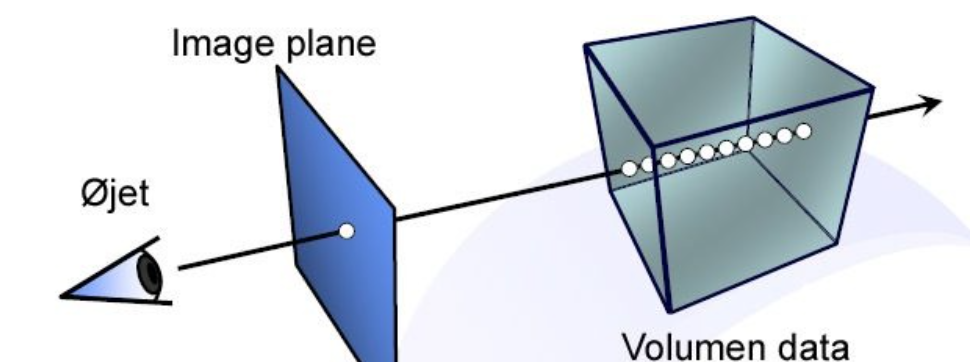
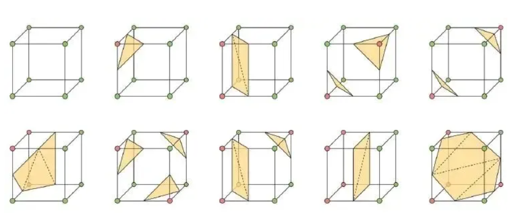
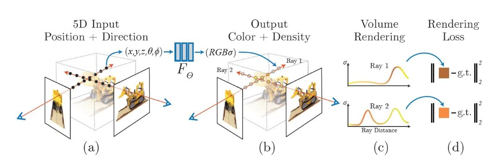
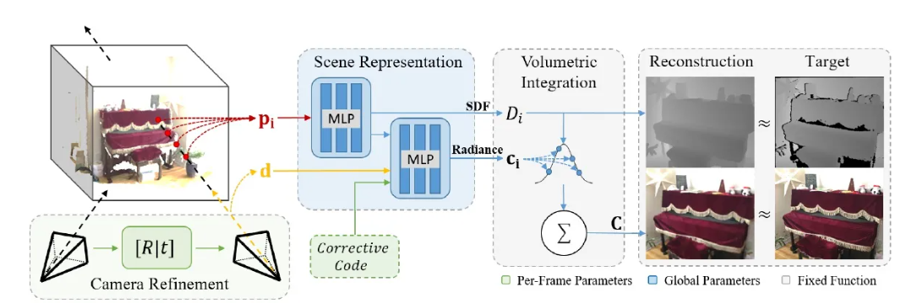

神经辐射场

NeRF：Representing Scenes as Neural Radiance Fields for View Synthesis (ECCV2020 Best Paper)

Neural RGB-D Surface Reconstruction（arxiv 2021）

**成像模型**

对于一个三维物体，它本身存在在那里，人眼的观察从传统上被建模为相机外参+内参，也就是一个降维的矩阵变换。

适合计算机表示的三维模型有Voxel Occlusion，ESDF，TSDF等等，但对于人类大脑，显然不会通过矩阵建模，从三维世界获取二维图像。随着神经网络的流行，学界开始探索隐式的三维表示方法。

**传统渲染方法**

所谓渲染，就是利用已经建立好的三维模型，重构出物体的表面点，再根据相机投影关系，生成任意视角的2D图像，也就是模拟人眼对物体的观察过程。

**NeRF的特点**

可以进行无限分辨率的渲染，在连续空间里面表示三维模型。

**NeRF的原理**

利用已经建立好的三维模型，重构出物体的表面点，再根据相机投影关系，生成任意视角的2D图像，也就是模拟人眼对物体的观察过程。

一个本身就在那的三维点，你从某个角度（2D角度，对应球坐标，构成360°球面就够了，即相机一个轴和scene坐标系一个轴本身方向统一；或者说相机原点和scene坐标系原点一致，都是球坐标原点）看，就能看到一个纹理和RGB。

纹理（Density)是物体本身的属性，所以要求他和方向无关；而RGB要求和方向与xyz都有关。所以这么设计网络。

其输入为一个五维向量，包括相机位置与方向，输出的是像素点的RGB色度空间与透明度。

损失函数为L2 Loss

**用途：三维重建**

**局限性**

1.NeRF泛化性较差，一个网络只能代表一个场景——暂无解决方案

2.要极为精确的相机位姿GT——基于GAN、BA层的

3.训练速度较慢，参数量较大——训练加速