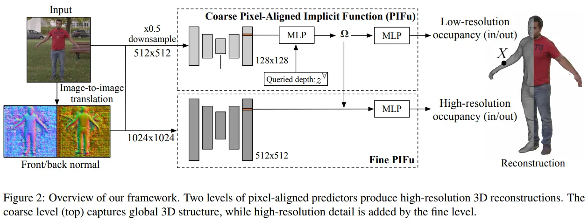
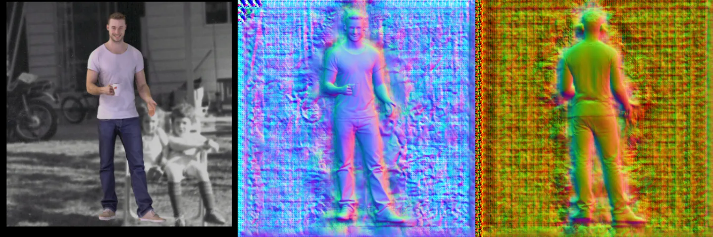

## 一、引言

作者提出PIFuHD的主要原因是现有的方法，比如PIFu虽然能够重建人体的大致三维模型，但是很难重建出图片中所展示的丰富细节。作者认为那些方法的这些限制主要来源于一下两方面的冲突：**准确的预测人体三维模型需要大范围的空间信息，精细的表面信息需要更高维度的特征信息。由于当前显卡的显存大小限制，之前的方法偏向于使用低分辨率的图片作为输入以让网络得到大范围的空间信息（大感受野），但是代价就是生成低精度（低分辨率）的三维模型。**

为了解决这个问题，作者提出一种可以端到端训练的Multi-level Architecture（两阶段）。在粗略估计阶段，输入是低分辨率的图片主要用于大致形状的预测；在精细重建阶段，输入是高分辨率的图片，联合粗略阶段的特征，输出高精度的三维预测。

本文的主要贡献有如下两点：

1. 一个端到端可训练的coarse-to-fine框架，可以学习从1k分辨率的输入图片中重建出高分辨率的人体三维模型。
2. 一个可以有效预测人体背部精细细节的解决方案。

## 二、论文整体方法以及细节

如上图所示，PIFuHD是由两个步骤组成，在粗略估计阶段中，作者使用的是PIFu方法，输入图片的分辨率是512×512，得到的 128×128低分辨率的嵌入式特征。在精细重建模块中，输入图像分辨率是1024×1024，得到的 512×512的特征，这个模块使用提取到的特征和粗略估计阶段的特征去预测三维点是否在三维人体表面内部。

为了提升重建模型的质量和精度，该文先使用方法预测该图片对应的正面和发面的法向图，和原始RGB图片一起作为两个模块的输入图片。

### 2.1 Pixel-Aligned Implicit Function (PIFu回顾)

重建人体的三维模型可以通过一个3D的bounding box（覆盖3D人体）中每个离散点是否被3D人体占有，即该点是在人体内部还是在人体外部。

**限制：**
由于显卡内存的限制，PIFu的输入图片的大小为512×512，输出的特征为128×128，且使用的是HourGlass作为image encoder ，该网络结果可以达到整张图片的感受野，并且多对中间阶段输出的监督可以得到比较鲁棒的3D重建结果，但是这样的网络结构也限制了该方法输入更大分辨率的输入图片，同时也不能得到更高维度的特征。所以需要一个能够平衡这两者的方案。

于是作者就引入了下面的多层PIFu

### 2.2 Multi-level Pixel-Aligned Implicit Function

本文提出了一个多层方法，输入是1024×1024的图片，输出是高精度的人体三维模型。该方法包括两个阶段（如fig.2 所示）：
**A coarse level:**
fig.2 上半部分，和PIFu一样，输入时原始图片下采样之后的 512×512大小的图片，主干网络输出的特征的分辨率是128×128，这一部分主要关注于生成全局的几何信息。

由于fine level输入了coarse level的3D全局特征，所以经过fine leve重建出来的结果不会差于coarse level单独的输出结果。如果网络设计能够很好利用高分辨率的图像信息，一定可以生成更好的三维模型。 另外，fine level不需要归一化可以让这一部分网络使用图片crop去进行训练，这样可以有效的节省显存。

### 2.3 Front-to-back 预测

上一部分说到，不管是fine level还是coarse level都使用了图片域中的法向信息。这是因为作者发现将法向预测的部分提取出来，并且放到特征提取之前，后面的PIFu网络能够得更锐利的三维几何。

作者直接使用了pix2pixHD网络，直接从RGB 彩色图预测改图正面和反面的法向图。作者认为这样得到的看起来合理的法向图对于重建三维人体就足够了。 下图是生成的法向图的例子。

### 2.4 损失函数以及表面训练数据的采样

损失函数的选择会极大地影响重建的三维模型细节。和PIFu中使用平均L1和L2损失函数不同，作者使用了扩展的BCE(Binary Cross Entropy)损失函数计算一个集合的采样点的损失
上诉Extended BCE其实思想很简单，有点像是检测中经常使用的Focal Loss。当采样点中，in/out采样点数量各占一半的时候，该loss其实就是BCE；但是只要 in/out 采样数量不同时，损失函数则会给较少数量的一方相对更大的权重。

和PIFu一样，训练点的采样方法还是包含两个部分，一个是在3D bounding box中均匀采样，以及在人体表面顶点的周围进行密集采样，即在该采样点加一个符合高斯分布的偏移，具体可以参考[文章](https://zhuanlan.zhihu.com/p/148509062)的描述。

## 三、Ablation Study和实验结果

在实验部分，作者做了两个Ablation Study的实验分别验证了

- coarse level中全局3D特征对fine level中生成精细模型的重要性；
- 不同的设计对重建结果精度的影响
- 反面法向对重建不可见区域的细节的影响重要性

其重建结果如fig.3 所示：

从结果上看，没有使用全局特征时，结果会出现比较严重的depth错误，从而得到较差的三维几何；而使用了全局特征时，则能够重建出较好的结果。这个实验说明了联合使用全局feature和高分辨率图像特征对重建精细三维模型的重要性。

**Ablation Study 2:**
为了验证pipeline不同设计对重建结果的影响，作者设计了如下的五种pipeline：
1）只使用fine level的部分，且在训练阶段使用高分辨率(1k)进行训练
2）在1）的基础上，添加使用从ResNet34提取的全局特征
3）只有PIFu，即fig.2中的coarse level
4）fig.2中的pipeline，训练的时候时联合训练coarse level 和 fine level
5）fig.2中的pipeline，但是训练的时候是交替的训练coarse level 和 fine level。

Fig.4 和 Tab.1 展示了不同设计在RenderPeople和BUFF上的结果。从以上时间结果实验可以知道：

- 和单独PIFu（特征分辨率只有128x128）相比，加上大分辨率的特征 （512x512）能够大大提升重建模型中的细节；
- 全局特征和高分辨率的特征结合可以较少overfitting以及提升网络的泛化能力；
- 交替训练coarse level和fine level可以得到更加好的结果；

**Ablation Study 3:**

作者也验证了反面对于重建不可见区域的重要性。从Fig.5结果上来看，单独输入图像会在不可见区域生成比较模糊的细节；当叠加输入pix2pixHD预测的法向图，重建的三维模型正反面的细节都能够得到提升。

**对比实验：**

作者和当前的一些方法做了比较实验： DeepHuman， PIFu，Tex2Shape，其可视化结果如下（当然是最好的了，哈哈）：

## 四、总结

每次看完一篇论文，都会问自己它为什么会work呢，为什么会比之前的方法好呢。同样对于这篇PIFuHD，从个人的理解来看（可能有误，哈哈），PIFuHD比PIFu好的主要原因是来自coarse to fine两层的设计，coarse level提取全图视野的特征从而能够保证得到global consistent的人体的基础几何，接着fine level利用全局特征和局部的高分辨率的local特征帮助得到更加精细的结果。而添加正反面normal图这一部分，我不认为能够为重建结果带来很大提升，因为首先正反面normal也是通过网络预测出来的，不能够保证准确，大体上是对的，但是细节部分也不能保证是正确的（比如下图头部重建较差的例子，首先normal预测的头部是不对的，重建出来的结果也不合理），在论文当中，作者也多次使用plausible（看起来合理）这个词；另外当人不是平行于相机平面时，按照作者方式得到的正反面的法向，大概率会生成不合理的法向。

