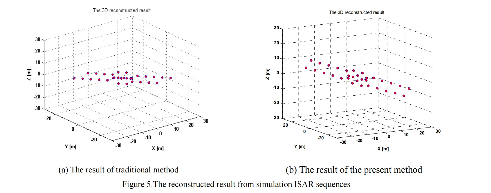
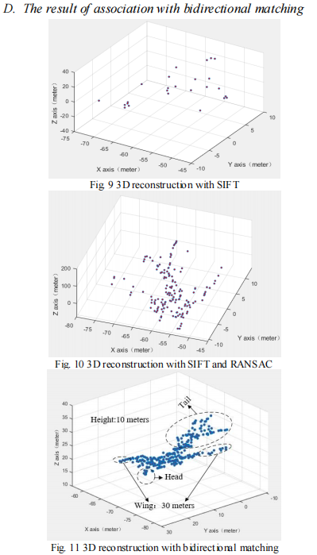
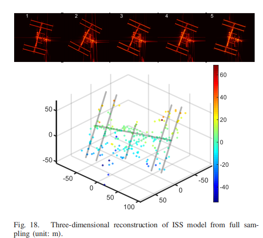

# ISAR 3D reconstruction已更新文献数量 3篇

------

## 1-Gang Li（Keywords: Scattering center correlation）

------

### -National University of Defense Technology

------

### 1 **A method of 3D Reconstruction via ISAR Sequences based on** scattering centers association for space rigid object（Millimetre Wave and Terahertz Sensors and Technology VII，2014）[paper](https://www.semanticscholar.org/paper/A-method-of-3D-reconstruction-via-ISAR-Sequences-on-Li-Zou/372c4d16f54e0ade16d0414cea35da917d9b8097)

- 2022/12/01（阅读时间）

### comments by LY:本文将轨道运动对散射中心轨迹的影响作为约束条件，引入散射中心的关联，然后提出了一种基于矩阵Err的特征点筛选方法来分析错误的关联，并定义了重构误差。

### conclusion by LY:本文将空间合作或近似合作目标的轨迹加入到特征关联的过程中，作为一个约束条件，但是由于文章篇幅太短，讲述的太简约，作者提出的基于矩阵Err的特征点筛选方法来分析错误的关联思路很好，可以借鉴。

------

## 2-Yu Wan（Keywords:bidirectional matching）

------

### -Sun Yat-sen University

------

### 2 Feature point bidirectional matching and 3D reconstruction of sequence ISAR image based on SFIT and RANSAC method（CIE International Conference on Radar，2021）[paper]([10.1109/Radar53847.2021.10028173](https://doi.org/10.1109/Radar53847.2021.10028173))

-2023/8/10（阅读时间）

### comments by LY:本文主要使用SIFT进行帧间关联，通过RANSAC去除误匹配点对，通过正确匹配点对求出投影变换矩阵，通过投影变换矩阵进行特征变换，由于正确匹配点对数量少，所以提出一种双向的匹配方法，增加关联的特征点数量

### conclusion by LY:本文通过一种双向匹配策略，增加了SIFT特征匹配点对的数量，虽然可以提高重建目标的完整度，但SIFT本身就很耗费时间，用SIFT进行关联太浪费时间。

------

## 3-Feng Wang（Keywords:**orthographic factorization method (OFM)、**3-D information）

------

### -Fudan University

------

### 3  Three-Dimensional Reconstruction From a Multiview Sequence of Sparse ISAR Imaging of a Space Target（IEEE TRANSACTIONS ON GEOSCIENCE AND REMOTE SENSING，2018）[paper]( [10.1109/TGRS.2017.2737988](https://doi.org/10.1109/TGRS.2017.2737988))

-2023/08/12（阅读时间）

### comments by LY:本文首先通过压缩感知模拟生成二维ISAR图像，然后使用KLT（Kanade–Lucas–Tomasi）进行特征检测和追踪，最后通过正交因式分解进行三维重构，三维重建方面没有太大创新，主要添加了压缩感知成像。

### conclusion by LY:这篇论文实验挺多，三维重建方面方法都是老的，个人感觉文中模拟的模型，重建结果都不是太理想。
