# 3D point cloud processing

------

## 1.点云局部特征描述与匹配研究（杨佳琪----华中科技大学博士论文）

--发布时间：2019.04

--关键词：三维点云、局部特征描述、特征匹配、点云配准、位姿估计、三维重建

--论文链接：[paper]([点云局部特征描述与匹配研究 (wanfangdata.com.cn)](https://oss.wanfangdata.com.cn/www/点云局部特征描述与匹配研究.ashx?isread=true&type=degree&resourceId=D01785245&transaction={"id"%3Anull%2C"transferOutAccountsStatus"%3Anull%2C"transaction"%3A{"id"%3A"1595688454660927488"%2C"status"%3A1%2C"createDateTime"%3Anull%2C"payDateTime"%3A1669276748706%2C"authToken"%3A"TGT-71895296-zf2DyPwCqPVsp3yJ5PY4FGad0xjaruVK3HLvEkYmZpD5RHQF5c-my.wanfangdata.com.cn"%2C"user"%3A{"accountType"%3A"Group"%2C"key"%3A"zjgydxtsg"}%2C"transferIn"%3A{"accountType"%3A"Income"%2C"key"%3A"ThesisFulltext"}%2C"transferOut"%3A{"GTimeLimit.zjgydxtsg"%3A30.0}%2C"turnover"%3A30.0%2C"orderTurnover"%3A30.0%2C"productDetail"%3A"degree_D01785245"%2C"productTitle"%3Anull%2C"userIP"%3A"115.233.205.171"%2C"organName"%3Anull%2C"memo"%3Anull%2C"orderUser"%3A"zjgydxtsg"%2C"orderChannel"%3A"pc"%2C"payTag"%3A""%2C"webTransactionRequest"%3Anull%2C"signature"%3A"I7aHih%2F6CkkcwN5QW%2B3eQpZbGXgt2bbhn%2B27zXtlkBa7efw5EAbAm%2Fb0yhMu9TqMgRbFInh1ZcUi\nHUOylKuEelr9pzqEbAR9%2BXjbgYwGRonXc81Ev5dYwbqI6EPHRGcwhQXU9EZEsV5h4t%2FtxSWdCWA%2F\n%2BqITqtk4Mg2O71Q47IU%3D"%2C"delete"%3Afalse}%2C"isCache"%3Afalse}))

--阅读时间：2022.11.15

------

### 创新点：

1）提出了一种基于正交投影的点云局部特征描述子（TOLDI），并介绍了一种基于法向量以及邻域点投影向量来计算的局部坐标系建立方法

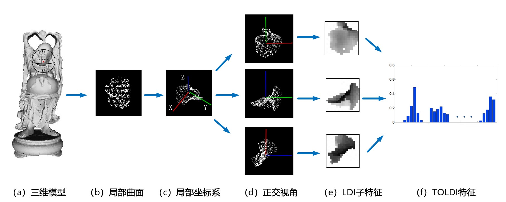

2）针对TOLDI描述子纬度高（1200维）而且是浮点型描述子，在存储和计算时效率低的问题，提出一种旋转轮廓特征（RCS），并进行二值化操作

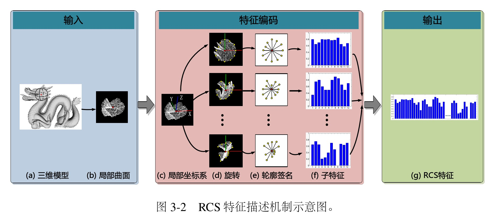

3）利用深度学习的方法非线性的融合点云的局部几何特征

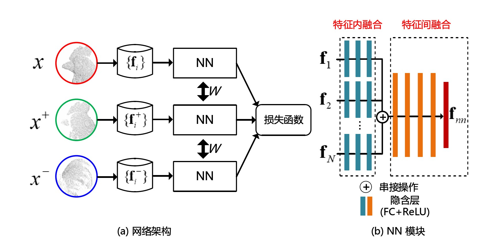

4）基于RCS特征和投票机制，提出一种新的点云配准重建算法

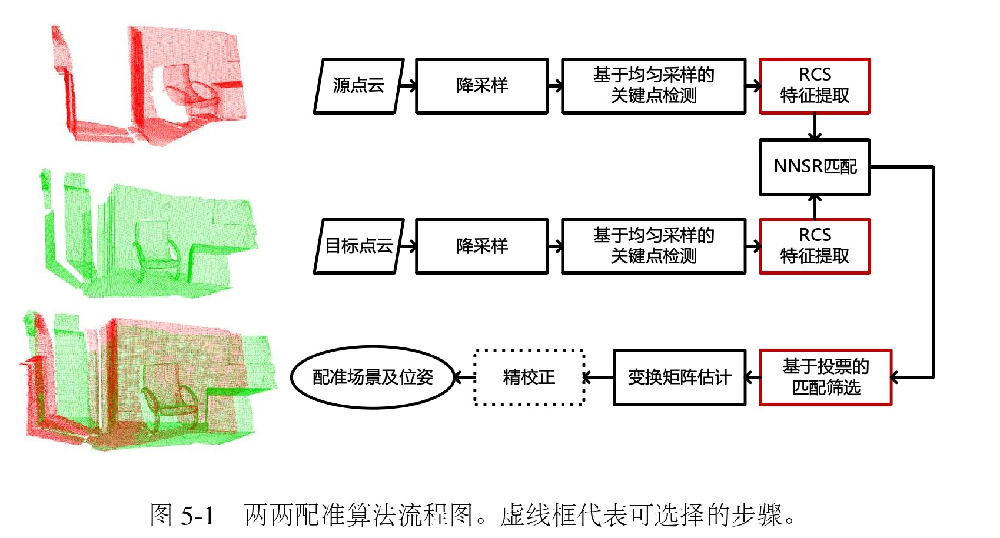

------

### 个人评论：

论文主要工作还是在创建点云局部特征描述上，TDLDI和RCS特征描述的参考意义还是挺大的，尤其是RCS，在提高效率和节省存储空间上还是优于一些传统特征描述的。

------

## 2.基于点对特征的三维物体快速识别方法研究 （肖正涛----广东工业大学博士论文）

--发布时间：2021.05

--关键词：局部特征、全局特征、点对特征、平面提取、三维物体识别

--论文链接：[paper]([基于点对特征的三维物体快速识别方法研究.ashx (wanfangdata.com.cn)](https://oss.wanfangdata.com.cn/www/基于点对特征的三维物体快速识别方法研究.ashx?isread=true&type=degree&resourceId=Y3831836&transaction={"id"%3Anull%2C"transferOutAccountsStatus"%3Anull%2C"transaction"%3A{"id"%3A"1595722490687029248"%2C"status"%3A1%2C"createDateTime"%3Anull%2C"payDateTime"%3A1669284863527%2C"authToken"%3A"TGT-71913972-5AKf5ZVpeIxAEVnoY73NVSNrO9gi0Quc57ZrhymlU7vIhpCY3b-my.wanfangdata.com.cn"%2C"user"%3A{"accountType"%3A"Group"%2C"key"%3A"zjgydxtsg"}%2C"transferIn"%3A{"accountType"%3A"Income"%2C"key"%3A"ThesisFulltext"}%2C"transferOut"%3A{"GTimeLimit.zjgydxtsg"%3A30.0}%2C"turnover"%3A30.0%2C"orderTurnover"%3A30.0%2C"productDetail"%3A"degree_Y3831836"%2C"productTitle"%3Anull%2C"userIP"%3A"115.233.205.171"%2C"organName"%3Anull%2C"memo"%3Anull%2C"orderUser"%3A"zjgydxtsg"%2C"orderChannel"%3A"pc"%2C"payTag"%3A""%2C"webTransactionRequest"%3Anull%2C"signature"%3A"ihePrpsFqAq6R1jC7H87oB%2FZCRARw1iuQEpEJYzhT2jmEH4Gc82xjffcayOP0%2FEoJFMTpzpmVAvC\nCQ3E%2ByUdKxksg5xfHoMgCDkA0Cujb6DhAImc25txqfzSxCq7DpiklCd4eJicEstbkJYnD%2F%2FQbKfZ\nRaw3DALTvRH21%2BRPoSk%3D"%2C"delete"%3Afalse}%2C"isCache"%3Afalse}))

--阅读时间：2022.11.17

------

### 创新点：

1）针对三维点云中存在的大量冗余数据，根据Drost体素网格降采样算法，提出一种不等分体素网格均匀降采样算法，将点云轴向包围盒ｘ，ｙ，ｚ轴三个方向的边分成不相等的份数，使得每一个体素为正方体而不是与包围盒相似的长方体。

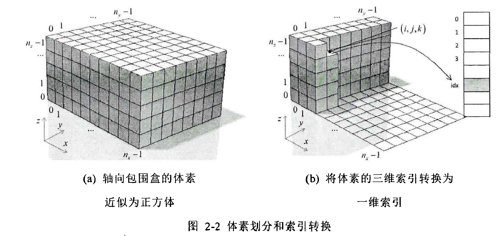

2）提出一种基于点对特征（Point Pair Feature，简称DDF）的平面提取算法

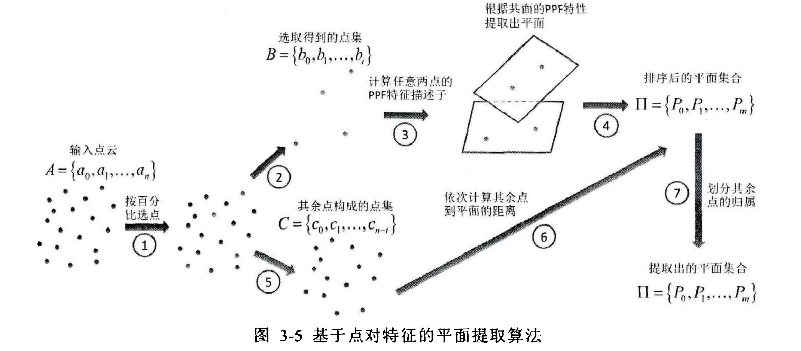

3）针对如何从场景点云中如何选取有效的三维点，提出一种三维物体的自适应均匀采样方法，并提出一种三维点云分布均匀性评价方法。

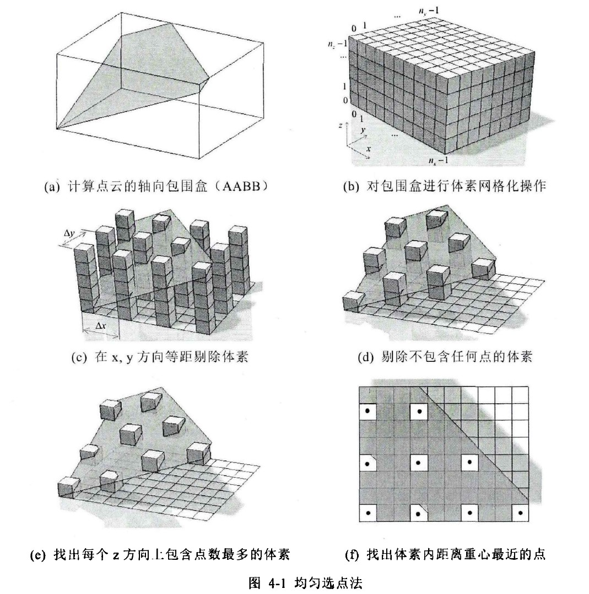

4）在前面的基础上，提出一种基于平面约束的点对特征三维物体快速识别方法，快速主要是基于前面的方法大量的剔除场景点云中的点云数量，之后在跟模型库中的目标点云进行配准时，就可以节省大量时间。

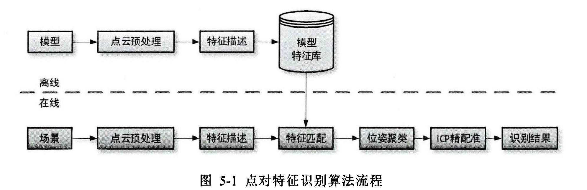

------

### 个人评论：

​		本文最大创新，个人认为是在点对特征想法的提出，原理和描述子表述都很简单移动，可以值得借鉴。

------

## 3.基于多特征模型库的物体识别和位姿估计研究  （马志军----沈阳工业大学硕士论文）

--发布时间：2021.06

--关键词：服务机器人、多特征模型库、 位姿估计、目标识别、特征描述子

--论文链接：[paper]([论文在线阅读—中国知网 (cnki.net)](https://kreader.cnki.net/Kreader/CatalogViewPage.aspx?dbCode=CMFD&filename=1021847089.nh&tablename=CMFD202201&compose=&first=1&uid=WEEvREcwSlJHSldSdmVpbisvQWlDQXErbit3RGJ6VW1aZ3BmTit1NWh1Zz0=$9A4hF_YAuvQ5obgVAqNKPCYcEjKensW4IQMovwHtwkF4VYPoHbKxJw!!))

--阅读时间：2022.11.19

------

### 主要内容概述：

1）比较详细的讲解了服务机器人视觉系统的搭建和算法设计，偏向硬件（使用的开发环境、使用的设备型号），感兴趣的可以去了解一下。

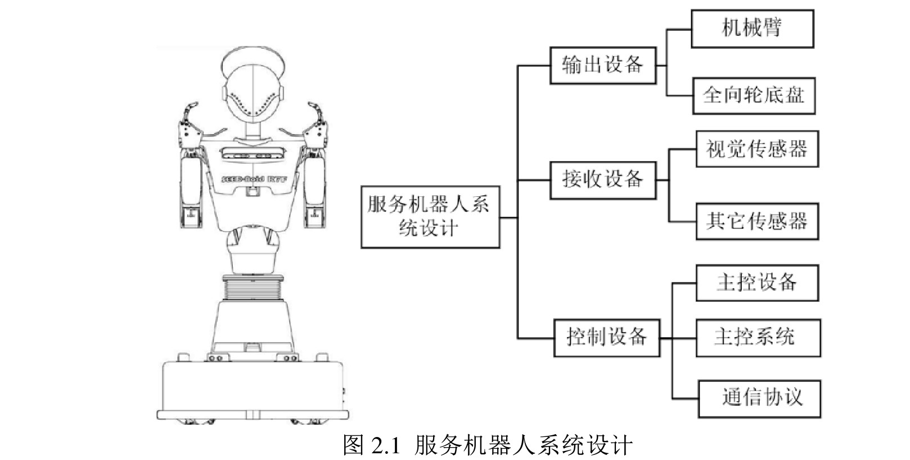

2）针对场景噪声，即离散点云，使用直通滤波进行点云滤波；针对点云密度大，采用体素滤波，降低点云密度；在点云分割方面（本文点云分割主要就是将支撑物体的平面点云与物体点云分开），采用欧式聚类分割；在点云特征提取方面，采用全局特征VFH（视点特征直方图）和局部特征FPFH（快速点特征直方图）结合的方法，其实就是先用全局特征VFH进行粗匹配，如果出现遮挡情况，采用局部特征FPFH进行细匹配。

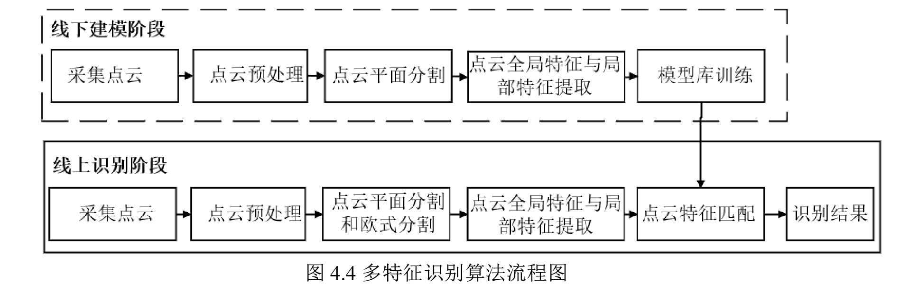

3）在基于点云局部特征的位姿估计模块，提出利用主成分分析法构建OBB包围盒坐标系建立模型点云坐标系（以前没有看到过，不确定是否是原创）；并针对局部特征FPFH计算进行了优化，主要就是先提取三维点云关键点（Iss3D），之后计算关键点附近的FPFH特征，减少了特征的计算数量。

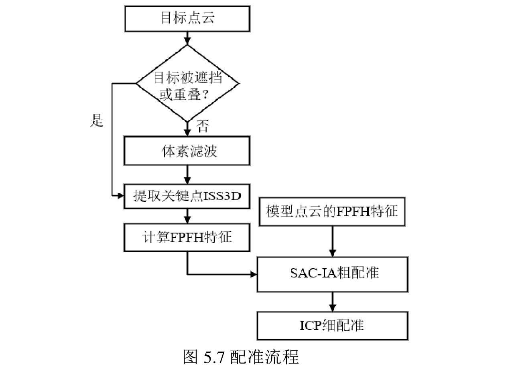

------

### 个人评论：

本文主要基于实际应用，所提方法主要也是用来解决实际问题，所用方法也是比较传统的，并未有太大创新，参考意义不是太大。

------

# Estimation of satellite attitude and size

------

## 1.Attitude and Size Estimation of Satellite Targets Based on ISAR Image Interpretation（Jiadong Wang----西安电子科技大学）

------

--发布时间：2021.12.31

--发布地址：IEEE TRANSACTIONS ON GEOSCIENCE AND REMOTE SENSING

--关键词：Pix2pixGAN、Principal Component Analysis

--论文链接：[paper](https://ieeexplore.ieee.org/abstract/document/9667365)

--阅读时间：2022.11.30

------

### 创新点：

1）提出了一种新的基于Pix2pixGAN的ISAR图像分割方法

2）提出了一种基于梯度的搜索最优参数的方法

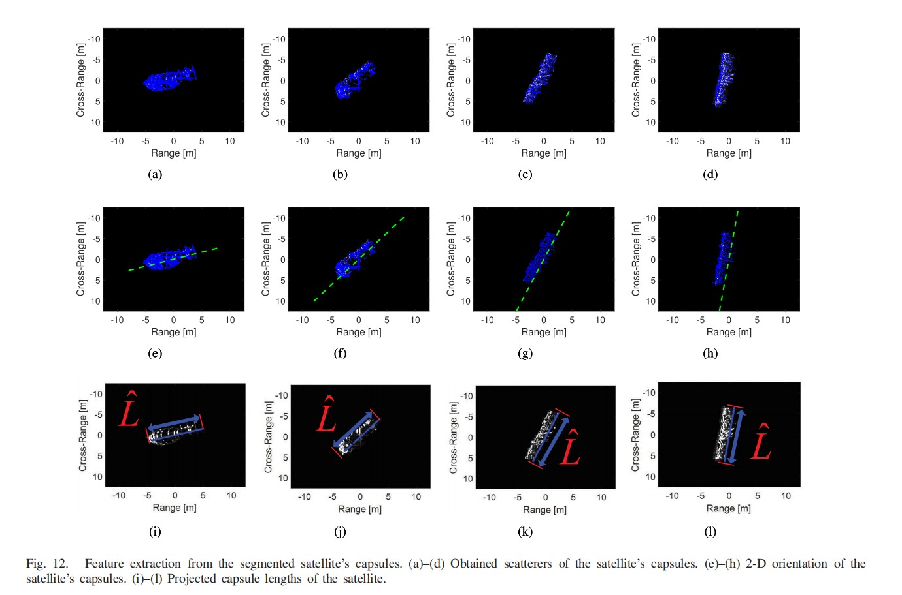

------

### 步骤：

1）基于学习X和Y两个域之间的映射函数的思想，提出一种Pix2pixGAN分割方法，分割出空间目标的太空舱（胶囊）；

2）基于OMP算法得到散射体在太空舱上的位置，此位置用来估计卫星胶囊的二维姿态；

3）利用PCA方法获取卫星胶囊在ISAR图像中的二维方向，通过将所有提取的散射体投影到主轴矢量上，可以估计出卫星太空舱的投影长度；

4）通过一个优化函数，利用基于梯度的迭代方法，求出最优解，得到卫星太空舱的绝对姿态和长度。

------

### 个人评论：

虽然最后比较过程中，本文方法比因式分解法性能好，但是本文主要针对包含太空舱（具有对称圆柱体结构）这一类卫星，具有很大局限性。

------

## 2.**A method of 3D Reconstruction via ISAR Sequences based on** scattering centers association for space rigid object（Gang Li----国防科技大学）

------

--发布时间：2014

--关键词：三维重建、散射中心关联

--论文链接：[paper](https://www.semanticscholar.org/paper/A-method-of-3D-reconstruction-via-ISAR-Sequences-on-Li-Zou/372c4d16f54e0ade16d0414cea35da917d9b8097)

--阅读时间：2022.12.01

------

### 创新点：

1）将轨道运动对散射中心轨迹的影响作为约束条件，引入散射中心的关联

2）提出了一种基于矩阵Err的特征点筛选方法来分析错误的关联，并定义了重构误差

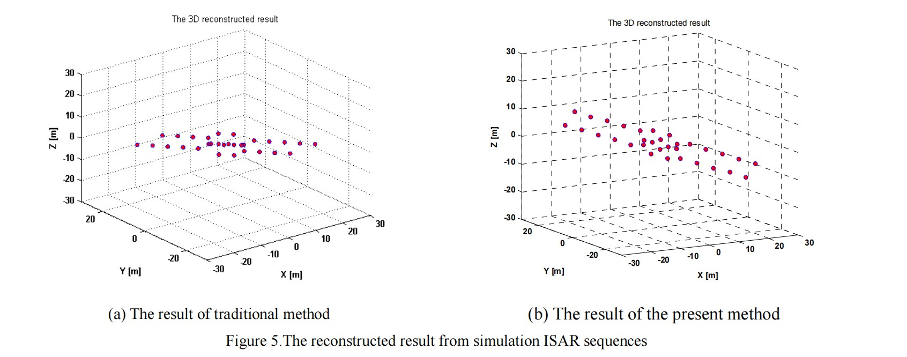

------

### 个人评论：

感觉这篇论文可能对我三维重建有用，下周需要细读。
