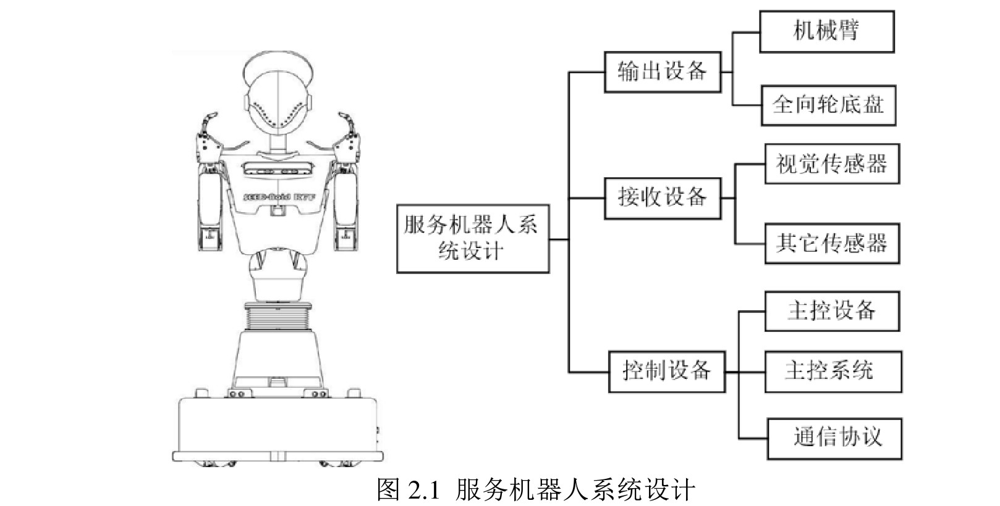
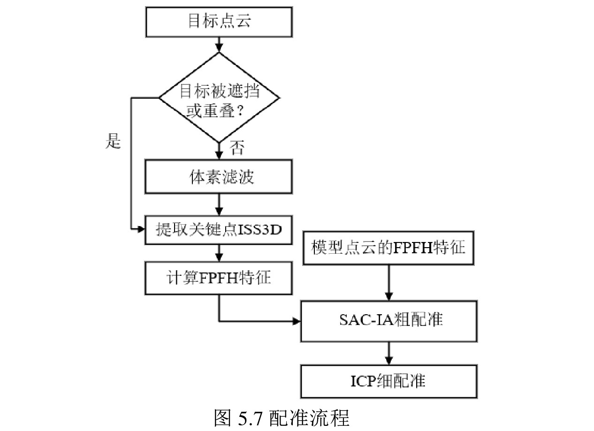
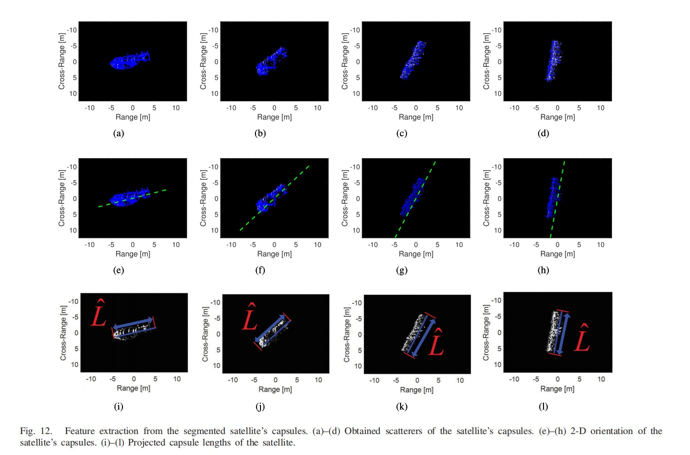
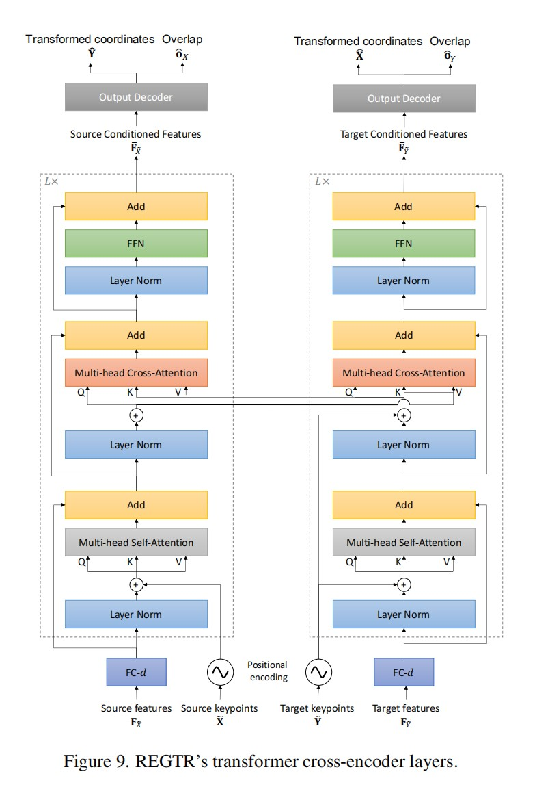

# Pose estimation已更新文献数量 4篇

------

## 1-马志军（Keywords: Pose estimation、object identification）

------

### -沈阳工业大学

------

### 1 基于多特征模型库的物体识别和位姿估计研究（硕士毕业论文，2021）[paper]([论文在线阅读—中国知网 (cnki.net)](https://kreader.cnki.net/Kreader/CatalogViewPage.aspx?dbCode=CMFD&filename=1021847089.nh&tablename=CMFD202201&compose=&first=1&uid=WEEvREcwSlJHSldSdmVpbisvQWlDQXErbit3RGJ6VW1aZ3BmTit1NWh1Zz0=$9A4hF_YAuvQ5obgVAqNKPCYcEjKensW4IQMovwHtwkF4VYPoHbKxJw!!))

- 2022/11/19（阅读时间）

### comments by LY: 本文比较详细的讲解了服务机器人视觉系统的搭建和算法设计，偏向硬件（使用的开发环境、使用的设备型号），感兴趣的可以去了解一下，本文点云分割主要就是将支撑物体的平面点云与物体点云分开，特征提取也都是用的已有方法，主要是添加了对遮挡物体的处理。

### couclusion by LY: 本文主要基于实际应用，所提方法主要也是用来解决实际问题，所用方法也是比较传统的，并未有太大创新，参考意义不是太大。

------

## 2-Jiadong Wang（Keywords: Pix2pixGAN、Principal Component Analysis）

------

### -XiDian

------

### 2 Attitude and Size Estimation of Satellite Targets Based on ISAR Image Interpretation（ IEEE TRANSACTIONS ON GEOSCIENCE AND REMOTE SENSING，2020）[paper](https://ieeexplore.ieee.org/abstract/document/9667365)

- 2022/11/30（阅读时间）

### comments by LY:本文主要基于学习X和Y两个域之间的映射函数的思想，提出一种Pix2pixGAN分割方法，分割出空间目标的太空舱（胶囊）；之后基于OMP算法得到散射体在太空舱上的位置，此位置用来估计卫星胶囊的二维姿态。

### couclusion by LY: 虽然最后比较过程中，本文方法比因式分解法性能好，但是本文主要针对包含太空舱（具有对称圆柱体结构）这一类卫星，具有很大局限性。

------

## 3-JinJian Cai（Keywords: Point cloud alignment）

------

### -Beijing Institute of Technology

------

#### 3 Automatic Target Recognition Based on Alignments of  Three-Dimensional Interferometric ISAR Images and CAD Models（IEEE TRANSACTIONS ON AEROSPACE AND ELECTRONIC SYSTEMS，2020）[paper]([Automatic Target Recognition Based on Alignments of Three-Dimensional Interferometric ISAR Images and CAD Models | IEEE Journals & Magazine | IEEE Xplore](https://ieeexplore.ieee.org/document/9130094))

- 2023/01/05

### comments by LY:本文主要使用InISAR（干涉逆合成孔径雷达）进行三维目标重建，然后提出一种改进的PCA（主成分分析）点云粗配准方法。

### couclusion by LY: 本文的主要创新点主要还是提出了一种改进的PCA（主成分分析）点云粗配准方法，旨在解决使用PCA进行粗匹配过程中的180°模糊问题，从而避免后面使用ICP进行细匹配过程中出现局部最优，对于InISAR三维重建方面，都是已有的工作，作者只是拿来使用而已，个人感觉这个应该算是工作量（说创新点有点勉强）。

------

## 4-Zi Jian Yew (Keywords：point cloud registration)

------

### -National University of Singapore

------

####  4 REGTR: End-to-end Point Cloud Correspondences with Transformers（CVPR，2022）[paper](https://arxiv.org/pdf/2203.14517.pdf)

-2023/04/25

### comments by LY:本文主要提出一种基于transformer的端对端的刚性点云配准网络-->REGTR，通过KPConv 卷积主干网络进行点云特征提取，提取的特征通过多个transformer编码层进行特征匹配和位置变换，最后的输出解码器可以直接预测特征点的重叠分数和相应的变换坐标，可以直接估计点云的姿态。

couclusion by LY:其实本文进行点云匹配的基本思路还是和传统的思路一致，只不过是使用网络来进行特征提取和匹配，相比于传统的ICP/RANSAN算法，节省了大量的时间，还有一点，就是这个网络最后可以直接预测一幅点云中的关键点在另一幅点云中的位置，省去了传统方法中位姿变换这一步骤。
