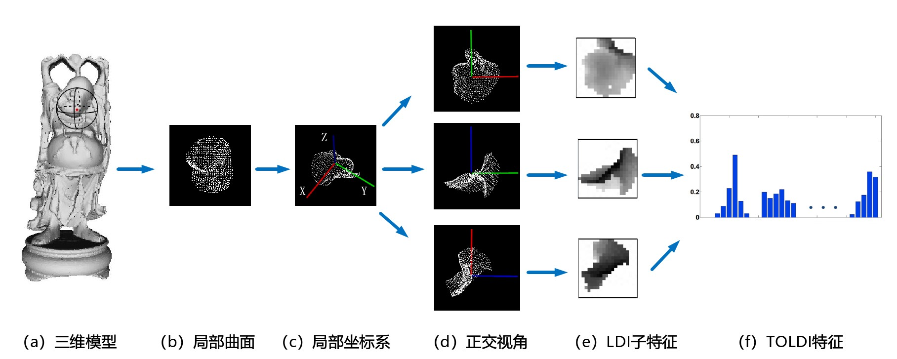
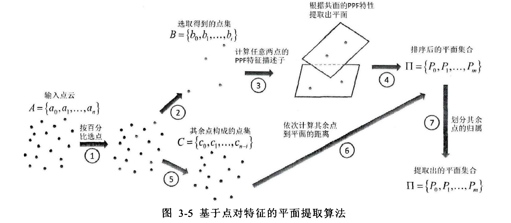

# Point Cloud Descriptor And Match 已更新文献数量 4 篇

------

## 1-杨佳琪（Keywords: 3D Feature Description And Matching）

------

### -华中科技大学

------

### 1 点云局部特征描述与匹配研究（博士毕业论文，2019）[paper]([点云局部特征描述与匹配研究 (wanfangdata.com.cn)](https://oss.wanfangdata.com.cn/www/点云局部特征描述与匹配研究.ashx?isread=true&type=degree&resourceId=D01785245&transaction={"id"%3Anull%2C"transferOutAccountsStatus"%3Anull%2C"transaction"%3A{"id"%3A"1595688454660927488"%2C"status"%3A1%2C"createDateTime"%3Anull%2C"payDateTime"%3A1669276748706%2C"authToken"%3A"TGT-71895296-zf2DyPwCqPVsp3yJ5PY4FGad0xjaruVK3HLvEkYmZpD5RHQF5c-my.wanfangdata.com.cn"%2C"user"%3A{"accountType"%3A"Group"%2C"key"%3A"zjgydxtsg"}%2C"transferIn"%3A{"accountType"%3A"Income"%2C"key"%3A"ThesisFulltext"}%2C"transferOut"%3A{"GTimeLimit.zjgydxtsg"%3A30.0}%2C"turnover"%3A30.0%2C"orderTurnover"%3A30.0%2C"productDetail"%3A"degree_D01785245"%2C"productTitle"%3Anull%2C"userIP"%3A"115.233.205.171"%2C"organName"%3Anull%2C"memo"%3Anull%2C"orderUser"%3A"zjgydxtsg"%2C"orderChannel"%3A"pc"%2C"payTag"%3A""%2C"webTransactionRequest"%3Anull%2C"signature"%3A"I7aHih%2F6CkkcwN5QW%2B3eQpZbGXgt2bbhn%2B27zXtlkBa7efw5EAbAm%2Fb0yhMu9TqMgRbFInh1ZcUi\nHUOylKuEelr9pzqEbAR9%2BXjbgYwGRonXc81Ev5dYwbqI6EPHRGcwhQXU9EZEsV5h4t%2FtxSWdCWA%2F\n%2BqITqtk4Mg2O71Q47IU%3D"%2C"delete"%3Afalse}%2C"isCache"%3Afalse}))

- ### 2022/11/15（阅读时间） 

### commends by LY: 本文提出了一种基于正交投影的点云局部特征描述子（TOLDI），并介绍了一种基于法向量以及邻域点投影向量来计算的局部坐标系建立方法，接着针对TOLDI描述子纬度高（1200维）而且是浮点型描述子，在存储和计算时效率低的问题，提出一种旋转轮廓特征（RCS），并进行二值化操作；为了增强特征的特异性，利用深度学习的方法非线性的融合点云的局部几何特征，最后基于RCS特征和投票机制，提出一种新的点云配准重建算法。

### conclusion by LY:论文主要工作还是在创建点云局部特征描述上，TDLDI和RCS特征描述的参考意义还是挺大的，尤其是RCS，在提高效率和节省存储空间上还是优于一些传统特征描述的。

------

## 2-肖正涛（Keywords: Point Pair Feature、Object Recognition）

------

### -广东工业大学

------

### 2 基于点对特征的三维物体快速识别方法研究 （博士毕业论文，2021）[paper]([基于点对特征的三维物体快速识别方法研究.ashx (wanfangdata.com.cn)](https://oss.wanfangdata.com.cn/www/基于点对特征的三维物体快速识别方法研究.ashx?isread=true&type=degree&resourceId=Y3831836&transaction={"id"%3Anull%2C"transferOutAccountsStatus"%3Anull%2C"transaction"%3A{"id"%3A"1595722490687029248"%2C"status"%3A1%2C"createDateTime"%3Anull%2C"payDateTime"%3A1669284863527%2C"authToken"%3A"TGT-71913972-5AKf5ZVpeIxAEVnoY73NVSNrO9gi0Quc57ZrhymlU7vIhpCY3b-my.wanfangdata.com.cn"%2C"user"%3A{"accountType"%3A"Group"%2C"key"%3A"zjgydxtsg"}%2C"transferIn"%3A{"accountType"%3A"Income"%2C"key"%3A"ThesisFulltext"}%2C"transferOut"%3A{"GTimeLimit.zjgydxtsg"%3A30.0}%2C"turnover"%3A30.0%2C"orderTurnover"%3A30.0%2C"productDetail"%3A"degree_Y3831836"%2C"productTitle"%3Anull%2C"userIP"%3A"115.233.205.171"%2C"organName"%3Anull%2C"memo"%3Anull%2C"orderUser"%3A"zjgydxtsg"%2C"orderChannel"%3A"pc"%2C"payTag"%3A""%2C"webTransactionRequest"%3Anull%2C"signature"%3A"ihePrpsFqAq6R1jC7H87oB%2FZCRARw1iuQEpEJYzhT2jmEH4Gc82xjffcayOP0%2FEoJFMTpzpmVAvC\nCQ3E%2ByUdKxksg5xfHoMgCDkA0Cujb6DhAImc25txqfzSxCq7DpiklCd4eJicEstbkJYnD%2F%2FQbKfZ\nRaw3DALTvRH21%2BRPoSk%3D"%2C"delete"%3Afalse}%2C"isCache"%3Afalse}))

- 2022/11/17（阅读时间）

### commends by LY: 本文针对三维点云中存在的大量冗余数据，根据Drost体素网格降采样算法，提出一种不等分体素网格均匀降采样算法，然后提出一种基于点对特征（Point Pair Feature，简称DDF）的平面提取算法，并针对如何从场景点云中如何选取有效的三维点，提出一种三维物体的自适应均匀采样方法，并提出一种三维点云分布均匀性评价方法。

### conclusion by LY: 本文最大创新，个人认为是在点对特征想法的提出，原理和描述子表述都很简单移动，可以值得借鉴。

------

## 3-Radu Bogdan Rusu（Keywords: Point Feature Histogram）

------

### -Technische Universität München

------

### 3  Aligning Point Cloud Views using Persistent Feature Histograms（RSJ International Conference on Intelligent Robots and Systems，2008）[paper]([Aligning point cloud views using persistent feature histograms | IEEE Conference Publication | IEEE Xplore](https://ieeexplore.ieee.org/document/4650967))

- 2023/01/06（阅读时间）

### commends by LY:  通过在高维（16D）中描述物体的局部几何特征，提出一种新的点云特征描述子PFH（点特征直方图），其主要基于法线信息，通过统计球体邻域内点云对的角度分布来形成描述子。本文通过真实的激光扫描的室内室外点云数据进行验证，证明了其在点云存在异常点时仍是鲁棒的，并且对点云的位置、方向或采样密度是不变的。

### conclusion by LY: 论文开创性的新提出一种新的点云特征描述子，有很大的参考价值，至于使用的话可以参考其提高/优化篇FPFH（快速点特征直方图）

------

## 4-Radu Bogdan Rusu（Keywords: Fast Point Feature Histogram）

------

### -Technische Universität München

------

### 4 Fast Point Feature Histograms (FPFH) for 3D Registratio（ IEEE International Conference on Robotics and Automation，2009）[paper]([Aligning point cloud views using persistent feature histograms | IEEE Conference Publication | IEEE Xplore](https://ieeexplore.ieee.org/document/4650967))

- 2023/01/09（阅读时间）

### commends by LY: 主要针对PFH中存在的一些问题进行优化和改进，在保留PFH特征描述子的大部分鉴别能力的同时，提高了其计算速度，并提出一种SAC-IA（Sample Consensus based method for the Initial Alignment）方法，对两幅点云进行对齐，此方法是点云粗匹配方法的一种，通常可以作为ICP细匹配的前一步骤。

### conclusion by LY: FPFH虽然降低了复杂度，满足某些实时性要求，可以在某些实时场景中使用，但是由于没有对近邻点所有组合进行计算，相比于PFH可能会漏掉一些重要点对，特征描述可能没PFH准确。FPFH在点云特征描述方面有很大的参考价值。
