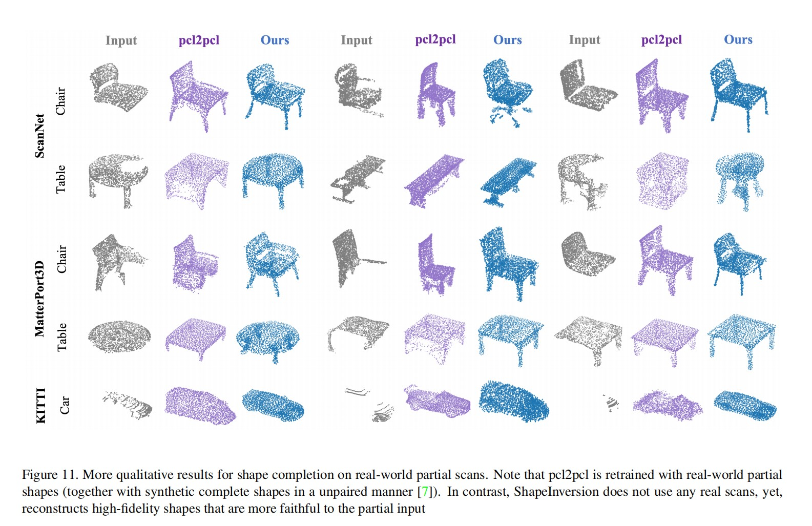

# Point cloud completion 已更新文献数量1篇

------

## 1-JunZhe  Zhang （Keywords：GAN（Generative  Adversarial  Network) 、ShapeInversion）

------

### -CVPR

------

### 3 Unsupervised 3D Shape Completion through GAN Inversion （CVPR，2021）[paper](https://arxiv.org/pdf/2104.13366.pdf)

-2023/04/03（阅读时间）

### comments by LY: 本文提出一个ShapeInversion，首次将生成对抗网络（GAN）逆映射引入到形状补全任务中。首先使用一个在完整的形状上预训练的GAN，学习一个潜在代码，然后使用潜在代码给出一个完整的形状，从而ShapeInversion能最好地重建给定的残缺输入。

### couclusion by LY: 本文虽然称为无监督的点云补全，但是仍然需要一个对现实世界中完整物体点云预训练的GAN，如果GAN训练中没有某一物体的完整点云，预计结果不会太好。