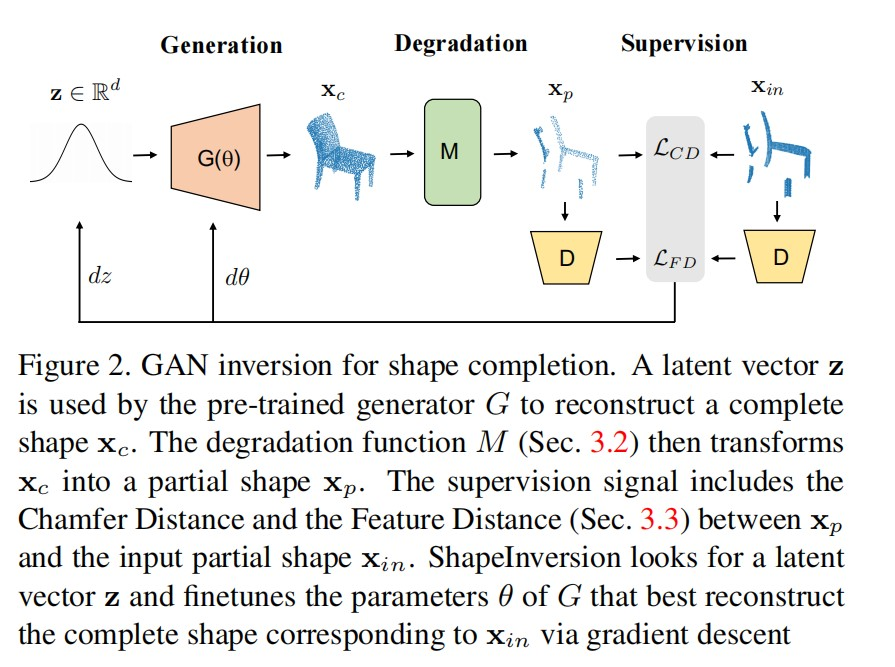
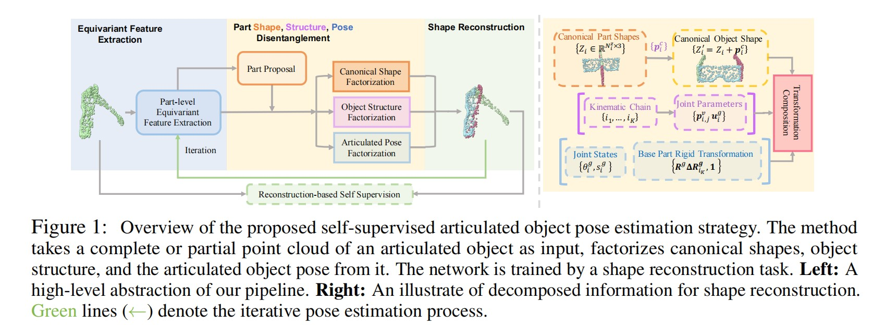
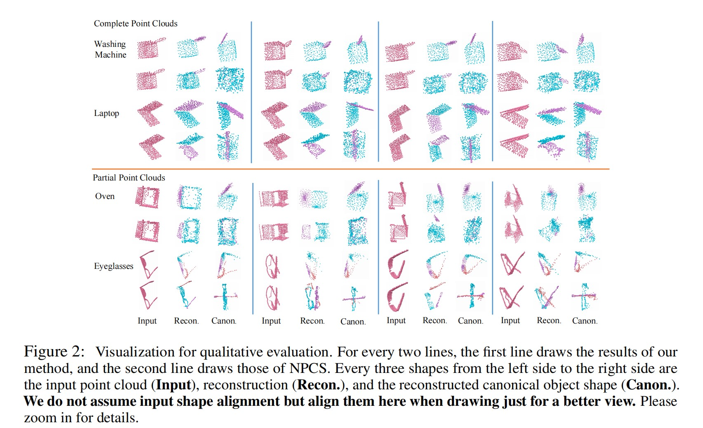

# Point cloud completion 已更新文献数量2篇

------

## 1-JunZhe  Zhang （Keywords：GAN（Generative  Adversarial  Network) 、ShapeInversion）

------

### -CVPR

------

### 1 Unsupervised 3D Shape Completion through GAN Inversion （CVPR，2021）[paper](https://arxiv.org/pdf/2104.13366.pdf)

-2023/04/03（阅读时间）

### comments by LY: 本文提出一个ShapeInversion，首次将生成对抗网络（GAN）逆映射引入到形状补全任务中。首先使用一个在完整的形状上预训练的GAN，学习一个潜在代码，然后使用潜在代码给出一个完整的形状，从而ShapeInversion能最好地重建给定的残缺输入。

### couclusion by LY: 本文虽然称为无监督的点云补全，但是仍然需要一个对现实世界中完整物体点云预训练的GAN，如果GAN训练中没有某一物体的完整点云，预计结果不会太好。

------

## 2-XueYi Liu（Keywords：Category-level articulated object pose estimation）

------

### -ICLR  

------

### 2 SELF-SUPERVISED CATEGORY-LEVEL ARTICULATED OBJECT POSE ESTIMATION WITH PART-LEVEL SE(3) EQUIVARIANCE（ICLR，2023）[paper](https://arxiv.org/pdf/2302.14268.pdf)

-2023/04/14

### comments by LY: 本文主要针对铰接物体进行位姿估计，最大贡献就是结合部件级别 SE(3) 等变特征，设计出一种铰接物体部件位姿估计的方法，这种方法无需额外监督即可以完成部件位姿估计的任务，不过这种方法还是需要对完整铰接物体点云进行预处理。

couclusion by LY: 虽然说是一种自监督方法，可以省去大量标注工作，但是在前期的数据处理上要花费很多时间，首先要有物体的完整点云，然后还需要各个铰接部件的不同位姿的点云，在实际生活中，如果有数据集里面有的数据还好，如果没有，要自己处理数据还是挺麻烦的。