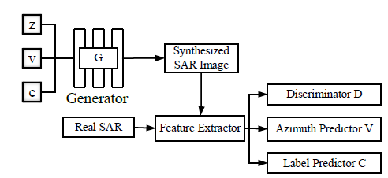

#  ISAR Image Generation
## 1篇 Ruo-Yi Zhou (Keywords:ISAR,ATR,GANs)
- Key laboratory for Information Science of Electromagnetic Waves (MoE), School of Information Science and 
  Technology, Fudan University, Shanghai, China
### 1 ISAR Images Generation Via Generative Adversarial Networks (IEEE International Symposium on Geoscience and Remote Sensing (IGARSS),2021)  [paper](images/ISAR_Images_Generation_Via_Generative_Adversarial_Networks.pdf)
- 2023/07/07
#### conslusion by mgl 当前智能目标识别任务面临的挑战之一是缺乏样本，特别是在逆合成孔径雷达(ISAR)图像理解方面。近年来发展起来的识别算法，特别是基于深度学习方法的识别算法，在很大程度上依赖于现有的训练数据。然而，据我们所知，目前还没有开源的实用ISAR数据集能够覆盖全方面角度。本文提出了一种ISAR目标生成网络，用于多向ISAR图像的生成。利用双向分析射线追踪(BART)方法，生成了六种飞机的模拟ISAR数据集。然后，利用模拟的ISAR数据集对所提出的生成网络进行训练。 使用结构相似度(SSIM)来评估所提出网络的性能。实验结果表明，生成的目标与真实ISAR图像非常接近，生成的飞机ISAR图像与真实ISAR图像之间的SSIM大于0.7;所提出的生成网络能够较好地生成缺失角度下的高分辨率ISAR图像，且图像与真实图像基本一致。

##  廖淮璋 （关键词：图像生成；逆合成孔径雷达（ISAR）图像生成；循环对抗生成网络）
- 国防科技大学电子科学学院，长沙，中国
### 2基于物理先验的空间目标光学-ISAR 图像跨域生成  [paper] (images/R23063_P_editing)
