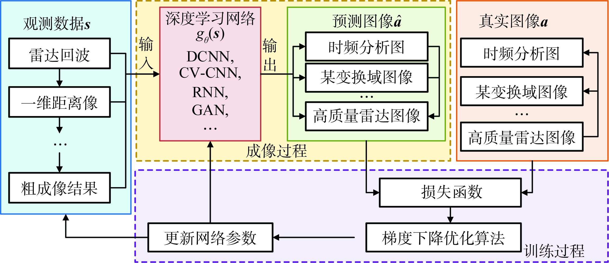
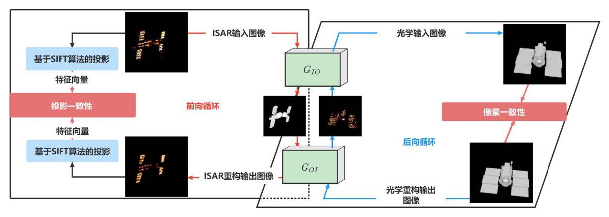
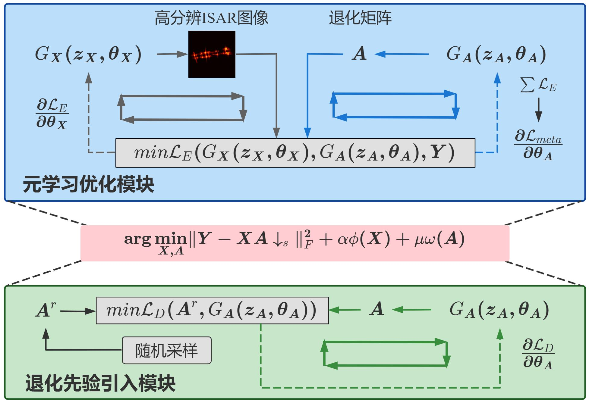

## 4篇 张云（关键词：深度学习； 雷达成像； 逆问题； 卷积神经网络）
- 哈尔滨工业大学电子与信息工程学院
- 2023.9.13
### 基于深度学习的雷达成像技术研究   http://radarst.cnjournals.com/html/2021/5/202105001.html
#### conslusion by mgl  成像雷达具有全天时、全天候、远距离、高分辨对地观测的能力，使得雷达系统具有对观测区域进行成像和解译的能力。利用先进信号处理技术实现实时高分辨成像以满足图像解译的需求是雷达成像技术研究的重要目的和意义。随着深度学习的迅速兴起，深度学习网络在逆问题求解中得到广泛应用，也为提升成像质量和成像效率提供新的求解思路。本文基于雷达成像数学模型将雷达成像问题建模为成像逆问题，从逆问题求解的角度分析了基于深度学习的雷达成像方法的可行性。
基于深度学习网络的雷达成像示意图如下图所示。观测数据作为网络的输入数据，是影响深度学习网络性能的重要因素之一。

#### 在SAR/ISAR成像中，观测数据可以是雷达的原始回波数据，也可以是成像过程中的中间处理结果，如一维距离像甚至传统成像算法预处理后的粗成像结果。在SAR运动目标聚焦成像网络中，观测数据可以为SAR原始回波信号，也可以是成像预处理甚至杂波抑制预处理的SAR图像。由于原始回波数据尚未进行二维匹配滤波，由数据域到图像域的映射过程比较复杂，所需感受野较大，因此训练成本较大。为减轻训练压力，可以首先对原始数据进行传统成像预处理得到粗成像结果，将粗成像结果作为初始图像，输入到成像网络中进行图像精确重构。相比于原始数据，该方法的训练成本更小。需要在数据保留程度和训练成本之间进行权衡，选择最合适的观测数据作为成像网络的输入。经过深度学习网络成像处理后，输出的预测图像可以直接为高质量雷达图像，也可以是时频分析图，或者在某变换域下的成像结果，进而转换为最终的高质量雷达成像结果。
#### 基于小样本甚至零样本学习的雷达成像方法研究。现有基于监督学习的深度学习模型对训练样本数量的依赖性较高，而目前尚无已标注的雷达成像实测数据集，尤其未知非合作目标的数据更加难以获取，现有的网络训练过程多数利用仿真数据，然而，仿真数据与实测数据仍存在一定的差异性，同时数据的不充足也进一步影响成像的性能。基于模型微调、数据增强以及迁移学习等的小样本学习模型和算法受到广泛关注，目前小样本学习研究主要集中在光学图像分类、字符识别等任务中，难以直接应用于雷达成像领域。因此，未来需要研究适用于雷达认知成像任务的小样本甚至零样本学习模型，以降低成像网络对训练样本的需求，使其具有更广阔的应用价值。

#  ISAR Image Generation
## 1篇 Ruo-Yi Zhou (Keywords:ISAR,ATR,GANs)
- Key laboratory for Information Science of Electromagnetic Waves (MoE), School of Information Science and 
  Technology, Fudan University, Shanghai, China
### 1 ISAR Images Generation Via Generative Adversarial Networks (IEEE International Symposium on Geoscience and Remote Sensing (IGARSS),2021)  [paper](images/ISAR_Images_Generation_Via_Generative_Adversarial_Networks.pdf)
- 2023/07/07
#### conslusion by mgl 当前智能目标识别任务面临的挑战之一是缺乏样本，特别是在逆合成孔径雷达(ISAR)图像理解方面。近年来发展起来的识别算法，特别是基于深度学习方法的识别算法，在很大程度上依赖于现有的训练数据。然而，据我们所知，目前还没有开源的实用ISAR数据集能够覆盖全方面角度。本文提出了一种ISAR目标生成网络，用于多向ISAR图像的生成。利用双向分析射线追踪(BART)方法，生成了六种飞机的模拟ISAR数据集。然后，利用模拟的ISAR数据集对所提出的生成网络进行训练。 使用结构相似度(SSIM)来评估所提出网络的性能。实验结果表明，生成的目标与真实ISAR图像非常接近，生成的飞机ISAR图像与真实ISAR图像之间的SSIM大于0.7;所提出的生成网络能够较好地生成缺失角度下的高分辨率ISAR图像，且图像与真实图像基本一致。

##  廖淮璋 （关键词：图像生成；ISAR；循环对抗生成网络）
- 国防科技大学电子科学学院，长沙，中国
### 2基于物理先验的空间目标光学-ISAR 图像跨域生成  [paper](images/R23063_P_editing.pdf)
#### conslusion by mgl  基于深度学习的识别检测模型通常依赖于大量的训练样本以得到优秀的性能保证。然而在实际应用中，空间目标的ISAR图像往往不易获取且成本高昂，因此限制了现有的前沿深度学习方法在ISAR图像处理中的应用；现有的光学图像翻译方法难以兼顾空天目标在雷达波下的物理特征（散射点强度、分布与强度变化方向等），因此对ISAR图像生成的效果较差。通过图像翻译技术从空间目标（如飞机、卫星）的光学图像生成对应ISAR图像，解决空间目标的ISAR图像往往不易获取且成本高昂的问题,提出了一种基于物理先验的循环生成对抗网络（Physical Domain Prior CycleGAN, PDP-CycleGAN）以学习ISAR图像中的物理域特征。解决存在显著差异物理特征的不同图像域的图像翻译问题。通过构建基于特征隐空间的拉格朗日函数损失函数，使得生成模型能够在训练中学习ISAR图像的散射点分布特征。采用尺度不变特征变换（Scale Invariant Feature Transform，SIFT）算法提取ISAR图像中的散射点强度、分布与散射点强度变化方向，并基于此构建ISAR图像域的物理先验一致性。通过一致性的构建，PDP-CycleGAN能够学习ISAR图像域与光学图像域的可逆映射，从而获取生成空间目标的ISAR图像的生成器。将本文所提PDP-CycleGAN方法分别在三个角度（非配对图像翻译，方位角变换下空间目标翻译,陌生目标ISAR 图像翻译 ）与传统主流方法CycleGAN、UNIT进行对比，并通过初始分数(Inception Score,IS)与多尺度结构相似度指数（Multi-scale Structural Similarity,MS-SSIM)对生成的ISAR图像进行定量评估。实验结果表明：PDP-CycleGAN具有最佳的性能，其在散射点分布、强度等特征上与真实的ISAR图像保持一致。

## 杨志雄(关键词: 空间目标 逆合成孔径雷达, 图像超分辨, 元学习)
- 国防科学技术大学, 长沙, 中国
### 一种基于元学习的空间目标 ISAR 图像超分辨算法  [paper](images/R23062_P_editing.pdf)
#### conslusion by mgl 针对空间目标逆合成孔径雷达(Inverse Synthetic Aperture Radar, ISAR)图像的超分辨率问题。现有的ISAR超分辨率算法主要分为基于模型的方法和基于深度学习的方法两大类；基于模型的方法通常具有明确数学模型，并在特定的超分辨率任务上表现良好。然而，现实中观测得到图像往往质量较此ISAR低，因图像超分辨问题具有高度非凸性。此时手工设计的图像先验难以具备较足ISAR好的泛化性能，不能有效地满图像超分辨任务需求。现有的基于深度学习的方法缺乏可解释性和泛化性能，不能满足空间目标ISAR图像的超分辨任务的需求提出了一种基于元学习的空间目标ISAR图像超分辨算法。该算法将ISAR图像退化模型中的先验信息和元学习求解策略进行结合，通过引入ISAR图像退化先验并基于元学习优化策略进行求解，实现了不依赖配对训练数据和预训练的空间目ISAR图像超分辨。本文所提出的空间目标ISAR 图像超分辨方法总共包含退化先验引入模块和元学习优化模块两部分，此方法实现了在没有数据训练，也没有训练过程的条件下，对低分辨率ISAR图像进行实时、自适应的超分辨率求解。实现了一种自适应、非贪婪的优化策略，从而保证了算法对空间目标ISAR图像超分辨问题的高效、准确求解。基于仿真的空间目标ISAR图像数据设计了多组对比实验，对比了两种基于模型的图像超分辨方法：bicubic和PAM，以及两种基于学习的图像超分辨方法：DIP和Double-DIP。实验结果表明：本文方法可以在无监督条件下实现空间目标ISAR图像超分辨，并获得优于其他常规ISAR图像超分辨算法的性能。本文方法的超分辨结果在定量评价结果和定性的视觉效果上都是最优的。

  
