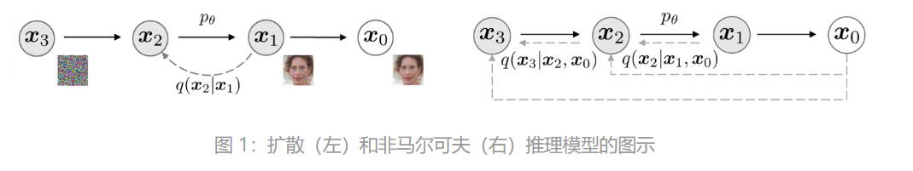
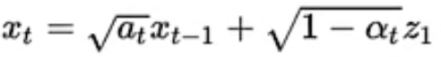
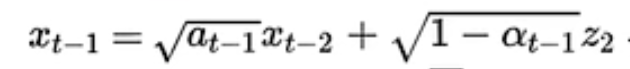
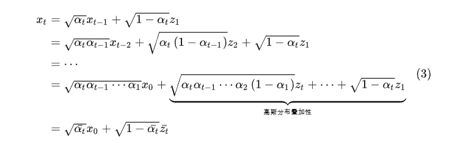
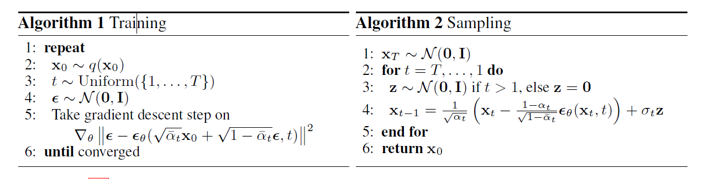
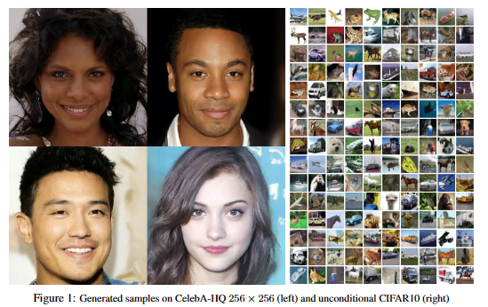

# Diffusion Models  已更新文献数量 2篇
## 2  Jiaming Song （DENOISING DIFFUSION IMPLICIT MODELS）[paper](images/ddim.pdf)  
- Stanford University
### DENOISING DIFFUSION IMPLICIT MODELS (ICLR 2021)
- 2023.10.23
### Situation
生成模型现在主要分为两类，分别是GAN和Diffusion Model，但是GAN存在一个很棘手的问题就是训练不稳定，这也是Diffusion Model相比之下的优势。DDPM是基于Markovian扩散过程的模型，虽然在生成模型上取得了不错的效果，但是同时也存在一个大缺点，就是由于在重建生成阶段是需要一步步进行，步数通常为2000，导致推理时间非常长，需要多次迭代才能产生高质量的生成样本，

####  conclusion by MGL: 相较于DDPM来说，DDIM更具更加确定性的结果，并且可以减少一定的计算时间。DDPM是可以通过改变一定的参数比如论文中的是可以互相转化的，其实也提供了另外一种模型的思路，比如也可以只用DDIM中论文的一部分来减少DDPM模型的计算时间，或者直接应用DDIM在参数上改变，看看能否对超分辨或者图像降噪等问题有新的实验发现。注意：DDIM只是在重建阶段使用，Unet训练的参数和DDPM是一样的，也就是说是通过DDPM训练参数得到的Unet模型应用到DDIM上的，这点是不变的

## 1 Jonathan Ho (Denoising Diffusion Probabilistic Models)[paper](images/ddpm.pdf)
-UC Berkeley 

### 34th Conference on Neural Information Processing Systems (NeurIPS 2020), Vancouver, Canada
-2023/10/15(阅读时间)

### Situation：
各种深度生成模型最近展示了各种数据模式的高质量样本。生成对抗网络（GAN）、自回归模型、流和变分自编码器（VAE）已经合成了引人注目的图像和音频样本，并且在基于能量的建模和分数匹配方面取得了显着进展，产生了与GAN相当的图像[。

### Task
使用扩散概率模型呈现高质量的图像合成结果,扩散概率模型是一类受非平衡热力学考虑启发的潜在变量模型

#### Action 

生成扩散模型DDPM如下图所示分为前向、逆向两个过程，它首先通过不断往原始清晰数据中添加噪声使其变成标准高斯噪声（前向过程），而后期望从标准高斯噪声中还原原始数据（逆向过程）。若能实现，那我们便可从已知的标准高斯分布中采样一个噪声数据，而后利用DDPM模型生成符合原始数据分布的新数据啦。下面将分别从前向过程和逆向过程两个角度解析DDPM算法。

  

在DDPM的前向过程中，通过下式往原始数据中逐步添加高斯噪声**（添加噪声的过程被假设为服从马尔可夫过程）**， T步过后（ T 足够大，在原始论文中作者取值是1000），数据就将变成纯高斯噪声 Z~N(0，I)、

   假设，
   
后一时刻分布是有前一时刻加噪得到的

利用马尔科夫过程特性以及高斯分布的叠加性得到

推导过程如下：

反向过程： 

​                                  前项过程提供标签 ，反向过程用这个标签去预测 噪声分布 Zt 

算法一，训练过程，

### Result

使用扩散模型展示了高质量的图像样本,我们的最佳结果是通过根据扩散概率模型与Langevin动力学的去噪分数匹配之间的新联系设计的加权变分边界进行训练而获得的，并且我们的模型自然地承认渐进式有损解压缩方案，可以解释为自回归解码的推广。在无条件CIFAR10数据集上，我们获得了 9.46 的 Inception 分数和 3.17 的最先进的 FID 分数。在256x256 LSUN上，我们获得了类似于ProgressiveGAN的样品质量。
