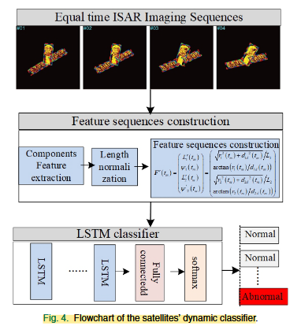
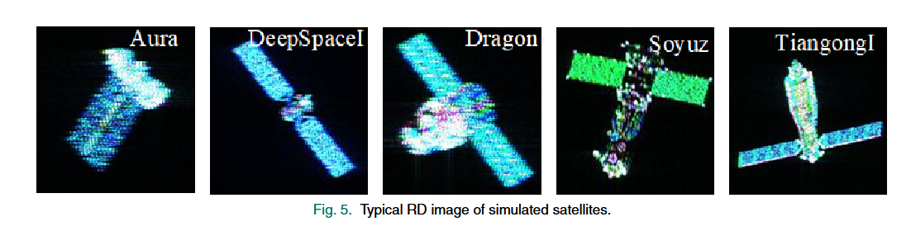
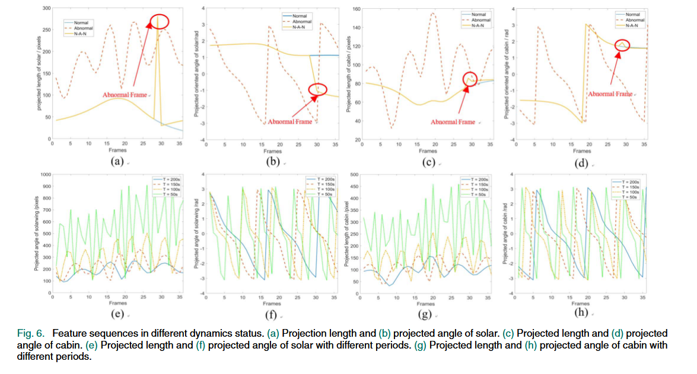
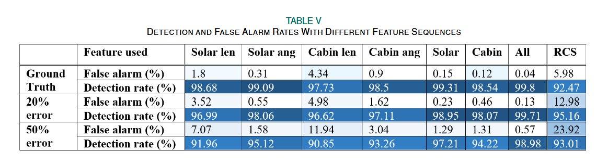

# Abnormal Dynamic Recognition 已更新文献数量 2 篇

## 1篇- Jia Duan (Keywords:Dynamic identification, LSTM)

-the School of Electronics and Communication Engineering, Sun Yat-sen University (Shenzhen),

### Space Target Dynamic Identification by  Exploiting Geometrical Feature Flow  From ISAR Image Sequences. (IEEE SENSORS JOURNAL, 2022.)[paper](https://ieeexplore.ieee.org/document/9912145)

   - 2024/11/24(阅读时间)

#### comments by MGL:主要分为三个阶段，

- 首先，使用等相干观测时序成像形成 **ISAR 图像序列**。
- 然后，太阳能帆板和舱体的**归一化**投影长度和投影角度被用于**创建特征序列向量**。
- 最后，将特征序列输入到训练好的 LSTM 网络中，该网络对空间目标的运动状态进行分类，以识别在轨姿态异常的样本

   -  

在每个观测序列中等时间生成36幅ISAR图像。针对每个空间目标，模拟了三种可供选择的动力学状态：正常(静态)、异常(自旋)和正常-异常-正常(静态-自旋-静态)。

评价指标，不同动力学状态下的特征序列。( a )投影长度和( b )太阳投影角。( c )舱段投影长度和( d )舱段投影角度。( e )不同周期的太阳投影长度和( f )不同周期的太阳投影角度。( g )不同周期舱段的投影长度和( h )不同周期舱段的投影角度。

#### 实验充分：模拟实际观测场景，特征序列提却过程中加入**高斯分布误差**来模拟提取误差。均值分别设置为特征最大值的20%和50%。

#### conclusion by MGL:

加入**高斯分布误差**来模拟提取误差。评价指标主要是异常预警率。
