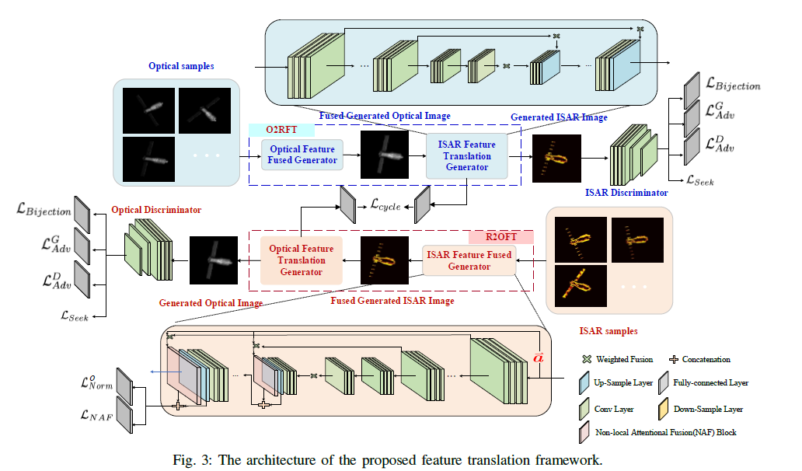
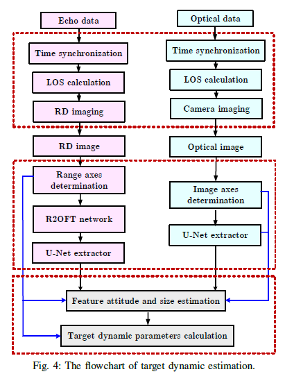

# 基于光学与雷达图像特征转换的自旋卫星动态估计
## Yejian Zhou,Weifeng Li (基于光学与雷达图像特征转换的自旋卫星动态估计)[paper](images/Automatic_Dynamic_Estimation_of_On_orbit_Satellites_through_Spaceborne_ISAR_Imaging.pdf)
-Zhejiang University of Technology Hangzhou, China

### IEEE TRANSACTIONS ON IMAGE PROCESSING 
-2023/10/08(阅读时间)
在轨卫星动态估计在空间态势感知应用中具有重要意义。现有的方法大多基于地面高分辨率遥感技术，由于观测范围的限制，难以满足巨型星座的监测需求。为了实现某一区域内卫星的自动动态估计尤为重要，与光学成像不同，逆合成孔径雷达(ISAR)图像中由于成像机理的原因，部分目标组件是不完整的。提出一种基于星载光学与地面雷达设备同步成像配合的新方法。针对ISAR图像部分目标不完整，还提出了雷达-光学特征转换网络来支持ISAR图像之间的特征提取。该方法利用提取的形状特征，分步估计目标的瞬时姿态和自旋参数。
基于循环对抗学习框架的特征翻译网络，本文提出的 R2OFT (radar-to-optical feature translation,R2OFT)网络如下所示，该网络由两个分支(Optical-ISAR分支和 ISAR-Optical translation 分支)组成。每个分支由特征生成器和鉴别器组成，旨在通过对抗性博弈优化特征转换过程。

动态估计方法，自旋卫星的动态估计由图像预处理、特征提取、目标姿态估计和自旋参数估计三部分组成。方法的流程如图下所示，

​选取天宫一号(TG-I)和Rosetta两颗典型卫星作为目标卫星，分别构建了两个仿真数据集，光学图像由光线跟踪算法生成，ISAR图像由FPO算法生成。设置每张图像的信噪比为10 dB，其他仿真参数如表1所示。每个数据集由 280 幅光学图像和280幅 ISAR图像组成，几乎覆盖了全方位的观测范围。其中，四分之三的样本用于训练，其余样本成为测试集。设计了特征翻译实验,特征提取实验,目标动态估计实验三个实验，验证了该方法的鲁棒性和优越性

总结：本文提出了一种基于星载光学和地面ISAR图像的动态估计方法，推导了同步图像与目标动态参数之间的显式表达式。为了实现宝贵的特征提取，R2OFT网络也采用循环对抗学习的方式进行设计。然后利用U-net 提取的目标投影特征，利用粒子群优化算法求解目标的瞬时姿态和自旋参数。实验结果验证了该算法的有效性。
