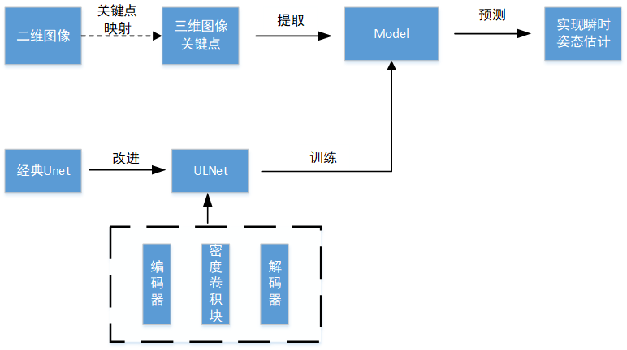

基于U-Linked 网络在轨航天器姿态估计

###### S背景：

在轨航天器实时姿态估计是各种空间应用中的核心任务。现有的方法大多是基于高分辨率传感器的长期观测，如星载相机和地面雷达。然而，在观测周期有限的情况下，这些方法很难获得目标的瞬时姿态信息。所以从单幅相机图像中实现瞬时姿态估计尤为重要。

###### T 任务

提出了一种基于关键点检测网络的目标瞬时姿态估计方法，将目标在轨姿态参数与单幅图像中的关键点特征相连接，实现从单幅相机图像中实现瞬时姿态估计。

###### A 行动

Action 1：从相机图像中估计目标姿态，将二维摄像机图像中的关键点分布看作是三维目标结构的隐式映射。航天器上一个关键点的成像可以表示为

表示关键点投影在成像平面P上的2D位置，表示3D；

K为摄像机已知的固有参数矩阵，R为目标姿态的旋转矩阵，t为平移向量

Action 2  设计基于UNet框架关键点提取网络ULNet，过程如下式

         为网络 的参数

ULNet 由编码器和解码部分组成，这两部分由一系列相邻的密度卷积块连接，编码器部分的目的是从图像中提取目标结构特征，而解码器部分的目的是对这些特征进行压缩。

在下采样部分和上采样部分之间插入密度卷积块，采用短链路策略来避免语义差异丢失，使用热图回归方法提取关键点，设计一个函数来估计关键点位置。

其中 )为滑动窗口在热图中的中心位置，为滑动窗口的大小，一般与热图大小成正比，-()< h < () ，-()< g < ()

​    并采用均方误差(MSE)函数作为损失函数来描述地面真实值与回归结果之间的差异

Loss =   其中 表示第i个关键点的热图的基本真值。

Action 3  实验

​    实验准备，两种典型航天器TG-1和Rosetta的仿真图像数据集，1200幅光学图像，水平和垂直分辨率均设置为0.05m, 图片大小为512×512， 训练集为400幅无遮挡图片，测试集50幅。

实验设计，自上向下与ULNet; 自下向上与UNet；自下向上ULNet；三种提取方法对比实验。（自上向下策略是指在目标特征描述之前提取目标组件。而自下向上的策略则是根据每个样本的热图直接检测目标关键点）;  bitch size设置为 4，学习速率为 0.01，训练梯度阈值为 0.0002。

分辨率分别设置为为原始分辨率0.05m; 0.06; 0.07m 三种分辨率对比实验。

###### R 结果

​     设计了ULNet 进行特征自动提取。通过对两种典型航天器在不同观测条件下的仿真实验，验证了该方法的可行性和鲁棒性。在实际应用中，它具有利用星载相机实现实时姿态估计的潜力。
