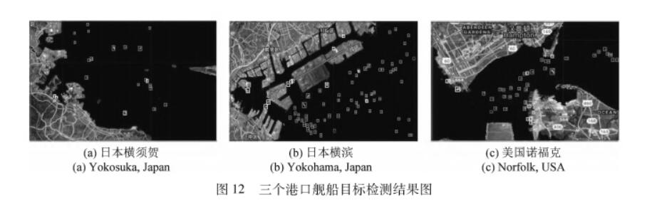
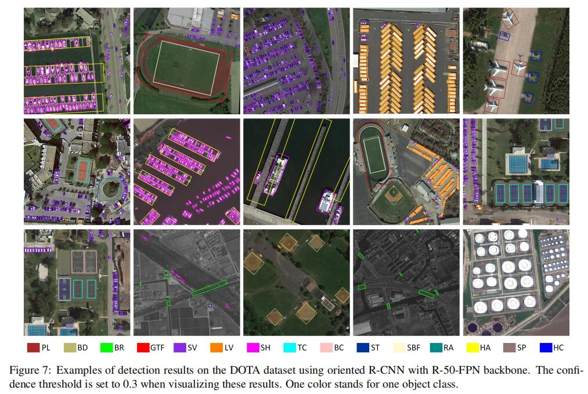
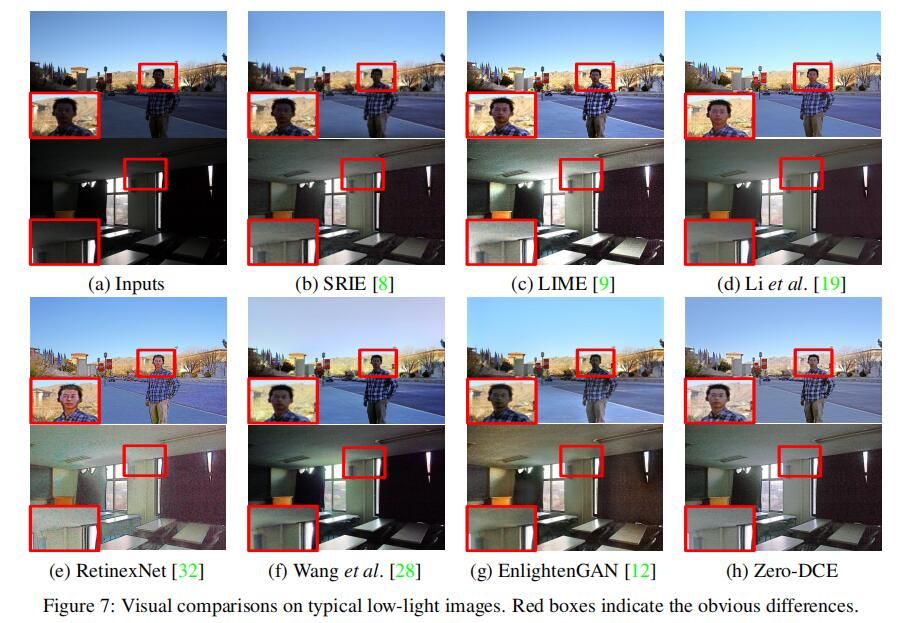

# SAR Ship-Detection 

## 1-SUN Xian (Keywords: SAR ship detection，Public dataset) 
中科院
### Publications
   - **AIR-SARShip-1.0: High-resolution SAR Ship Detection Dataset**  [paper](https://radars.ac.cn/en/article/doi/10.12000/JR19097) 
   - AIR-SARShip-1.0：高分辨率SAR舰船检测数据集 [paper](https://radars.ac.cn/article/doi/10.12000/JR19097)
  - 2022/11/20
  - comments by WYC: SAR图像舰船检测公开的数据集比较有限，基于高分三号卫星数据，构建了一个面向宽幅场景的数据集，该数据集有更多的近岸和岛礁，更贴近真实场景，且分辨率更高。数据集按照PASCAL VOC格式标注，保存为XML格式。Train和Test按照2：1比例分配。
  - conclusion by WYC:此数据集存在两个问题，一是影像数量太少(31张)，二是单张影像太大(3000*3000)，使用时应该要进行剪切。
  -  
## 2-LeiYu (Keywords:Google Earth Engines，遥感云计算，舰船检测)
国防科技大学
### Publications：
   - **基于Google Earth Engine的海量舰船目标SAR图像处理应用研究** [paper](https://www.signalpro.com.cn/cn/article/doi/10.16798/j.issn.1003-0530.2021.06.019)
   - 2022/11/24
   - comments by WYC:GEE平台海量的数据存储能力和强大的运算能力，可以应用在大范围海域的海量舰船检测方面。论文中利用GEE平台的Sentinel1 SAR卫星数据集剪切出一些港口的SAR图像，然后通过"NASA SRTM Digital Eleva tion 30 m"数据集获得相应图像的陆地掩膜，将陆地Mask掉只留下海洋区域减少误差。在得到只有海洋背景下的图片后，通过设置阈值，利用最大类间方差法(OTSU)过滤得到目标舰船。
   - conclusion by WYC：论文用的是传统的图像处理方法进行舰船检测，感觉参考意义不大，但是文章使用的数据集得到的图像质量比较好，无论是利用神经网络还是传统方法进行舰船检测，陆地都会有干扰，可以借鉴文章的方法减小陆地带来的误差。
   -  
## 3-Xie Xing xing，Cheng Gong (Keywords: Oriented Object Detection) 
西北工业大学
### Publications
   - **Oriented R-CNN for Object Detection**  [paper:ICCV2021](https://arxiv.org/abs/2108.05699)   [github](https://arxiv.org/abs/2108.05699) 
  - 2022/12/7
  - comments by WYC: SAR图像舰船检测公开的数据集比较有限，基于高分三号卫星数据，构建了一个面向宽幅场景的数据集，该数据集有更多的近岸和岛礁，更贴近真实场景，且分辨率更高。数据集按照PASCAL VOC格式标注，保存为XML格式。Train和Test按照2：1比例分配。
  - conclusion by WYC:此数据集存在两个问题，一是影像数量太少(31张)，二是单张影像太大(3000*3000)，使用时应该要进行剪切。
  - 网络结构：
    
  - 检测结果：
   

# Deep Learning

## 1-Liu Zhuang (Keywords: Vision Transformer，Convnet，RenNet)
Facebook AI Research，UC Berkeley
### Publications
   - **A ConvNet for the 2020s**  [paper](https://arxiv.org/abs/2201.03545)  [github](https://github.com/jbwang1997/OBBDetection)
   - 2022/11/22
   - comments by WYC：已有的双阶段定向目标检测方法在生成候选框时是很耗时的，以Rotated RPN为例，每个像素点生成54个候选框，这极大的增加了参数量和计算量，而Oriented RPN只生成3个候选框，在检测速度上有了很大的突破。一个轻量的FCN，输出一6个参数的元组(x ,y ,w ,h ,α ,β)代表一个候选框，并且提出了一种新的叫做中心偏移法来表示候选框。文章主要的创新点就在第一阶段提取候选框上，突破了定向目标检测的速度瓶颈。
   - conclusion by WYC:oriented_RPN快速生成带方向的候选框，Head检测头用来提取候选框的特征并进行回归和分类。
   -  

# Light Enhancement
## 1-Chunle Guo，Chongyi Li (Keywords: Low-light，Image Enhancement)
BIIT Lab, Tianjin University，City University of Hong Kong，Nanyang Technological University
### Publications
- **Zero-Reference Deep Curve Estimation for Low-Light Image Enhancement**  [paper](https://arxiv.org/abs/2001.06826)  [github](https://li-chongyi.github.io/Proj_Zero-DCE.html/)
- 2022/11/28
- comments by WYC:Low Light影像在识别或检测中会传递错误的信息，该文提出了一种新的解决低光影像增强的方法。现有的多种影像增强方法都需要借助paired/unpaired data，这种数据集很少且想要自己制作也很难，作者设计了一种non-reference影像增强方法。可以在没有参考图像的情况下进行训练，通过image-specific曲线对输入图像做像素级调整，从而得到增强图像。
- conclusion by WYC:文章的主要亮点在于训练数据可以不需要成对，一般的数据集很难有low light和normal light相匹配的，如果只有一种数据集而且想要增强影像的话，可以用这个模型。
-  

## 2-Jiang Yi fan，Gong Xin yu (Keywords: GAN，Image Enhancement,Deep Light Enhancement)
University of Texas at Austin
### Publications
- **EnlightenGAN: Deep Light Enhancement without Paired Supervision**  [paper](https://arxiv.org/abs/1906.06972)  [github](https://github.com/VITA-Group/EnlightenGAN)
- 2022/11/30
- comments by WYC:做低光图像增强，很大的一个问题就是成对的数据集很少也很难扩展，该算法采用GAN网络，在不依赖于精确匹配的影像的情况下，在低光和正常光影像空间建立非配对映射，即训练数据集同样需要低光和正常光两种图片，但无需这两种图片一一对应，只需光照强度不同即可。EnlightenGAN降低了对数据集的要求，使得它能更灵活的应用于各种领域的低光影像增强问题。
- conclusion by WYC:在我使用的数据集中，EnlightenGAN比上面那个算法的效果要好很多，而且EnlightenGAN对于正常亮度的图片处理后的影响也小很多，Zero—DCE处理正常图片后会丢失很多细节。但是EnlightenGAN的训练和处理时间会更长一些。
-  

