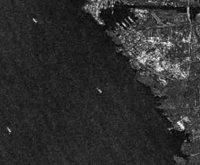
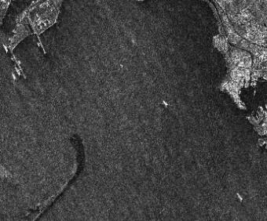
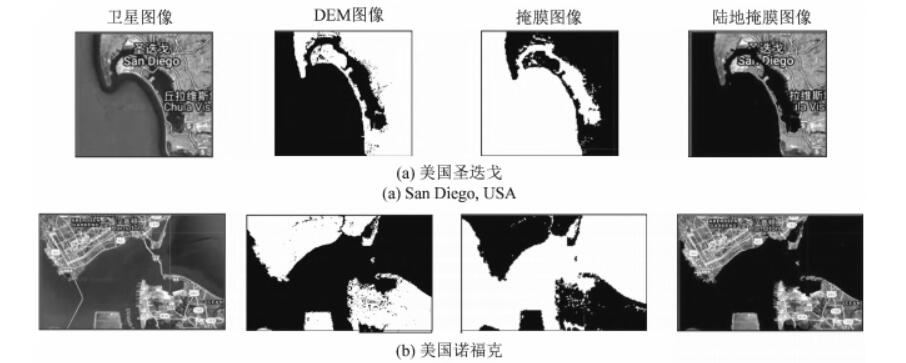
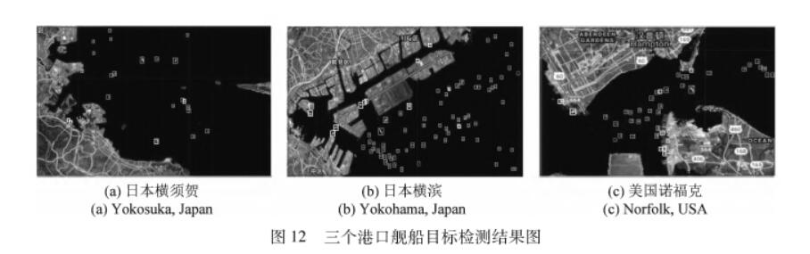
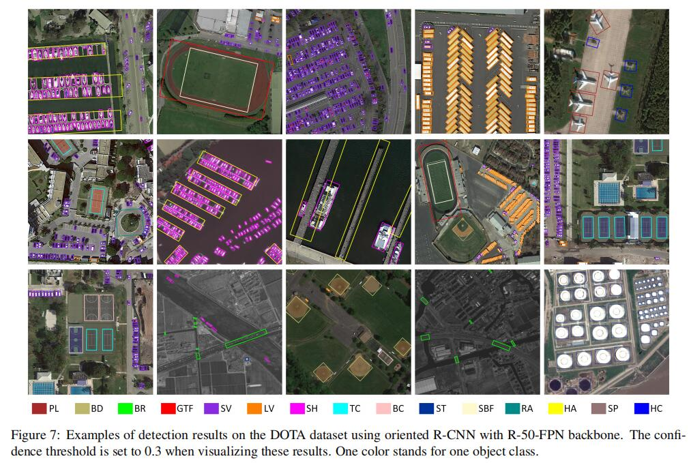
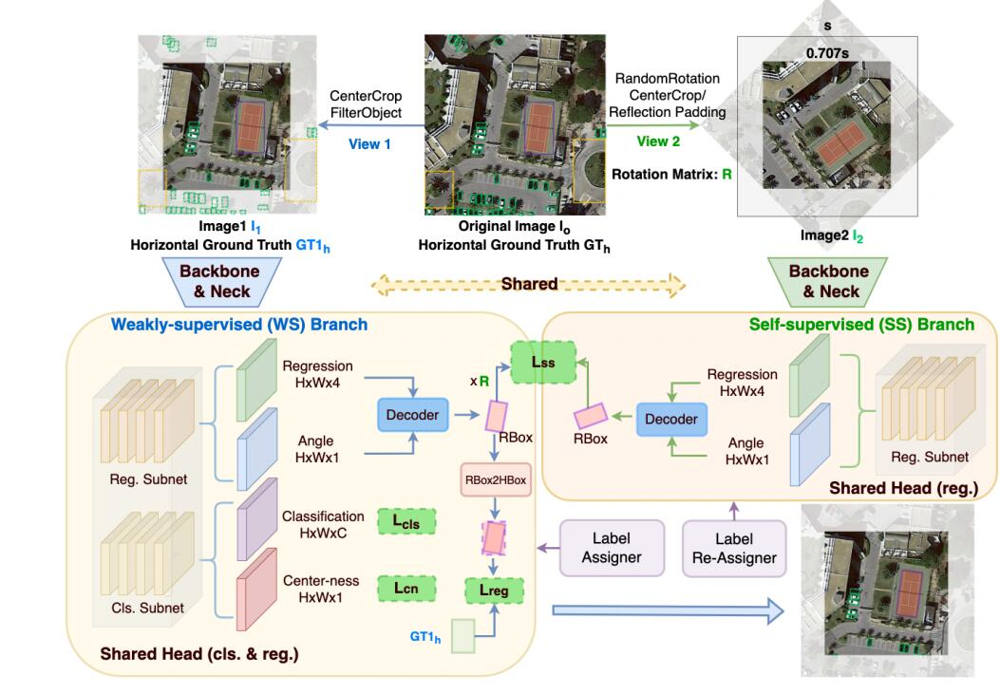
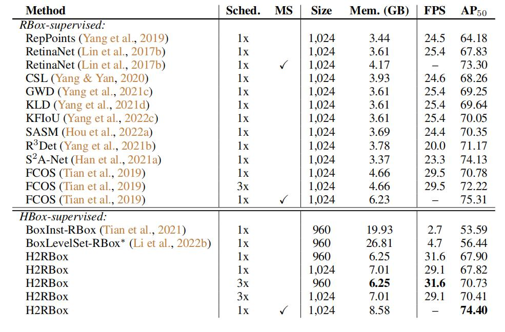

# SAR Ship-Detection  已更新四篇文章

## 1-SUN Xian (Keywords: SAR ship detection，Public dataset) 
中科院
### Publications
   - **AIR-SARShip-1.0: High-resolution SAR Ship Detection Dataset**  [paper](https://radars.ac.cn/en/article/doi/10.12000/JR19097) 
   - AIR-SARShip-1.0：高分辨率SAR舰船检测数据集 [paper](https://radars.ac.cn/article/doi/10.12000/JR19097)
  - 2022/11/20
  - comments by WYC: SAR图像舰船检测公开的数据集比较有限，基于高分三号卫星数据，构建了一个面向宽幅场景的数据集，该数据集有更多的近岸和岛礁，更贴近真实场景，且分辨率更高。数据集按照PASCAL VOC格式标注，保存为XML格式。Train和Test按照2：1比例分配。
  - conclusion by WYC:此数据集存在两个问题，一是影像数量太少(31张)，二是单张影像太大(3000*3000)，使用时应该要进行剪切。
  -  
## 2-LeiYu (Keywords:Google Earth Engines，遥感云计算，舰船检测)
国防科技大学
### Publications：
   - **基于Google Earth Engine的海量舰船目标SAR图像处理应用研究** [paper](https://www.signalpro.com.cn/cn/article/doi/10.16798/j.issn.1003-0530.2021.06.019)
   - 2022/11/24
   - comments by WYC:GEE平台海量的数据存储能力和强大的运算能力，可以应用在大范围海域的海量舰船检测方面。论文中利用GEE平台的Sentinel1 SAR卫星数据集剪切出一些港口的SAR图像，然后通过"NASA SRTM Digital Eleva tion 30 m"数据集获得相应图像的陆地掩膜，将陆地Mask掉只留下海洋区域减少误差。在得到只有海洋背景下的图片后，通过设置阈值，利用最大类间方差法(OTSU)过滤得到目标舰船。
   - conclusion by WYC：论文用的是传统的图像处理方法进行舰船检测，感觉参考意义不大，但是文章使用的数据集得到的图像质量比较好，无论是利用神经网络还是传统方法进行舰船检测，陆地都会有干扰，可以借鉴文章的方法减小陆地带来的误差。
   -  
## 3-Xie Xing xing，Cheng Gong (Keywords: Oriented Object Detection) 
西北工业大学
### Publications
   - **Oriented R-CNN for Object Detection**  [paper:ICCV2021](https://arxiv.org/abs/2108.05699)   [github](https://arxiv.org/abs/2108.05699) 
  - 2022/12/7
  - comments by WYC: 已有的双阶段定向目标检测方法在生成候选框时是很耗时的，以Rotated RPN为例，每个像素点生成54个候选框，这极大的增加了参数量和计算量，而Oriented RPN只生成3个候选框，在检测速度上有了很大的突破。一个轻量的FCN，输出一6个参数的元组(x ,y ,w ,h ,α ,β)代表一个候选框，并且提出了一种新的叫做中心偏移法来表示候选框。文章主要的创新点就在第一阶段提取候选框上，突破了定向目标检测的速度瓶颈。
  - conclusion by WYC:oriented_RPN快速生成带方向的候选框，Head检测头用来提取候选框的特征并进行回归和分类。
  - 网络结构：
       
  - 检测结果：
       
上海交通大学，浙江大学
### Publications
- **H2RBOX: HORIZONTAL BOX ANNOTATION IS ALL YOU NEED FOR ORIENTED OBJECT DETECTION**  [paper](https://arxiv.org/abs/2210.06742)   [github](https://github.com/yangxue0827/h2rbox-mmrotate)
- 2023/1/10
- comments by WYC: 文章提出了一种简单且有效的旋转框目标检测算法，仅使用horizontal box标注进行弱监督训练即可。算法主要包括弱监督分支(WS)和自监督分支(SS)两部分，WS分支的backbone和neck可以用经典的resnet和FPN，Head采用FCOS的Head得到旋转框，然后利用旋转框的外接矩形和GT水平框计算loss。由于一个水平框可以内接无数个旋转框，所以引入SS分支，ss分支用来回归确定唯一的旋转框。
- conclusion by WYC:H2RBOX是相当成熟的旋转框检测算法了，它基于Anchor-free，极大程度提升了检测速度，同时采用弱监督方法，只利用水平框标注即可，极大减少了标注损失，且精度已经和传统的利用旋转标注的检测算法相差无几。
- 网络结构：
  
- 实验对比：
  