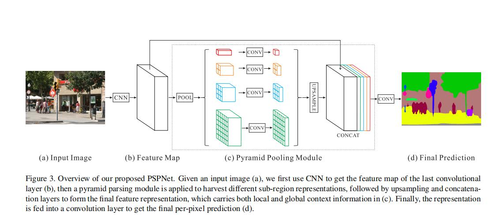
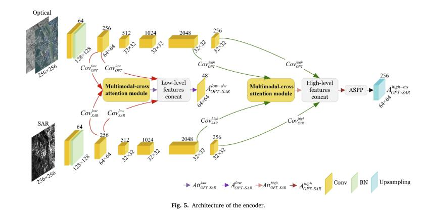
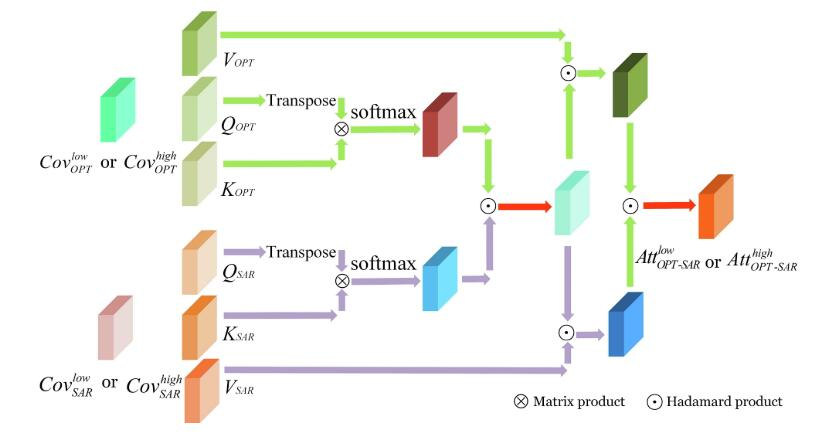
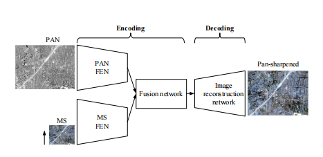
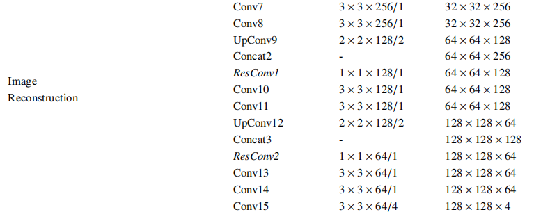
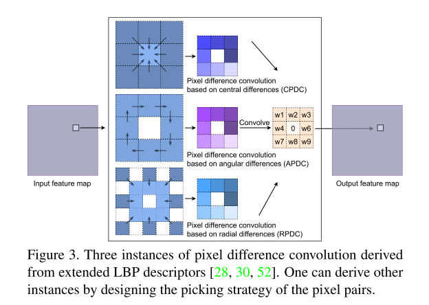
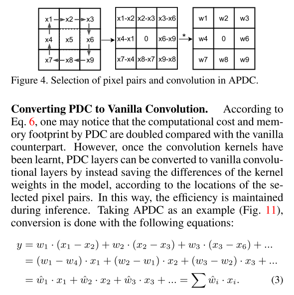
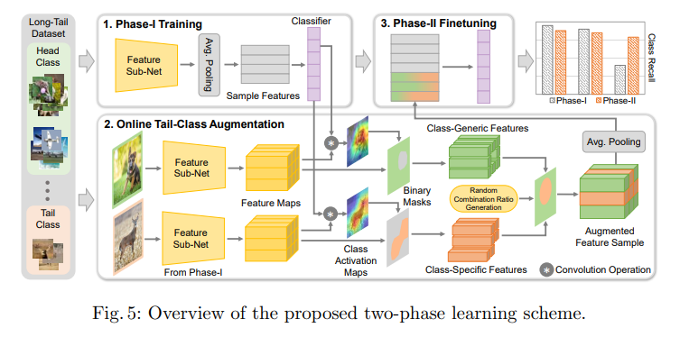
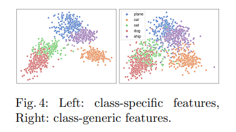
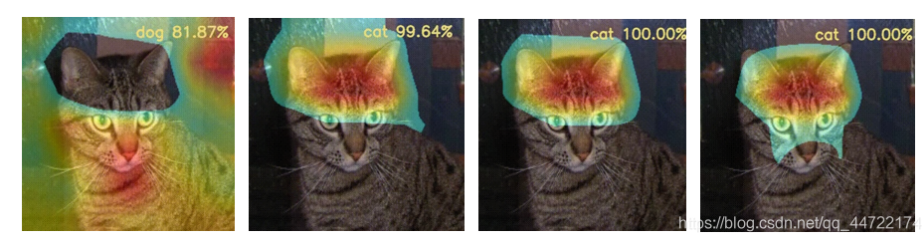

# Semantic Segmentation 已更新5篇文章

## 1-Zhao Heng zhuang，Qi Xiao juan (Keywords: Deep Learn，Semantic Segmentation)

cse.cuhk.edu.hk，ee.cuhk.edu.hk,

### Publications

   - **Pyramid Scene Parsing Network**   [paper](https://arxiv.org/abs/1612.01105)  [github](https://github.com/hszhao/semseg)
   - 2023/01/24
   - comments by WYC：语义分割是计算机视觉里的一个基础任务，任务难度取决于场景的复杂性和标签的多样性。PSPNet的核心是基于整合全局上下文信息的金字塔池化模块，聚合不同区域的上下文信息，从而提高获取全局信息的能力。PSP网络通过ResNet提取Feature Map，FP经过金字塔池化模块得到带有整体信息的Feature，金字塔共4个不同大小的模块，通过上采样和池化后Concat，然后通过卷积层输出。
   - conclusion by WYC:PSPNet的主要贡献就是提出了金字塔池化模块，更多的依靠上下文信息，不同区域的上下文聚合起来提高了学习能力。
   - 

## 2-Xue Li，Guo Zhang (Keywords:Deep convolution neural network，Multimodal-cross attention network)

Wuhan University

### Publications

   - **MCANet: A joint semantic segmentation framework of optical and SAR images for land use classification**   [paper](https://www.sciencedirect.com/science/article/pii/S0303243421003457)  [github](https://github.com/yisun98/SOLC)
   - 2023/04/7
   - comments by WYC：MCANet是一个双流网络，SAR图像提供目标的轮廓用来辅助RGB图提高分割精度。有两个创新点，一个是提出了一种Pseudo-siamese(孪生网络)用来提取特征，分别得到SAR和RGB的低维度和高维度特征(两种特征应该是用ResNet101的satge1和stage4提取的)，另一个创新点是对于得到的SAR和RGB相对应的特征图，一般的操作是简单的叠加(通道叠加、维度叠加、特征图相乘)，该文提出了Multimodal-cross attention机制处理SAR和RGB对应的特征图，引导MCANet更关注感兴趣区域，最后通过ASPP进行低维度特征和高维度特征的融合。
   - 
   - 
   - 
   - conclusion by WYC:文章除了提出MCANet用于语义分割外，还简单探讨了SAR图像在图像分割中对RGB提供了哪些帮助，作者用255减去像素值得到255_SAR，做对比试验后发现整体精度并没有下降的特别明显，并且有些类别精度是上升的。对SAR取反后，目标的轮廓并没有改变，所以作者认为SAR的关键之处就在于提供了轮廓特征，SAR影像的灰度分布与光学影像的光谱信息不存在直接联系，所以直接对二者的特征图进行简单的拼接叠加是不行的。

## 3-Xiangyu Liu，Qingjie Liu

The State Key Laboratory of Virtual Reality Technology and Systems

### Publications

   - **Remote Sensing Image Fusion Based on Two-stream Fusion Network**   [paper](https://www.sciencedirect.com/science/article/pii/S1566253517308060)  [github](https://github.com/huangshanshan33/Remote_Sensing_Image_Fusion/tree/main)
   - 2023/07/08
   - comments by WYC：论文主要做的任务是遥感中双源图像做融合得到高分辨率光学图像，网络采用的基本结构仍然是经典的双流网络结构。两种图像输入分别利用encoder提取特征，然后经过特征融合部分，上面的MCANet特征融合使用的注意力机制，这篇文章特征融合使用的是卷积，融合后的网络经过decoder部分进行重建。
   - 
   - 
   - conclusion by WYC:双流图像融合和语义分割都是像素级的任务，一些相似的方法可以通用。TFNet在decoder部分重建图像时采用了反卷积而不是双线性插值，现在这种任务基本都是采用双线性插值法在重建图像中增大图像尺寸，且不会引入多的参数，但是可能会造成精度下降。在分割中尝试了使用反卷积重建图像，效果确实有提升。
   
## 4-Zhuo Su，Wenzhe Liu, Zitong Yu

Center for Machine Vision and Signal Analysis, University of Oulu, Finland

### Publications

   - **Pixel Difference Networks for Efficient Edge Detection**   [paper](https://openaccess.thecvf.com/content/ICCV2021/papers/Su_Pixel_Difference_Networks_for_Efficient_Edge_Detection_ICCV_2021_paper.pdf)  [github](https://github.com/hellozhuo/pidinet)
   - 2023/07/15
   - comments by WYC：论文主要工作是将传统的边缘检测算法LBP整合为CNN模型，通过传统检测算法捕获梯度信息，然后让CNN专注于提取语义特征。一般的CNN网络能够进行边缘检测，但是参数量巨大，传统的边缘检测参数量少速度快，二者进行结合，设计出了一种轻量且有效的边缘检测网络。
   - 
   - 
   - conclusion by WYC:论文中如何根据传统检测算法设计出CNN网络写得十分清晰，并且说明了如何优化CNN网络，使其参数量进一步减少，从而达到轻量高效的目的。对比试验做的十分充分，网络结构的色彩搭配看起来很舒服。

## 5-Peng Chu，Xiao Bian

Temple University, USA pchu@temple.edu, Google Inc., USA xbian@google.com

### Publications

   - **Feature Space Augmentation for Long-Tailed Data**   [paper](https://arxiv.org/pdf/2008.03673.pdf)  [github](https://github.com/SSRSGJYD/Feature-Space-Augmentation-for-Long-Tailed-Data/tree/main)
   - 2023/08/10
   - comments by WYC：多数数据集遵循长尾分布，数据集头部类中样本数很多，尾部类中样本数很少，类平衡损失、重采样和数据增广是常见的解决不平衡问题的方法。论文提出了一种新的方法解决长尾问题，即利用其他知识弥补尾部类丢失的信息。在特征空间中将头部类的特征增广到尾部类特征上，实现特征空间的增广。
   - 整个过程分为三个部分，第一步先训练backbone分类器，第二步利用头部类对尾部类做增广，第三步利用得到的增广特征图微调第一步训练的模型。
     
   - 第二步如何在特征空间对尾部类做增广是整篇论文的重点，文章中把每个类的特征分为特有特征和共有特征(应该指的是前景特征和背景特征)作者在文章中指出每个类的共有特征联系更密切，所以使用头部类的共有特征和尾部类的特有特征进行融合，实现对尾部类的特征增广。
     
     
   - conclusion by WYC:论文中如何根据传统检测算法设计出CNN网络写得十分清晰，并且说明了如何优化CNN网络，使其参数量进一步减少，从而达到轻量高效的目的。对比试验做的十分充分，网络结构的色彩搭配看起来很舒服。
