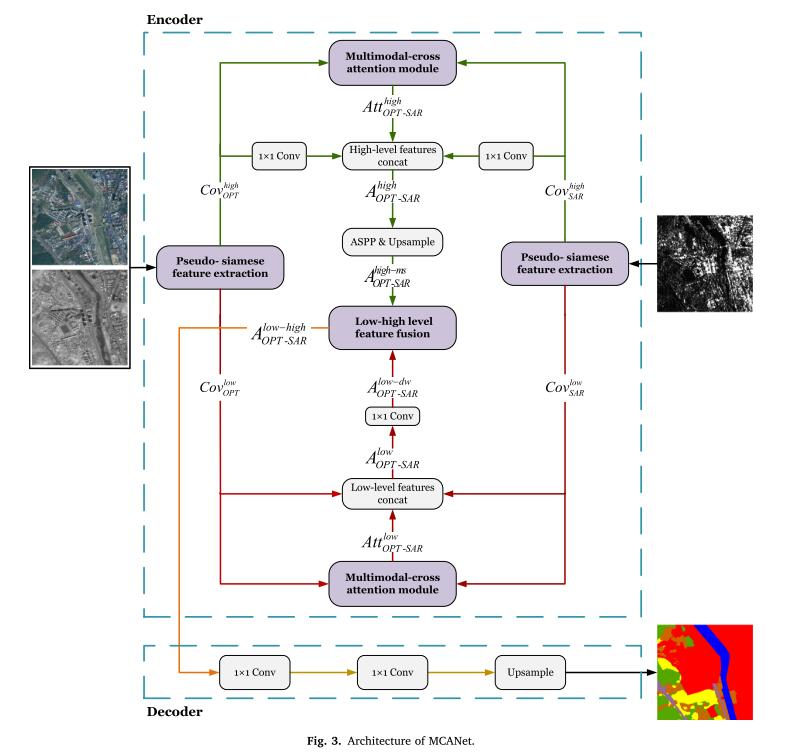

# Semantic Segmentation 已更新2篇文章

## 1-Zhao Heng zhuang，Qi Xiao juan (Keywords: Deep Learn，Semantic Segmentation)

cse.cuhk.edu.hk，ee.cuhk.edu.hk,

### Publications

   - **Pyramid Scene Parsing Network**   [paper](https://arxiv.org/abs/1612.01105)  [github](https://github.com/hszhao/semseg)
   - 2023/01/24
   - comments by WYC：语义分割是计算机视觉里的一个基础任务，任务难度取决于场景的复杂性和标签的多样性。PSPNet的核心是基于整合全局上下文信息的金字塔池化模块，聚合不同区域的上下文信息，从而提高获取全局信息的能力。PSP网络通过ResNet提取Feature Map，FP经过金字塔池化模块得到带有整体信息的Feature，金字塔共4个不同大小的模块，通过上采样和池化后Concat，然后通过卷积层输出。
   - conclusion by WYC:PSPNet的主要贡献就是提出了金字塔池化模块，更多的依靠上下文信息，不同区域的上下文聚合起来提高了学习能力。
   - 

## 2-Xue Li，Guo Zhang (Keywords:Deep convolution neural network，Multimodal-cross attention network)

Wuhan University

### Publications

   - **MCANet: A joint semantic segmentation framework of optical and SAR images for land use classification**   [paper](https://www.sciencedirect.com/science/article/pii/S0303243421003457)  [github](https://github.com/yisun98/SOLC)
   - 2023/04/7
   - comments by WYC：MCANet是一个双流网络，SAR图像提供目标的轮廓用来辅助RGB图提高分割精度。有两个创新点，一个是提出了一种Pseudo-siamese(孪生网络)用来提取特征，分别得到SAR和RGB的低维度和高维度特征(两种特征应该是用ResNet101的satge1和stage4提取的)，另一个创新点是对于得到的SAR和RGB相对应的特征图，一般的操作是简单的叠加(通道叠加、维度叠加、特征图相乘)，该文提出了Multimodal-cross attention机制处理SAR和RGB对应的特征图，引导MCANet更关注感兴趣区域，最后通过ASPP进行低维度特征和高维度特征的融合。
   - 
   - conclusion by WYC:文章除了提出MCANet用于语义分割外，还简单探讨了SAR图像在图像分割中对RGB提供了哪些帮助，作者用255减去像素值得到255_SAR，做对比试验后发现整体精度并没有下降的特别明显，并且有些类别精度是上升的。对SAR取反后，目标的轮廓并没有改变，所以作者认为SAR的关键之处就在于提供了轮廓特征，SAR影像的灰度分布与光学影像的光谱信息不存在直接联系，所以直接对二者的特征图进行简单的拼接叠加是不行的。
   - 
   - 

